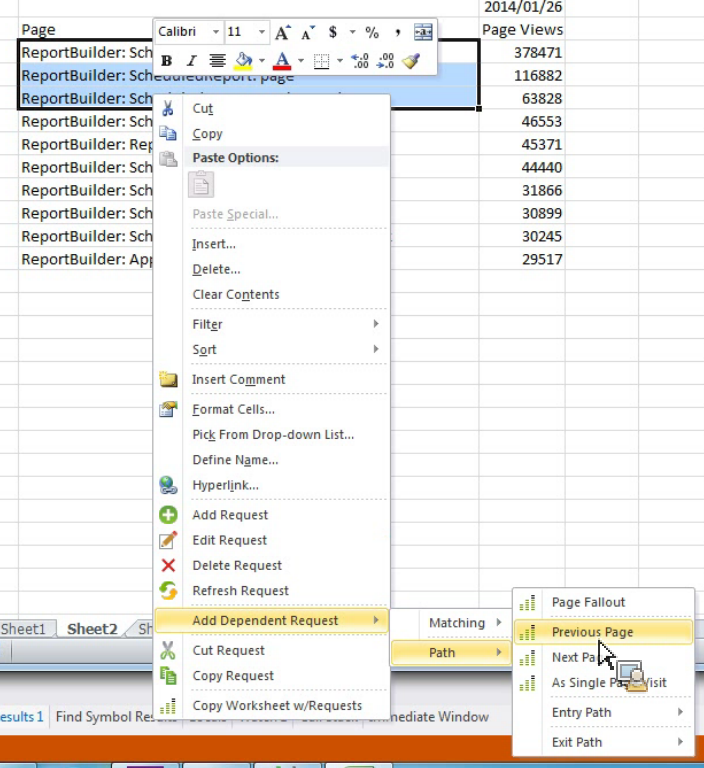

# Pfadberichte durch Hinzufügen von abhängigen Anforderungen filtern

{{legacy-arb}}

Beschreibt, wie Pfadberichte mit vordefinierten Filtern erstellt werden.

Report Builder bietet keine Pfadberichte als eigenständige Berichte an, Sie können sie jedoch über die Kontextmenüs **[!UICONTROL Abhängige Anfrage hinzufügen]** > **[!UICONTROL Pfad]** erstellen. Die folgenden Berichte sind verfügbar:

* Pfad > Trichteranalyse für Seite
* Pfad > Einstiegspfad
* Pfad > Ausstiegspfad
* Pfad > Nächste Seite
* Pfad > Einstiegspfad > Nächste Seite
* Pfad > Vorherige Seite
* Pfad > Ausstiegspfad > Vorherige Seite
* Pfad > Einstiegspfad > Als Entrypage
* Pfad > Ausstiegspfad > Als Exitpage

1. Wählen Sie mehrere Zeilen aus einer vorhandenen Anfrage aus und klicken Sie dann mit der rechten Maustaste auf **[!UICONTROL Abhängige Anfrage hinzufügen]** > **[!UICONTROL Pfad]**. Sie müssen mindestens drei Zeilen auswählen, wenn Sie den Menüeintrag **[!UICONTROL Seiten-Fallout]** anzeigen möchten.

   

2. Wählen Sie den vordefinierten Filter aus, z. B. **[!UICONTROL Vorherige Seite]**.

   Der Anforderungs-Assistent wird angezeigt, wobei die Metrik „Vorherige Seite“ bereits ausgewählt ist. 1. Verfeinern Sie Ihre Anforderung im Anforderungs-Assistenten weiter und generieren Sie Ihre Anforderung.
