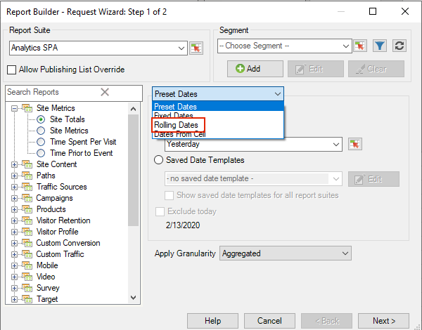

# Benutzerdefinierte Datumsausdrücke

Sie können einen komplexen Datumsbereich festlegen, indem Sie einen benutzerdefinierten Ausdruck verwenden.

Wenn Sie Ausdrücke erstellen, lesen Sie einen Kalender , um die Anzahl der Wochen und Tage korrekt anzugeben. Excel bietet verschiedene integrierte Funktionen für die Berechnung von Tagen, Werktagen, Monaten und Jahren, die zwischen zwei Datumswerten liegen. Sie können diese Funktionen in Formeln verwenden, um andere Intervalle zu berechnen, etwa Wochen oder Quartale.

**So aktivieren Sie benutzerdefinierte Ausdrücke**

Das folgende Beispiel zeigt, wie Sie einen benutzerdefinierten Ausdruck für **[!UICONTROL Rollierende Datumswerte]** aktivieren.

1. Wählen Sie im Dialogfeld &quot;[!UICONTROL Anforderungs-Assistent: Schritt 1]&quot;anstelle von &quot;**[!UICONTROL Vordefinierte Datumswerte]**&quot; die Option &quot;**[!UICONTROL Rollierende Datumswerte]**&quot;.

   

1. Wechseln Sie zu Rollierend wöchentlich, monatlich, vierteljährlich oder jährlich. Beachten Sie, wie sich die folgenden Optionen ändern.
1. Klicken Sie für weitere Anpassungsoptionen auf **[!UICONTROL Erweiterte Optionen anzeigen]**.

   

1. Wenn Sie beispielsweise die oben genannten Daten in &quot;Monatlich&quot;ändern, vom ersten Tag vor drei Monaten bis zum ersten Tag dieses Monats, werden die Datumsangaben in den vorherigen Optionen aktualisiert, um Folgendes widerzuspiegeln:

   

1. Aktivieren Sie **[!UICONTROL Ausdruck anpassen]**. Wenn Sie unter **[!UICONTROL Rollierende Datumswerte]** Optionen auswählen, können Sie die Syntax für benutzerdefinierte Datumsausdrücke leicht sehen.

   

   Sie können Erweiterte Optionen verwenden, um benutzerdefinierte Datumsausdrücke zu kombinieren und zuzuordnen. Wenn Sie beispielsweise Daten vom ersten des Jahres bis zum Ende des letzten vollen Monats sehen möchten, können Sie Folgendes eingeben: `From: cy` `To: cm-1d`. Im Assistenten werden diese Daten als 1.1.2020-1.31.2020 angezeigt.
