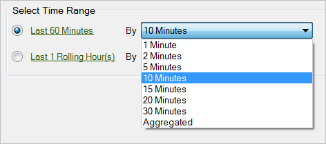

# Konfigurieren einer Echtzeitanforderung

{{legacy-arb}}

So konfigurieren Sie Echtzeit-Anfragedaten:

1. Stellen Sie sicher, dass die Echtzeitberichterstellung in den [Admin Tools“ aktiviert &#x200B;](/help/admin/tools/manage-rs/edit-settings/realtime/t-realtime-admin.md).
1. Klicken Sie im [!UICONTROL Anforderungs-Assistenten, Schritt 1] auf **[!UICONTROL Echtzeitbericht]** > **[!UICONTROL `<report type>`]**

   Wählen Sie beispielsweise einen Traffic-Bericht. Wenn Sie einen Echtzeitberichtstyp auswählen, werden die Optionen für die [!UICONTROL Auswahl des Zeitraums] angezeigt.

1. Wählen Sie einen Zeitraum in Minuten oder Stunden.

   

   Echtzeitberichte sind nur für die letzten 20 Stunden verfügbar. Für die Granularität sind Optionen von 1 Minute bis 30 Minuten verfügbar.
1. Klicken Sie auf **[!UICONTROL Weiter]** und [konfigurieren Sie das Anforderungslayout](/help/analyze/legacy-report-builder/layout/layout.md) weiter.
