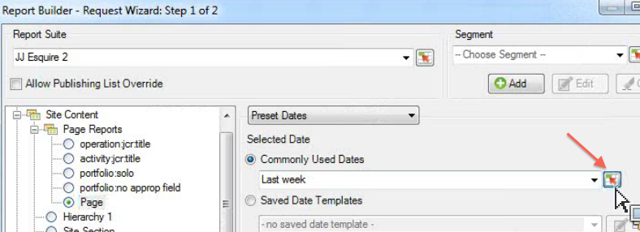

# interaktive Steuerelemente

{{legacy-arb}}

Mit interaktiven Steuerelementen können Sie Segmente und Datumsbereiche für eine oder mehrere Anfragen direkt im Arbeitsblatt bearbeiten. Dadurch erhalten Sie mehr Flexibilität bei der Aktualisierung von Report Builder-Anfragen.

Interaktive Steuerelemente wurden als Reaktion auf einen allgemeinen Workflow erstellt, bei dem Analysten Arbeitsmappen erstellen und diese für die Marketing-Organisation freigeben. Interaktive Steuerelemente bieten Marketing-Experten die Möglichkeit, Anfragen zu ändern und zu aktualisieren, ohne über fundierte Kenntnisse der Funktionsweise von Report Builder verfügen zu müssen. (Beachten Sie, dass der Arbeitsmappen-Empfänger ein Report Builder-Benutzer sein muss, um eine Anfrage aktualisieren zu können.) Diese Steuerelemente funktionieren in geplanten Arbeitsmappen. Derzeit sind zwei Arten von interaktiven Steuerelementen verfügbar:

* Rollierender Datumsbereich
* Segmente

>[!IMPORTANT]
>
>Damit die interaktiven Steuerelemente funktionieren, muss Report Builder v5.0 installiert sein. >
>* Wenn Sie Microsoft Excel unter Windows ausführen, aber eine niedrigere Version von Report Builder ausführen, oder wenn Report Builder nicht installiert ist: Sie können den Wert im interaktiven Steuerelement ändern, aber es wird weder die zugehörige Anfrage aktualisieren noch die zugehörigen Parameter der Anfrage aktualisieren.
>* Wenn Sie Excel auf einem Mac ausführen, wird die folgende Nachricht angezeigt, wenn Sie den Wert im Steuerelement ändern: „Das Makro &#39;Adobe.ReportBuilder.Bridge.FormControlClick.Event&#39; kann nicht gefunden werden.“
>

>[!WARNING]
>
>Bearbeiten Sie nicht den Namen des Steuerelements. (Zum Anzeigen des Namens fokussieren Sie das Steuerelement. Der Name des Steuerelements wird dann direkt über dem Excel-Raster in der oberen linken Ecke angezeigt.)

## Implementieren des interaktiven Steuerelements für Datumsbereiche {#section_39B228F2D2C44985863D31424C953280}

1. Wählen Sie in Schritt 1 des Anforderungs-Assistenten zum Beispiel den Bericht **[!UICONTROL Seite]** aus.
1. Klicken Sie neben dem Dropdown-Menü **[!UICONTROL Häufig verwendete Datumsangaben]** auf das Symbol **[!UICONTROL Steuerungseinstellungen]**:

   

1. Wählen Sie im Dialogfeld Steuerelementeinstellungen alle Datumsbereichselemente aus, die im interaktiven Steuerelement angezeigt werden sollen. Geben Sie außerdem die obere linke Zellenposition des Steuerelements an.

   

1. Beachten Sie die Option „Verknüpfte Anforderungen bei Elementauswahl automatisch aktualisieren“.

   * Wenn diese Option aktiviert ist, werden alle Anfragen, die dieses Steuerelement verwenden, aktualisiert.
   * Wenn diese Option nicht aktiviert ist, werden die zugehörigen Anfrageparameter aktualisiert, die Anfrage wird jedoch nicht aktualisiert.

1. Klicken Sie auf **[!UICONTROL OK]**. Das Steuerelement wird an der angegebenen Zellenposition angezeigt:

1. Sie können jetzt den Datumsbereich ändern, und die Anfrage wird mit diesem Datumsbereich aktualisiert.

   

1. Sie können die Anfrage auch kopieren und mit der rechten Maustaste klicken, um eine von zwei Optionen zum Einfügen einer Anfrage zu verwenden:

   * **[!UICONTROL Anfrage einfügen]** > **[!UICONTROL Absolute Eingabezelle verwenden]**. Das bedeutet, dass die kopierte Anfrage auf dasselbe interaktive Datumsbereichssteuerelement verweist wie die ursprüngliche Anfrage.

   * **[!UICONTROL Anforderung einfügen]** > **[!UICONTROL Relative Eingabezelle verwenden]**. Das bedeutet, dass die kopierte Anforderung zum eigenen Steuerelement verweist.

     >[!NOTE]
     >
     >Sie können die native Microsoft Excel-Funktion zum Ausschneiden/Kopieren/Einfügen verwenden. Report Builder erkennt die neu hinzugefügten Steuerelemente automatisch.

## Implementieren des interaktiven Steuerelements für Segmente {#section_5003D3F724644280BF1BCD6E1B0CB784}

Die Implementierung des interaktiven Segmentsteuerelements ähnelt der Implementierung des Steuerelements für Datumsbereiche.

1. Wählen Sie in Schritt 1 des Anforderungs-Assistenten neben **[!UICONTROL Dropdown-Liste]** Segment“ das Symbol für die Einstellungen der Segmentsteuerung aus:

   

1. Wählen Sie im Dialogfeld „Einstellungen für die Segmentsteuerung“ die Segmente aus, die Sie in die Dropdown-Liste aufnehmen möchten. Geben Sie außerdem die obere linke Zellenposition des Steuerelements an.

   

1. Das neue interaktive Steuerelement wird jetzt in der Arbeitsmappe angezeigt:

   
