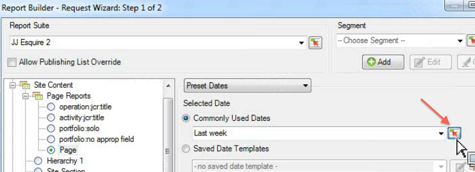
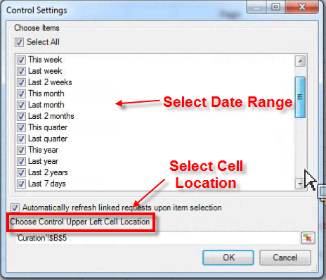
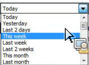

# interaktive Steuerelemente

{{legacy-arb}}

Mit interaktiven Steuerelementen können Sie direkt im Arbeitsblatt Segmente und Datumsbereiche für eine oder mehrere Anforderungen bearbeiten. Dadurch erhalten Sie mehr Flexibilität bei der Aktualisierung von Report Builder-Anfragen.

Interaktive Steuerelemente wurden als Antwort auf einen gemeinsamen Workflow erstellt, bei dem Analysten Arbeitsmappen erstellen und diese mit der Marketingorganisation teilen. Interaktive Steuerelemente bieten Marketing-Experten die Möglichkeit, Anfragen zu ändern und zu aktualisieren, ohne über fundierte Kenntnisse der Funktionsweise von Report Builder verfügen zu müssen. (Beachten Sie, dass der Arbeitsmappen-Empfänger ein Report Builder-Benutzer sein muss, um eine Anfrage aktualisieren zu können.) Diese Steuerelemente funktionieren in geplanten Arbeitsmappen. Derzeit sind zwei Arten interaktiver Steuerelemente verfügbar:

* Rollierender Datumsbereich
* Segmente

>[!IMPORTANT]
>
>Damit die interaktiven Steuerelemente funktionieren, muss Report Builder v5.0 installiert sein. >
>* Wenn Sie Microsoft Excel unter Windows ausführen, aber eine niedrigere Version von Report Builder ausführen, oder wenn Report Builder nicht installiert ist: Sie können den Wert im interaktiven Steuerelement ändern, aber es wird weder die zugehörige Anfrage aktualisieren noch die zugehörigen Parameter der Anfrage aktualisieren.
>* Wenn Sie Excel auf einem Mac ausführen, wird die folgende Nachricht angezeigt, wenn Sie den Wert im Steuerelement ändern: „Das Makro &#39;Adobe.ReportBuilder.Bridge.FormControlClick.Event&#39; kann nicht gefunden werden.“
>

>[!WARNING]
>
>Bearbeiten Sie nicht den Namen des Steuerelements. (Zum Anzeigen des Namens fokussieren Sie das Steuerelement. Der Name des Steuerelements wird dann direkt über dem Excel-Raster in der oberen linken Ecke angezeigt.)

## Implementieren des interaktiven Steuerelements für Datumsbereiche {#section_39B228F2D2C44985863D31424C953280}

1. Wählen Sie in Schritt 1 des Anforderungs-Assistenten zum Beispiel den Bericht **[!UICONTROL Seite]** aus.
1. Klicken Sie neben dem Dropdown-Menü **[!UICONTROL Häufig verwendete Datumsangaben]** auf das Symbol **[!UICONTROL Steuerungseinstellungen]**:

   

1. Wählen Sie im Dialogfeld „Steuerungseinstellungen“ alle Datumsbereichselemente aus, die im interaktiven Steuerelement angezeigt werden sollen. Legen Sie außerdem den oberen linken Zellenstandort des Steuerelements fest.

   

1. Beachten Sie die Option „Verknüpfte Anforderungen bei Elementauswahl automatisch aktualisieren“.

   * Wenn diese aktiviert ist, werden alle Anforderungen aktualisiert, die dieses Steuerelement verwenden.
   * Wenn sie nicht aktiviert ist, werden zwar die verknüpften Anforderungsparameter aktualisiert, jedoch nicht die Anforderung selbst.

1. Klicken Sie auf **[!UICONTROL OK]**. Das Steuerelement wird in dem von Ihnen festgelegten Zellenstandort angezeigt:

1. Nun können Sie den Datumsbereich ändern und die Anforderung wird mit diesem Datumsbereich aktualisiert.

   

1. Sie können die Anforderung auch kopieren und mit der rechten Maustaste darauf klicken, um eine der zwei Optionen zum Einfügen von Anforderungen zu verwenden:

   * **[!UICONTROL Anforderung einfügen]** > **[!UICONTROL Absolute Eingabezelle verwenden]**. Das bedeutet, dass die kopierte Anforderung zu demselben interaktiven Steuerelement für Datumsbereiche verweist wie die ursprüngliche Anforderung.

   * **[!UICONTROL Anforderung einfügen]** > **[!UICONTROL Relative Eingabezelle verwenden]**. Das bedeutet, dass die kopierte Anforderung zum eigenen Steuerelement verweist.

     >[!NOTE]
     >
     >Sie können die native Microsoft Excel-Funktion zum Ausschneiden/Kopieren/Einfügen verwenden. Report Builder erkennt die neu hinzugefügten Steuerelemente automatisch.

## Implementieren des interaktiven Steuerelements für Segmente {#section_5003D3F724644280BF1BCD6E1B0CB784}

Das Implementieren interaktiver Steuerelemente für Segmente ähnelt dem Implementieren des Steuerelements für Datumsbereiche.

1. Wählen Sie in Schritt 1 des Anforderungs-Assistenten neben dem Dropdown-Menü **[!UICONTROL Segment]** das Symbol für die Segmentsteuerungseinstellungen:

   

1. Wählen Sie im Dialogfeld für die Segmentsteuerungseinstellungen die Segmente aus, die im Dropdown-Menü enthalten sein sollen. Legen Sie außerdem den oberen linken Zellenstandort des Steuerelements fest.

   

1. Das neue interaktive Steuerelement wird nun in der Arbeitsmappe angezeigt:

   
