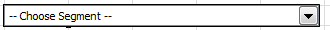

# Segmente verwalten

{{legacy-arb}}

So können Sie in Report Builder Adobe Analytics-Segmente hinzufügen, bearbeiten, anwenden und filtern.

Report Builder bietet in Schritt 1 des Anforderungs-Assistenten ein Bedienfeld für die Segmentierung, mit dem Sie Segmente erstellen und verwalten können.

## Hinzufügen oder Bearbeiten von Segmenten {#section_B2BC136F9A53498D90C7C2ECC5DB892B}

>[!NOTE]
>
>Um Segmente hinzuzufügen oder zu bearbeiten, wird über die Report Builder-Schnittstelle für Segmente in einem Microsoft Internet Explorer-Fenster der Analytics-Segment-Builder gestartet. Ihre Report Builder-Sitzung bleibt aktiv. Andere Browser als Internet Explorer werden für diesen Vorgang nicht unterstützt.

1. Klicken Sie im Segment-Bedienfeld von Schritt 1 des Anfrage-Assistenten auf **[!UICONTROL Hinzufügen]**.
1. Ein Internet Explorer-Fenster wird geöffnet, in dem die Benutzeroberfläche von Analytics Segment Builder geöffnet wird. Informationen zum Erstellen von Segmenten finden Sie unter [Analytics-Segmentierung](/help/components/segmentation/seg-home.md).
1. Nachdem Sie das Segment definiert und gespeichert haben, kehren Sie zum Anforderungs-Assistenten zurück.
1. Klicken Sie auf das Aktualisierungssymbol, um die Segmentliste zu aktualisieren.

>[!IMPORTANT]
>
>Diese Liste wird zwischengespeichert und das neu erstellte Segment wird erst nach einer Aktualisierung angezeigt.

## Erstellen von kontextabhängigen Segmenten {#section_6DD2C663B2854469AA1075438F907678}

Möglicherweise verfügen Sie über bestimmte Kombinationen an Berichtsdimensionen, die Sie in ein Segment umwandeln möchten. Solche Segmente können Sie über die Report Builder-Schnittstelle erstellen. Wählen Sie beispielsweise einige Seiten aus einer Seitenanforderungsausgabe aus und erstellen Sie ein Segment basierend auf diesen Werten.

1. Wählen Sie die Berichtsausgabeelemente aus, die Sie in ein Segment umwandeln möchten.
1. Klicken Sie mit der rechten Maustaste, um **[!UICONTROL In-Context-Segment erstellen in]** auszuwählen und legen Sie den rechten Container fest (Container für Seitenaufrufe, Container für Besuche, Container für Besucher).

   

   Weitere Informationen zu Containern finden Sie im [Segmentierungshandbuch](/help/components/segmentation/seg-home.md).

1. Die Segment Builder-Benutzeroberfläche wird jetzt in Internet Explorer gestartet. Die Benutzeroberfläche von Segment Builder wird mit dem angegebenen Container und Filter initialisiert.
1. Nachdem Sie dem Segment einen Namen und eine Beschreibung hinzugefügt haben, speichern Sie es.
1. Kehren Sie zu Report Builder zurück und klicken Sie auf das Aktualisierungssymbol, um die Segmentliste zu aktualisieren.
1. Sie können dieses Segment jetzt anwenden.

## Segmente suchen und anwenden 

In dieser Segmentliste werden alle Segmente angezeigt, die in Reports &amp; Analytics (jetzt eingestellt), Report Builder oder Data Warehouse erstellt wurden. Um die Liste zu aktualisieren, klicken Sie auf das Aktualisierungssymbol .

Sie können bei allen Anforderungen eines oder mehrere Segmente anwenden. Dazu gehören sequenzielle Segmente.

1. Wechseln Sie in der Dropdown-Liste zu **[!UICONTROL Segment]** und klicken Sie im Feld **[!UICONTROL Segment auswählen]** auf den kleinen Pfeil nach unten, um alle Segmente anzuzeigen.

1. Aktivieren Sie die Segmente, die Sie anwenden möchten.

   

>[!NOTE]
>
>Unabhängig davon, ob Sie Administrator oder Nicht-Administrator sind, können Sie in Report Builder nur die Segmente anzeigen, deren Inhaber Sie sind, sowie die Segmente, die für Sie freigegeben wurden.

## Filtern von Segmenten {#filter}

**Filtern** von Segmenten durch Klicken auf das Filtersymbol: 

Zu den verfügbaren Filtern gehören:

| Filtername | Beschreibung |
|---|---|
| Tags | Ermöglicht das Filtern nach Segmenten mit bestimmten Tags. Beachten Sie, dass Tagfilter mit dem Operator AND arbeiten. Wenn Sie zwei Tags aktivieren, werden im rechten Bereich Segmente angezeigt, die mit (**) Tags** wurden. |
| Inhaberinnen oder Inhaber | Filtert Segmente nach Inhaber. Beachten Sie, dass Inhaberfilter mit dem Operator OR arbeiten. Wenn Sie zwei Eigentümer überprüfen, zeigt der rechte Bereich Segmente an, die dem (oder **)** gehören. |
| Andere Filter > Nur *Report Suite-Name* | Wenn Sie den Filter „Nur *Report Suite-Name* im Segment Builder in Adobe Analytics anwenden und dann den erweiterten Filter in [!DNL Report Builder] anzeigen, zeigt der erweiterte Filter das Segment nur für die ausgewählte Report Suite an. |
| Weitere Filter > Meine | Zeigt alle Segmente an, deren Inhaber Sie sind. |
| Weitere Filter > Für mich freigegeben | Zeigt alle Segmente an, die andere für Sie freigegeben haben. |
| Weitere Filter > Favoriten | Zeigt alle als Favoriten markierten Segmente an. |
| Weitere Filter > Genehmigt | Zeigt alle offiziell genehmigten Segmente an. |

## Hinzufügen eines Segmentsteuerelements zu einer Arbeitsmappe {#segment-control}

Wenn Sie ein Segmentsteuerelement hinzufügen, können Sie innerhalb einer Arbeitsmappe zwischen Segmenten wechseln, anstatt hierfür zum Anforderungs-Assistenten wechseln zu müssen.

1. Klicken Sie auf das Symbol Kontrolle  neben der Dropdown-Liste des Segments.

1. Markieren Sie alle Segmente, die in der Segmentsteuerung angezeigt werden sollen, oder aktivieren Sie **[!UICONTROL Alle auswählen]**.

   

1. Beachten Sie die Option **[!UICONTROL Verknüpfte Anfragen bei der Elementauswahl automatisch aktualisieren]**.

   * Wenn diese Option aktiviert ist, werden alle Anfragen, die dieses Steuerelement verwenden, aktualisiert.
   * Wenn diese Option nicht aktiviert ist, werden die zugehörigen Anfrageparameter aktualisiert, die Anfragen werden jedoch nicht aktualisiert.

1. Geben Sie die obere linke Zellenposition des Segmentsteuerelements an.

1. Klicken Sie **[!UICONTROL OK]** und das Segmentsteuerelement wird an der angegebenen Position angezeigt.

   

## Segmentliste aktualisieren  {#refresh}

Jedes Mal, wenn Sie ein neues Segment hinzufügen oder ein vorhandenes bearbeiten, sollten Sie auf das Aktualisierungssymbol  klicken, um die zwischengespeicherte Segmentliste zu aktualisieren.

## Verwalten von Segmenten in mehreren Anfragen {#manage}

Vor der Version v5.4 konnten Benutzer in Report Builder Segmente in mehreren Anforderungen ändern. Dieser Prozess ersetzte jedoch immer die vorhandenen Segmente. Benutzende, die jeder Anfrage ein neues Segment hinzufügen möchten, konnten dies nicht tun, da beim Hinzufügen des Segments der vorherige Satz von Segmenten entfernt würde, die bereits jeder Anfrage zugewiesen waren.

In Report Builder 5.4 ist das Hinzufügen, Entfernen und Ersetzen einzelner oder aller Segmente innerhalb mehrerer Anforderungen zulässig:

1. Auswahl mehrerer Anfragen in einer Arbeitsmappe.
1. Klicken Sie mit der rechten Maustaste und wählen **[!UICONTROL Anforderungen bearbeiten]** > **[!UICONTROL Nach Segment]**.

   

1. Wählen Sie im Dialogfeld Gruppe bearbeiten eine der vier Optionen aus:

   | Option | Beschreibung |
   |---|---|
   | Segment hinzufügen | Ermöglicht die Auswahl eines oder mehrerer Segmente, die der Liste der aktuellen Segmente hinzugefügt werden sollen. |
   | Segment(e) ersetzen | Hier können Sie auswählen, welche Segmente durch ein oder mehrere Segmente ersetzt werden sollen. |
   | Alle Segmente ersetzen durch | Ermöglicht die Auswahl von einem oder mehreren Segmenten, durch die das aktuelle Segment bzw. die aktuellen Segmente ersetzt werden sollen. |
   | Segment(e) entfernen | Hiermit können Sie Segmente aus den Anfragen entfernen. |
