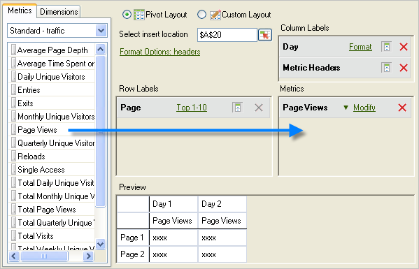

# Metriken und Dimensionen hinzufügen

{{legacy-arb}}

Schritte zum Hinzufügen von Metriken und Dimensionen zu einer Anforderung.

1. Verwenden Sie das Formular [!UICONTROL Anforderungs-Assistent: Schritt 1], um [Datenanforderung erstellen](/help/analyze/legacy-report-builder/data-requests/data-requests.md) und klicken Sie dann auf **[!UICONTROL Weiter]**.
1. Doppelklicken Sie im [!UICONTROL Anforderungs-Assistenten: Schritt 2] auf Metriken oder ziehen Sie sie an die gewünschte Position.

   

   Wenn Sie Metriken hinzufügen, werden sie nicht aus der Registerkarte [!UICONTROL Metriken] entfernt, da Metriken innerhalb einer Anforderung mehrfach verwendet werden können. Beispielsweise kann die Zwischensumme einer Metrik neben jedem Wert angezeigt werden. Allerdings ändert sich die Liste der verfügbaren Metriken jedes Mal, wenn Sie eine Dimension hinzufügen oder entfernen.

   Metriken können nur im Abschnitt [!UICONTROL Metriken] des Layoutbereichs hinzugefügt werden. Metriken werden dem Layout [!UICONTROL Spaltenbezeichnung] als [!UICONTROL Metrik-Überschrift] hinzugefügt. Wenn Sie eine [!UICONTROL Metrik-Überschrift] aus dem [!UICONTROL Spalten-Layout] in das [!UICONTROL Zeilen-Layout] verschieben, wird sie dort angezeigt und die zugehörige Metrik wird für die Aufschlüsselung verwendet.

   Beachten Sie, dass auf der Registerkarte „Metriken“ direkt über der Metrikenliste eine Suchleiste angezeigt wird.

   

## Richtlinien

Beachten Sie beim Hinzufügen von Metriken und Dimensionen die folgenden Richtlinien.

* Wenn Sie einen Suchbegriff eingeben, wird die Liste automatisch aktualisiert und zeigt Metriken an, deren Kennzeichnungen mit dem Suchbegriff übereinstimmen.
* Bei der Übereinstimmung wird nicht zwischen Groß- und Kleinschreibung unterschieden und sie entspricht einer *contains*-Suche.
* Volltextsuchen und andere spezielle Suchflags (beginnend mit, endend mit, UND, ODER usw.) werden nicht unterstützt.

Der Suchbegriff wird gelöscht, wenn Sie den Anforderungs-Assistenten beenden, wenn Sie auf [!UICONTROL Beenden] oder [!UICONTROL Abbrechen] klicken, oder zurück zum Anforderungs-Assistenten zu Schritt 1 wechseln oder die Metrikkategorie ändern.

Der Suchbegriff wird nicht gelöscht:

* Wenn Sie ein Metrik-Element per Drag-and-Drop aus der Liste ziehen (oder darauf doppelklicken), wird es zum Bedienfeld „Pivot-Layout/Benutzerdefinierte Layout-Metriken“ hinzugefügt.
* Wenn Sie ein oder mehrere Metrikelemente aus dem Metrikbedienfeld Pivot-Layout/Benutzerdefiniertes Layout entfernen.
* Wenn Sie auf die Registerkarte Dimension klicken, kehren Sie dann zur Registerkarte Metrik zurück.
* Wenn Sie andere Teilformulare (modal oder moduslos) aufrufen, die beim Beenden zum Anforderungs-Assistenten von Schritt 2 zurückkehren. Beispiele für diese Formulare:

   * Formulare für Dimensionsfilter
   * Formulare für die Datumsbereichformatierung
   * Formulare für Formatoptionen
   * Formulare für das Voranstellen/Anhängen von Text
   * Formulare für das Festlegen des Ausgabebereichs

## Sortieren einer Anfrage nach Metrik

Optional können Sie eine Anfrage nach Metrik sortieren.

So sortieren Sie eine Anfrage nach Metrik

1. Klicken Sie auf die Metrikbeschriftung.
1. Dimensionen hinzufügen. Fügen Sie Dimensionen auf die gleiche Weise hinzu wie Metriken. Siehe Schritte 1 und 2 oben.

   Auf der Registerkarte [!UICONTROL Dimensionen] zeigt das System Dimensionen an, die aufgeschlüsselt sind oder eine Klassifizierung eines Basisberichts darstellen, den Sie unter [!UICONTROL Anforderungs-Assistent: Schritt 1] und über die Konfiguration der Report Suite auswählen. Wenn Sie eine Dimension in die Layout-Raster ablegen, wird sie aus der Strukturansicht entfernt und berechnet die Liste der verbleibenden verfügbaren Dimensionen neu.

   Die Dimension [!UICONTROL Datum] wird automatisch hinzugefügt. Die verfügbaren Datumsdimensionen hängen von der im Dialogfeld [!UICONTROL Anforderungs-Assistent: Schritt 1] gewählten Granularität ab. Gültige Werte sind:

   * Stunde
   * Tag
   * Woche
   * Monat
   * Jahr
   * Datumsbereich (wenn keine Granularität angegeben ist)

1. Ändern Sie Metriken und Dimensionen, indem Sie [Formatoptionen](/help/analyze/legacy-report-builder/layout/t-format-display-headers.md) und Filter konfigurieren.
1. Klicken Sie auf **[!UICONTROL Fertigstellen]**. 
Im folgenden Beispiel gehören die Dimensionen zur Metrik [!UICONTROL Seite]. Die Dimension [!UICONTROL Verweisende Domain] erstellt einen Aufschlüsselungsbericht zwischen [!UICONTROL Seite] und [!UICONTROL Verweisende Domain]. Die Registerkarte [!UICONTROL Dimension] wird nur mit Dimensionen aktualisiert, die für einen Detailbericht verwenden können.

   
