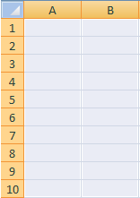

# Metriken und Dimensionen Zellen zuordnen

{{legacy-arb}}

Bevor Sie damit beginnen, einem Arbeitsblatt Elemente zuzuordnen, stellen Sie sicher, dass das Arbeitsblatt nicht schreibgeschützt ist. Wenn ein bestehender Schutz für das Arbeitsblatt die Benutzerinteraktion verhindert, können Sie keine Zellen darin auswählen. Heben Sie zunächst den Schreibschutz auf und beginnen Sie dann mit der Zuordnung von Elementen zu Zellen.

Die Anzahl der Bereiche und Zellen, die zugeordnet werden sollen, hängt von der ausgewählten Metrik, der Granularität, dem Datumsbereich und den von Ihnen festgelegten Filtern ab. Wenn Sie beispielsweise [!UICONTROL Site-Metrik] > [!UICONTROL Traffic-Bericht] auswählen, die [!UICONTROL Woche]-Granularität festlegen und den Datumsbereich für die [!UICONTROL Letzte 2 Wochen] festlegen, werden Sie aufgefordert, drei Zellen (bei Verwendung von [!UICONTROL Benutzerdefiniertes Layout]) im [!UICONTROL -Anforderungs-Assistenten zuzuordnen: Schritt 2]. Die Anfrage ruft Daten für die erste Woche und Daten für die zweite Woche ab, wobei jeder Datenpunktwert dem Wert einer Seitenansicht entspricht. Die dritte Zelle dient als Zeilenüberschrift, die Sie mit Hilfe der [!UICONTROL Formatoptionen] konfigurieren können.

Wenn Sie versehentlich inkompatible Speicherorte auf dem Arbeitsblatt zuordnen, gibt Report Builder einen Fehler aus.

Weitere Informationen finden Sie in den folgenden Abschnitten:

* [Auswahl eines Zellenbereiches &#x200B;](/help/analyze/legacy-report-builder/layout/map-metrics-and-dimensions-to-cells.md#section_1E37FB46DA194FB7A1050B8833A48AC6)
* [Methoden für die Auswahl von Zellen &#x200B;](/help/analyze/legacy-report-builder/layout/map-metrics-and-dimensions-to-cells.md#section_760421C3D7F84D67A639174710C93B22)
* [Probleme bei der Zuordnung](/help/analyze/legacy-report-builder/layout/map-metrics-and-dimensions-to-cells.md#section_CC1BCF841291447EB3A994EB08F3A099)

## Einen Zellenbereich auswählen {#section_1E37FB46DA194FB7A1050B8833A48AC6}

Wenn Sie in [!UICONTROL Anforderungs-Assistent: Schritt 2] die Option [!UICONTROL Benutzerdefiniertes Layout] für eine Trendanforderung verwenden, können Sie die Anforderung einem Bereich von Zellen zuordnen.

Klicken Sie auf **[!UICONTROL Bereichsauswahl]**  neben dem Element, das Sie zuordnen möchten.

* **Alle Zellen im Bereich:** Dies erfordert die Auswahl einer Gruppe von Zellen für eine Anforderung mit [!UICONTROL benutzerdefiniertem Layout].
* **Erste Zelle des Bereichs:** Hierdurch wird die Zelle links oben im Zellbereich ausgewählt und die Option [!UICONTROL Bereichausrichtung] angezeigt, mit der Sie festlegen können, ob die Eingabe- und Ausgabezellen horizontal (Zeile) oder vertikal (Spalte) angeordnet werden sollen. Verwenden Sie diese Option, damit Report Builder Zellen für Sie auswählt.
* **Bereichsausrichtung:** Wahlweise Orientierung des Zellenbereichs als Spalten oder Zeilen.
* **Position der obersten Zelle des Bereichs auswählen:** Zeigt die Zellreferenzen an.

## Verfahren zur Auswahl von Zellen {#section_760421C3D7F84D67A639174710C93B22}

Sie können die Daten durch Klicken auf das Symbol **[!UICONTROL Bereichsauswahl]** auswählen 

und die Maus bei gedrückter Taste über den gewünschten Zellbereich im Arbeitsblatt ziehen. Eine durchgehende Auswahl wird schwarz umrahmt dargestellt.

Getrennt ausgewählte Zeilen weisen einen weißen Rahmen um die jeweiligen Zeilen auf.

Um getrennte Zeilen in einer einzigen Anforderung zuzuordnen, drücken Sie die [!UICONTROL Strg]-Taste und ziehen Sie den Cursor bei gedrückter Maustaste über die gewünschten Zellen. Dieses Verfahren kann eingesetzt werden, wenn Ihre Anforderung beispielsweise in vier Bereichen mit jeweils zehn Zellen angezeigt werden soll, nicht in 40 zusammenhängenden Zellen.

Klicken Sie nach dem Auswählen von Zellen im Dialogfeld **[!UICONTROL Bereichsauswahl]** erneut auf das Symbol für die [!UICONTROL Bereichsauswahl], um zum Dialogfeld [!UICONTROL Anforderungs-Assistent: Schritt 2] zurückzukehren.

## Fehlerbehebung bei Zuordnungsproblemen{#section_CC1BCF841291447EB3A994EB08F3A099}

Wenn Sie versehentlich eine Zuordnung zu einer Zelle auswählen, die bereits über eine aktive Zuordnung verfügt, wird im Textfeld neben dem Bereichsauswahlsymbol kein Zellverweis angezeigt. Wenn Sie auf [!UICONTROL OK] klicken, zeigt Report Builder den Fehler an *Der ausgewählte Bereich überschneidet sich mit dem Bereich einer anderen Anfrage. Ändern Sie Ihre Auswahl.*

* Wenn Sie die Zelle trotzdem benötigen, klicken Sie mit der rechten Maustaste darauf (und auf evtl. ebenfalls betroffene Zellen) und wählen Sie **[!UICONTROL Anforderung löschen]**.

Wenn Sie diese Fehlermeldung vermeiden möchten, haben Sie zwei Möglichkeiten:

* Planen des Berichtsformats durch Formatierung von Zellen mit Anforderungen und Zuordnungen
* Testen eines Arbeitsblatts, die Zuordnungen enthält

Ein Test auf Bereiche mit eingebetteten Anforderungen wird folgendermaßen durchgeführt:

* Starten Sie den [!UICONTROL Anforderungs-Manager] und klicken Sie auf die einzelnen in der Tabelle aufgeführten Anforderungen. Durch Klicken auf eine Anforderung werden die zugehörigen Bereiche im Arbeitsblatt markiert.
* Wählen Sie die Zellen in der Kalkulationstabelle aus, die für die neue Zuordnung verwendet werden sollen, und klicken Sie auf [!UICONTROL Aus Blatt]. Im [!UICONTROL Anforderungs-Manager] wird nun eine Anforderung, deren Ausgabeelemente sich mit der betreffenden Zelle überschneiden, hervorgehoben dargestellt. Wird keine Anforderung hervorgehoben, ist die Zelle verfügbar.
* Wählen Sie Zellen im Arbeitsblatt aus, klicken Sie mit der rechten Maustaste und überprüfen Sie, ob im Kontextmenü die Option [!UICONTROL Anforderung bearbeiten] verfügbar ist. Ist dies der Fall, ist eine mit den Zellen verknüpfte Anforderung vorhanden.
