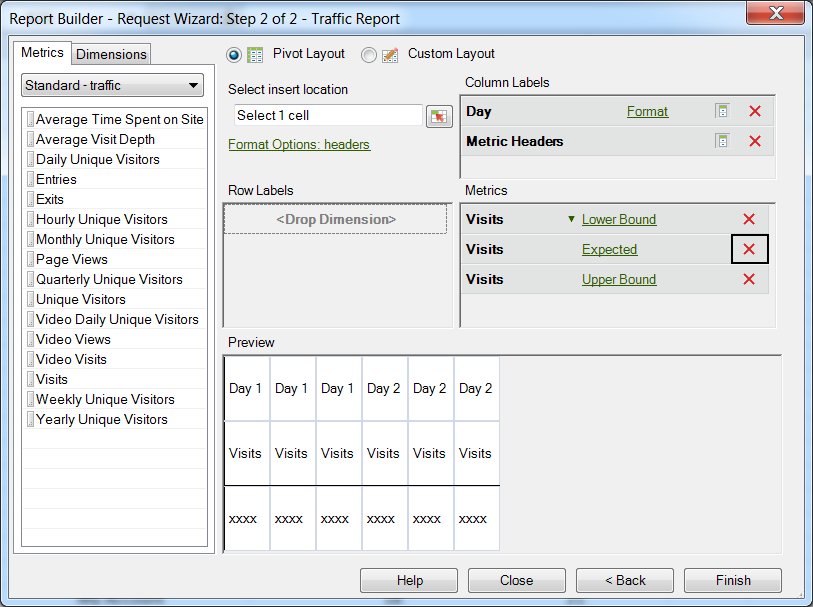

# Konfigurieren einer Anomalieerkennungsanforderung

{{legacy-arb}}

So erstellen Sie eine Anomalieerkennungsanfrage in Report Builder:

1. Wählen Sie einen Trendbericht aus, z. B. einen Bericht für **[!UICONTROL Site-Metriken]** > **[!UICONTROL Traffic]**.
1. Wählen Sie im Menü [!UICONTROL Granularität anwenden] den Eintrag **[!UICONTROL Tag]**.

   >[!NOTE]
   >
   >Das Menü [!UICONTROL Anomalieerkennung] ist nur verfügbar, wenn Sie als Granularität „Tag“ auswählen. Die Daten der letzten 30 Tage werden unabhängig vom gewählten Datumsbereich als Schulungszeitraum für statistische Daten verwendet.

1. Nach dem Konfigurieren der Datumsbereiche klicken Sie auf **[!UICONTROL Weiter]**.

   Im Anforderungs-Assistenten, Schritt 2 von 2, fügen Sie eine Metrik hinzu, z. B. **[!UICONTROL Besuche]**.

   Klicken Sie für die hinzugefügte Metrik auf den Link **[!UICONTROL Keine]**.

   

1. Wählen Sie **[!UICONTROL Anomalieerkennung]** > **[!UICONTROL `<selection>`]** aus.

   

   Wenn Sie eine dieser Optionen wählen, erstellt das System für die Anomalieerkennung Kopien der ursprünglichen Metrik. Beispielsweise wird für die Besuchsmetrik der Gruppe [!UICONTROL Metrik] eine Metrik für die Untergrenze von Besuchen hinzugefügt.
1. Klicken Sie auf **[!UICONTROL Fertigstellen]** und wählen Sie eine Zelle für die Ausgabe in Excel.

   Siehe [Anomalieerkennung](/help/analyze/analysis-workspace/c-anomaly-detection/anomaly-detection.md) für Definitionen.
