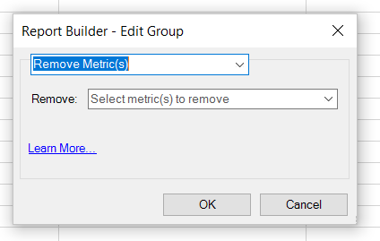

# Metriken mit Mehrfachanforderungen bearbeiten

{{legacy-arb}}

Hinzufügen, Entfernen oder Ersetzen von Metriken in einer bereits bestehenden Anforderung oder in einer Anforderungsgruppe.

## Kennzahlen hinzufügen {#section_3FBDA9668039404895059618D70FCBCD}

Beachten Sie beim Hinzufügen von Metriken die folgenden Richtlinien:

* Metriken können nur Anforderungen des Typs Pivot-Layout hinzugefügt werden.
Wenn einige der ausgewählten Anforderungen benutzerdefinierte Layouts sind, können keine Metriken hinzugefügt werden. Wenn das Layout angepasst wird, weiß der Report Builder nicht, wo im Arbeitsblatt die neue Metrik platziert werden soll.
* Wenn Sie nur benutzerdefinierte Layout-Anforderungen auswählen, ist die Option **[!UICONTROL Metriken hinzufügen]** nicht verfügbar.
* Das Hinzufügen von Metriken erhöht die Größe einer Anforderung und kann dazu führen, dass sie sich mit einer anderen Anforderung überschneidet. Achten Sie darauf, dass Ihre Anforderung rundherum ausreichend Platz zum Hinzufügen von Metriken hat.
* Wenn die hinzugefügte Metrik bereits in einer der ausgewählten Anforderungen vorhanden ist, wird sie dieser Anforderung nicht hinzugefügt.

Hinzufügen einer oder mehrerer Metriken

1. Wählen Sie mindestens eine Anforderung in Excel aus, klicken Sie mit der rechten Maustaste darauf und wählen Sie **[!UICONTROL Metriken bearbeiten]** aus. (Oder klicken Sie auf **[!UICONTROL Verwalten]** > **[!UICONTROL Mehrere bearbeiten]** > `<choose metric>` > **[!UICONTROL Gruppe bearbeiten]**, um die zu ändernde Anforderungsgruppe auszuwählen.)
1. Wählen Sie **[!UICONTROL Metrik(en) hinzufügen]** und danach die entsprechenden Metriken aus.

   

1. Aktualisieren Sie die Anforderung, um die tatsächlichen Daten anzuzeigen. Offline-Daten werden angezeigt, bis Sie die Daten aktualisieren.

## Metriken ersetzen

Beachten Sie beim Ersetzen von Metriken die folgenden Richtlinien:

* Nur 1:1-Substitutionen sind zulässig. 1:viele oder viele:1 sind nicht zulässig.
* Wenn die ausgewählte Metrik nicht in einer der ausgewählten Anforderungen vorhanden ist, bleibt die Anforderung unverändert.
* Die neue Metrik wird an derselben Stelle platziert wie die ersetzte Metrik.

   * Wenn in einem Pivot-Layout **Datums-, Besuchs-, Unique- und Tagesbesucher sowie *Besucher* durch den Umsatz *ersetzt werden, lautet das aktualisierte Anforderungslayout: Datum, Besuch, Umsatz und tägliche Eindeutigkeit.***
   * **In einem benutzerdefinierten Layout** zeigt das aktualisierte Anforderungslayout, wenn die Metrik *Besucher* in Zelle F11 ausgegeben wurde, den *Umsatz* in derselben Zelle F11.

* Wenn auf die ersetzte Metrik eine Operation angewendet wird (Durchschnitt, pre-pended text, post-pended text, microcharting), wird diese Operation auch auf die neue Metrik angewendet.

So ersetzen Sie eine Metrik:

1. Wählen Sie mindestens eine Anforderung in Excel aus, klicken Sie mit der rechten Maustaste darauf und wählen Sie **[!UICONTROL Metriken bearbeiten]** aus. Alternativ können Sie auf **[!UICONTROL Verwalten]** > **[!UICONTROL Mehrere Anforderungen bearbeiten]** > **`<choose metric>`** > **[!UICONTROL Gruppe bearbeiten]** klicken, um die zu ändernde Anforderungsgruppe auszuwählen.

1. Wählen Sie **[!UICONTROL Metrik ersetzen]** aus.

   

1. Wählen Sie die zu ersetzende Metrik und die Ersatzmetrik aus.
1. Aktualisieren Sie die Anforderung. Offline-Daten werden angezeigt, bis Sie die Daten aktualisieren.

## Kennzahlen entfernen {#section_D3CD5BAC7670416593B633B2B8423C60}

Beachten Sie beim Entfernen von Metriken die folgenden Richtlinien:

* Wenn eine der Metriken, die Sie zum Entfernen auswählen, nicht in einer der ausgewählten Anforderungen vorhanden ist, bleibt die Anforderung unverändert.
* Wenn Sie in einem Pivot-Layout eine Metrik entfernen, ändert sich das Layout für Metriken, die sich nach der entfernten Metrik befinden. Wenn beispielsweise eine Anforderung mit Pivot-Layout Datum, Besuche, Besucher und Unique Visitors pro Tag ausgibt und Sie *Besuche* entfernen, zeigt das aktualisierte Layout für die Anforderung Folgendes an: Datum, Besucher und Unique Visitors pro Tag.

So entfernen Sie Metriken

1. Wählen Sie mindestens eine Anforderung in Excel aus, klicken Sie mit der rechten Maustaste darauf und wählen Sie **[!UICONTROL Metriken bearbeiten]** aus. Klicken Sie alternativ auf **[!UICONTROL Verwalten]** > **[!UICONTROL Mehrere Anforderungen bearbeiten]** > **`<choose metric>`** > **[!UICONTROL Gruppe bearbeiten]** , um die zu ändernde Anforderungsgruppe auszuwählen.

1. Wählen Sie **[!UICONTROL Metrik(en) entfernen]**.

   

1. Wählen Sie mindestens eine Metrik aus, die aus der Anforderung entfernt werden soll.
1. Aktualisieren Sie die Anforderung. Die Offline-Daten werden so lange angezeigt, bis Sie eine Aktualisierung durchführen.
