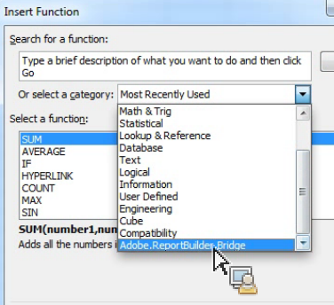
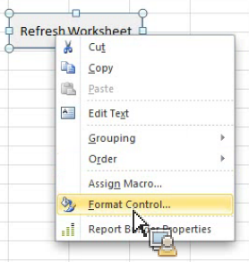

# Verwenden von Report Builder-Funktionen mit Microsoft Excel

{{legacy-arb}}

Sie können Report Builder-Funktionen verwenden, um auf Funktionen zuzugreifen, ohne auf die Report Builder-Benutzeroberfläche zuzugreifen.

Um beispielsweise Report Builder-Anfragen automatisch mit Eingabefiltern zu aktualisieren, die auf Daten basieren, die aus anderen Quellen in Excel abgerufen wurden, verwenden Sie die Zeichenfolge RefreshRequestsInCellsRange(..) Funktion. Alle Aufrufe sind asynchron und werden sofort zurückgegeben. Sie warten nicht auf die vollständige Ausführung.

**Anforderungen**

* Report Builder 5.0 (oder höher) ist erforderlich.

In der folgenden Tabelle sind die verfügbar gemachten Funktionen aufgeführt.

| Funktionsname | Typ | Beschreibung |
|:---| --- | ---|
| AsyncRefreshAll() | string | Aktualisiert alle in einer Arbeitsmappe vorhandenen Report Builder-Anforderungen. |
| AsyncRefreshRange(String rangeAddressInA1Format) | string | Aktualisiert alle Report Builder-Anforderungen in der angegebenen Zellbereichsadresse (ein Zeichenfolgenausdruck, der einen Zellbereich im A1-Format darstellt, z. B. „Sheet1!A2:A10„). |
| AsyncRefreshRangeAltTextParam() | string | Aktualisiert alle Report Builder-Anforderungen, die im angegebenen, über den Alternativtext des MS-Formularsteuerelements weitergeleiteten Zellenbereich vorhanden sind. |
| AsyncRefreshActiveWorksheet() | string | Aktualisiert alle im aktiven Arbeitsblatt vorhandenen Report Builder-Anforderungen. |
| AsyncRefreshWorksheet(Zeichenfolge, Arbeitsblattname) | string | Aktualisiert alle im angegebenen Arbeitsblatt vorhandenen Report Builder-Anforderungen (der Arbeitsblattname, wie er auf der Registerkarte angezeigt wird.) |
| AsyncRefreshWorksheetAltTextParam(); | string | Aktualisiert alle Report Builder-Anforderungen, die im angegebenen, über den Alternativtext des MS-Formularsteuerelements weitergeleiteten Arbeitsblattnamen vorhanden sind. |
| String GetLastRunStatus() | string | Gibt eine Zeichenfolge zurück, die den Status des letzten Durchgangs beschreibt. |

Um auf die Report Builder-Funktionen zuzugreifen, gehen Sie zu **[!UICONTROL Formeln]** > **[!UICONTROL Funktion einfügen]**. Verwenden Sie das Suchfeld, um nach einer Funktion zu suchen, oder wählen Sie eine Kategorie aus, um die Funktionen in dieser Kategorie aufzulisten.



## Beispiel {#section_034311081C8D4D7AA9275C1435A087CD}

Das folgende Beispiel zeigt *Wenn der Wert in Zelle P5 Text oder leer ist, aktualisieren Sie den Bereich in Zelle P9*.

```
=IF(OR(ISTEXT(P5),ISBLANK(P5)),AsyncRefreshRange("P9"),"")
```

## Verwenden von Report Builder-Funktionen mit Formatsteuerung {#section_26123090B5BD49748C8D8ED7A1C5ED84}

Sie können einem von Ihnen erstellten Steuerelement ein Makro zuweisen. Dieses Steuerelement kann eine Funktion sein, die eine Arbeitsmappenanfrage aktualisiert. Beispielsweise aktualisiert die Funktion „AsyncRefreshActiveWorksheet“ alle Anforderungen in einem Arbeitsblatt. Manchmal empfiehlt es sich jedoch, nur bestimmte Anforderungen zu aktualisieren.

1. Legen Sie den Makroparameter fest.
1. Klicken Sie mit der rechten Maustaste auf das Steuerelement und wählen Sie **[!UICONTROL Makro zuweisen]**.
1. Geben Sie den Report Builder-Funktionsnamen ein (keine Parameter oder Klammern).


## Übergeben von Parametern an Report Builder-Funktionen mithilfe der Formatsteuerung {#section_ECCA1F4990D244619DFD79138064CEF0}

Mit der Formatsteuerung können zwei Funktionen verwendet werden, die einen Parameter annehmen. Sie müssen das Feld **Alternativtext:** verwenden:

* AsyncRefreshRange(String rangeAddressInA1Format)
* AsyncRefreshWorksheet(Zeichenfolge, Arbeitsblattname)

So übergeben Sie Parameter mithilfe der Formatsteuerung an Report Builder-Funktionen

1. Klicken Sie mit der rechten Maustaste auf das Steuerelement und wählen Sie **[!UICONTROL Steuerelement formatieren]** aus.

   

1. Klicken Sie auf die **[!UICONTROL Alt-Text]**-Registerkarte.

   

1. Geben **[!UICONTROL unter „Alternativtext]** den Zellenbereich ein, den Sie aktualisieren möchten.
1. Öffnen Sie die Liste der Report Builder-Parameter unter **[!UICONTROL Formeln]** > **[!UICONTROL Funktion einfügen]**> **[!UICONTROL Adobe.ReportBuilder.Bridge]**.

1. Wählen Sie eine der beiden Funktionen aus, die auf AltTextParam enden, und klicken Sie auf **[!UICONTROL OK]**.
