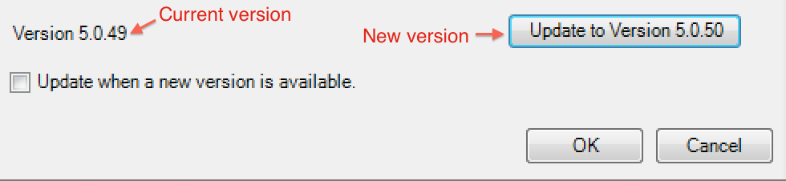

# Report Builder aktualisieren

{{legacy-arb}}

Beachten Sie beim Upgrade von Report Builder die folgenden Richtlinien:

* Die alte Version wird entfernt.

* Alle vorhandenen Berichte funktionieren weiterhin.

* Alle persönlichen Einstellungen, einschließlich der Authentifizierungseinstellungen, funktionieren weiterhin.

So aktualisieren Sie den Report Builder

1. Melden Sie sich bei der aktuellen Version von Report Builder an.
1. Navigieren Sie zum Menü **[!UICONTROL Optionen]**, um ein Upgrade auf die neueste Version durchzuführen. Ihre aktuelle Versionsnummer wird neben der Schaltfläche des Dialogfelds „Option“ angezeigt.

   

1. Wenn eine neue Version verfügbar ist, klicken Sie auf **[!UICONTROL Aktualisieren...]**. Die Schaltfläche zeigt an, auf welche Version Sie aktualisieren, z. B.: *Update auf Version 5.0.50*

   >[!NOTE]
   >
   >Wenn diese Schaltfläche ausgegraut ist, ist keine neue Version von Report Builder verfügbar.

1. (Optional) Aktivieren Sie das **[!UICONTROL Aktualisieren, wenn eine neue Version verfügbar ist]**. Auf diese Weise wird in Zukunft die Aktualisierung automatisch gestartet, sobald eine neue Version verfügbar ist.
1. Wenn der Setup-Bildschirm angezeigt wird, klicken Sie auf **[!UICONTROL Weiter >]**.

   

1. Melden Sie sich nach Abschluss des Upgrades wieder beim Report Builder an.

## Anleitung zur manuellen Aktualisierung {#section_27A0200010DC4747A718F1A65B180599}

Sie können die neueste Version von Report Builder immer von Adobe Analytics erhalten.

1. Melden Sie sich bei Adobe Analytics an und gehen Sie zu **[!UICONTROL Werkzeuge]**.
1. Klicken Sie auf **[!UICONTROL Report Builder]**.
1. Wählen Sie auf der Anzeige **[!UICONTROL Überblick]** entweder die 32-Bit- oder die 64-Bit-Version aus.
1. Klicken Sie auf **[!UICONTROL Jetzt herunterladen!]**
