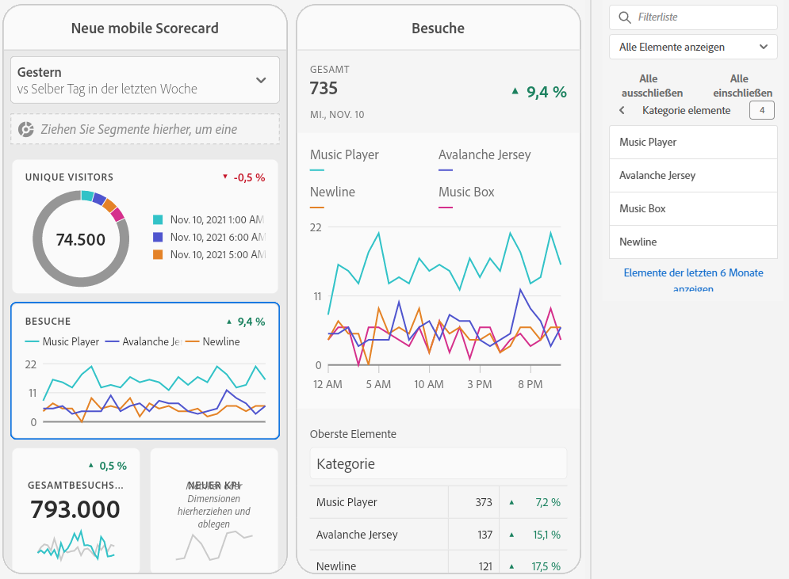
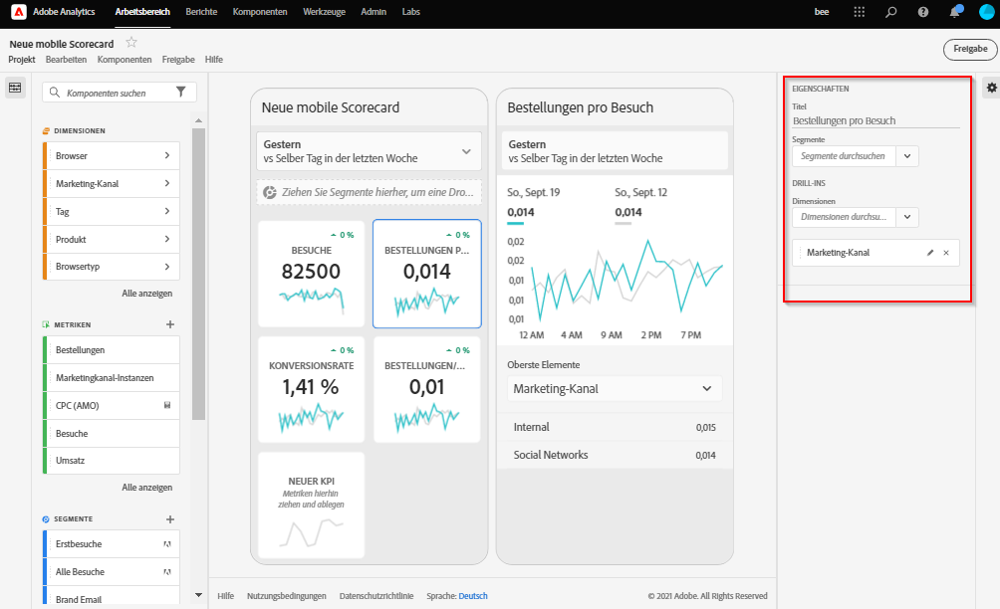

# Mobile-Scorecard erstellen

Die folgenden Informationen liefern Kuratoren von Adobe Analytics-Daten eine Anleitung dazu, wie sie Mobile-Scorecards für Führungskräfte konfigurieren und darstellen können. Sehen Sie sich zunächst das Video zu Scorecard Builder von Adobe Analytics-Dashboards an:

>[!VIDEO](https://video.tv.adobe.com/v/34544)

Eine Adobe Analytics Scorecard stellt wie nachfolgend gezeigt wichtige Datenvisualisierungen für ausführende Benutzer in einem gekachelten Layout bereit:

Als Kurator dieser Scorecard können Sie mit dem Scorecard Builder festlegen, welche Kacheln auf der Scorecard für den ausführenden Benutzer angezeigt werden. Sie können auch konfigurieren, wie die detaillierten Ansichten bzw. Aufschlüsselungen angepasst werden können, nachdem auf die Kacheln getippt wird. Hier sehen Sie die Scorecard Builder-Oberfläche:

Zur Erstellung der Scorecard führen Sie folgende Schritte aus:

1. Öffnen Sie die Vorlage für [!UICONTROL leere mobile Scorecards].
2. Konfigurieren Sie die Scorecard mit Daten und speichern Sie sie.

## Zugriff auf die Vorlage für [!UICONTROL leere mobile Scorecards] {#template}

Sie können die Vorlage [!UICONTROL Leere mobile Scorecard] öffnen, indem Sie entweder ein neues Projekt erstellen oder über das Menü „Tools“ zugreifen.

### Neues Projekt erstellen {#create}

1. Öffnen Sie Adobe Analytics und klicken Sie auf die Registerkarte **[!UICONTROL Arbeitsbereich]**.
1. Klicken Sie auf die Schaltfläche **[!UICONTROL Projekt erstellen]** und wählen Sie die Projektvorlage **[!UICONTROL Leere mobile Scorecard]** aus.
1. Klicken Sie auf **[!UICONTROL Erstellen]**.

### Tools-Menü

1. Wählen Sie im Menü **[!UICONTROL Tools]** die Option **[!UICONTROL Analytics-Dashboards (Mobile App)]** aus.
1. Klicken Sie im nachfolgenden Bildschirm auf **[!UICONTROL Neue Scorecard erstellen]**.

## Scorecard mit Daten konfigurieren und speichern {#configure}

So implementieren Sie die Scorecard-Vorlage:

1. Geben Sie unter **[!UICONTROL Eigenschaften]** (in der rechten Leiste) eine **[!UICONTROL Report Suite des Projekts]** an, aus der Sie Daten verwenden möchten.

   

1. Um Ihrer Scorecard eine neue Kachel hinzuzufügen, ziehen Sie eine Metrik aus dem linken Bereich und legen Sie sie im Bereich **[!UICONTROL Metriken hierher ziehen und ablegen]** ab. Sie können auch eine Metrik zwischen zwei Kacheln einfügen, indem Sie einen ähnlichen Workflow verwenden.

   

1. Von jeder Kachel aus können Sie auf eine Detailansicht zugreifen, die zusätzliche Informationen über die Metrik anzeigt, wie z. B. die obersten Elemente in einer Liste verwandter Dimensionen.

## Dimensionen oder Metriken hinzufügen {#dimsmetrics}

Um einer Metrik eine verwandte Dimension hinzuzufügen, ziehen Sie eine Dimension aus dem linken Bereich und legen Sie sie auf einer Kachel ab.

Sie können beispielsweise geeignete Dimensionen (wie **[!DNL Marketing Channel]** in diesem Beispiel) zur Metrik **[!UICONTROL Unique Visitors]** hinzufügen, indem Sie sie auf die Kachel ziehen und dort ablegen. Aufschlüsselungen von Dimensionen werden unter der [!UICONTROL Bohrinseln] Bereich der Detailfolienspezifisch **[!UICONTROL Eigenschaften]**. Sie können jeder Kachel mehrere Dimensionen hinzufügen.

## Segmente anwenden {#segments}

Um ein Segment auf einzelne Kacheln anzuwenden, ziehen Sie es aus dem linken Bereich und legen Sie es direkt auf der Kachel ab.

Wenn Sie das Segment auf alle Kacheln in der Scorecard anwenden möchten, legen Sie die Kachel oben auf der Scorecard ab. Sie können auch Segmente anwenden, indem Sie im Filtermenü unterhalb der Datumsbereiche Segmente auswählen. Sie [konfigurieren und wenden Filter für Ihre Scorecards](https://experienceleague.adobe.com/docs/analytics-learn/tutorials/analysis-workspace/using-panels/using-drop-down-filters.html?lang=de) genauso wie in Adobe Analytics Workspace an.

## Datumsbereiche hinzufügen {#dates}

Um Datumsbereichskombinationen, die in Ihrer Wertungsliste ausgewählt werden können, hinzuzufügen oder zu entfernen, wählen Sie die Dropdown-Liste „Datumsbereich“ aus.

Jede neue Scorecard Beginn mit 6 Datumsbereichskombinationen, die sich auf den Datumsbereich von heute und gestern konzentrieren. Sie können unnötige Datumsbereiche entfernen, indem Sie auf das „x“ klicken, oder Sie können jede Datumsbereichskombination durch Klicken auf den Stift bearbeiten.

Um ein Primärdatum zu erstellen oder zu ändern, wählen Sie über die Dropdown-Liste aus den verfügbaren Datumsbereichen aus oder ziehen Sie eine Datumskomponente aus der rechten Leiste in den Ablagebereich.

Um ein Vergleichsdatum zu erstellen, können Sie im Dropdown-Menü aus praktischen Voreinstellungen für gängige Zeitvergleiche auswählen. Sie können auch eine Datumskomponente aus der rechten Leiste ziehen und ablegen.

Wenn der gewünschte Datumsbereich noch nicht erstellt wurde, können Sie durch Klicken auf das Kalendersymbol einen neuen erstellen.

Dadurch gelangen Sie zum Generator für den Datumsbereich, in dem Sie eine neue Komponente für den Datumsbereich erstellen und speichern können.

## Visualisierungen anwenden {#viz}

Video zu Visualisierungen für Mobile-Scorecards ansehen:

>[!VIDEO](https://video.tv.adobe.com/v/337570/?quality=12&learn=on)

Analytics-Dashboards verfügen über vier Visualisierungen, die Ihnen einen nützlichen Einblick in Dimensionselemente und -metriken bieten. Wenn Sie eine andere Visualisierung anwenden möchten, ändern Sie den [!UICONTROL Diagrammtyp] in den [!UICONTROL Eigenschaften] einer Kachel. Wählen Sie einfach die rechte Kachel aus und ändern Sie dann den Diagrammtyp.

Oder klicken Sie auf das Symbol für [!UICONTROL Visualisierungen] in der linken Leiste und ziehen Sie die rechte Visualisierung per Drag &amp; Drop auf die Kachel:

### [!UICONTROL Zusammenfassungszahl]

Verwenden Sie die Visualisierung der Zusammenfassungsnummer, um eine große Zahl hervorzuheben, die in einem Projekt wichtig ist.

### [!UICONTROL Ringdiagramm]

Ähnlich einem Tortendiagramm zeigt diese Visualisierung die Daten als Teile oder Segmente eines Ganzen. Ein Ringdiagramm kann für den Vergleich der Teile eines Ganzen verwendet werden. Nehmen wir beispielsweise an, Sie möchten sehen, welche Anzeigenplattform zur Gesamtzahl der Unique Visitors beigetragen hat:

### [!UICONTROL Linie]

Die Linienvisualisierung stellt Metriken anhand einer Linie dar, die den Wertverlauf über einen bestimmten Zeitraum hinweg zeigt. Ein Liniendiagramm zeigt Dimensionen im Zeitverlauf an, funktioniert aber bei jeder Visualisierung. In diesem Beispiel visualisieren Sie die Dimension „Produktkategorie“.

### [!UICONTROL Horizontalbalken]

Diese Visualisierung zeigt Horizontalbalken, die verschiedene Werte aus einer oder mehreren Metriken darstellen. Verwenden Sie zum Beispiel [!UICONTROL Horizontalbalken] als bevorzugte Visualisierung, um ganz leicht zu erkennen, welches Ihre Top-Produkte sind.

### Entfernen Sie [!UICONTROL nicht angegebene] Dimensionselemente

Wenn Sie [!UICONTROL nicht angegebene] Dimensionselemente aus Ihren Daten entfernen möchten, gehen Sie wie folgt vor:

1. Wählen Sie die richtige Kachel aus.
1. Wählen Sie in der rechten Leiste unter **[!UICONTROL Drill-ins]** den Rechtspfeil neben dem Dimensionselement aus, für das Sie Elemente des Typs **[!UICONTROL Nicht angegeben]** entfernen möchten.

   

1. Klicken Sie auf das Symbol neben **[!UICONTROL Nicht angegeben]**, um nicht spezifizierte Daten aus Ihrem Reporting zu entfernen. (Sie können auch jedes andere Dimensionselement entfernen.)

## Kacheleigenschaften anzeigen und konfigurieren {#tiles}

Wenn Sie im Scorecard Builder auf eine Kachel klicken, zeigt die rechte Leiste die Eigenschaften und Eigenschaften an, die dieser Kachel und der zugehörigen Detailfolie zugeordnet sind. In dieser Leiste können Sie eine neue **Titel** für die Kachel und konfigurieren Sie alternativ die Kachel, indem Sie Segmente anwenden.

## Detailfolien anzeigen {#view-detail-slides}

Wenn Sie auf Kacheln klicken, wird in einem dynamischen Popup-Fenster angezeigt, wie die Detailfolie für ausführende Benutzer in der App angezeigt wird. Sie können Dimensionen hinzufügen, um Ihre Daten für Ihre spezifischen Anforderungen aufzuschlüsseln. Wenn keine Dimension angewendet wurde, wird die Aufschlüsselungsdimension **hour** oder **Tage**, abhängig vom Standarddatumsbereich.

Aufschlüsselungen verfeinern Ihre Analyse, indem sie die Metriken buchstäblich nach Dimensionselementen aufschlüsseln.

* Metrik „Unique Visitors“ aufgeschlüsselt nach Anzeigenplattform (AMO-ID)
* Besuche aufgeschlüsselt nach Produktkategorie (Einzelhandel)
* Gesamtumsatz aufgeschlüsselt nach Produktnamen

Jede der Detailfolie hinzugefügte Dimension wird in einer Dropdown-Liste in der Ansicht der Detailfolie in der App angezeigt. Der ausführende Benutzer kann dann aus den in der Dropdown-Liste aufgelisteten Optionen auswählen.

## Detailfolien anpassen {#customize-detail-slide}

Mit benutzerspezifischen Detailfolien können Sie noch zielgerichteter festlegen, welche Informationen Sie für Ihre Audience freigeben. Sie können das Layout für jede Detailfolie ändern und Text hinzufügen, um besser zu erklären, was der Endbenutzer in den Daten sehen kann. Sie können den Diagrammtyp auch über das Dropdown-Menü ändern.

### Layout der Folie ändern

Ändern Sie das Dialayout, um sich auf die wichtigsten Informationen zu konzentrieren. Sie können beispielsweise das Layout ändern, um nur ein Diagramm oder nur eine Tabelle anzuzeigen. Um das Dialayout zu ändern, wählen Sie eines der vordefinierten Formate aus.

Sie können das Dialayout auch ändern, indem Sie Visualisierungskomponenten aus der linken Leiste auf die Arbeitsfläche ziehen und dort ablegen. Jede Detailfolie darf nur zwei Visualisierungen gleichzeitig enthalten.

### Hinzufügen von beschreibendem Text zu einer Folie

Sie können Text hinzufügen, um aussagekräftige Informationen darüber bereitzustellen, was in den Diagrammen oder Nuancen zu den Daten enthalten ist.

Um einer Detailfolie Text hinzuzufügen, wählen Sie ein Layout aus, das die `T` oder ziehen Sie die Komponente Textvisualisierung aus der linken Leiste herüber. Der Texteditor wird automatisch geöffnet, wenn eine neue Textvisualisierung hinzugefügt oder ein Dialayout mit Text ausgewählt wird. Der Texteditor bietet alle Standardoptionen zur Formatierung Ihres Textes. Sie können Textstile wie Absätze, Überschriften und Unterüberschriften anwenden und eine fett gedruckte und kursiv gedruckte Schriftart anwenden. Sie können Text ausrichten, Listen mit Aufzählungszeichen und Nummerierungen hinzufügen und Links hinzufügen. Wenn Sie die Bearbeitung abgeschlossen haben, klicken Sie auf die Schaltfläche &quot;Minimieren&quot; in der oberen rechten Ecke des Texteditors, um sie zu schließen. Um bereits hinzugefügten Text zu bearbeiten, wählen Sie das Stiftsymbol aus, um den Texteditor erneut zu öffnen.

## Komponenten entfernen {#remove}

Um eine Komponente zu entfernen, die auf die gesamte Scorecard angewendet wird, klicken Sie auf eine beliebige Stelle außerhalb der Kacheln auf die Scorecard. Entfernen Sie die Komponente, indem Sie auf das **x** klicken, das angezeigt wird, wenn Sie den Mauszeiger über die Komponente bewegen, wie unten für das Segment **Erstbesuche** dargestellt:

## Vorschau der Scorecard {#preview}

Sie können eine Vorschau davon anzeigen, wie die Scorecard nach ihrer Veröffentlichung in der Analytics-Dashboards-App aussieht und funktioniert.

1. Klicken Sie auf **[!UICONTROL Vorschau]** in der rechten oberen Ecke des Bildschirms.

   

1. Um anzuzeigen, wie die Scorecard auf verschiedenen Geräten aussehen wird, wählen Sie ein Gerät aus dem Dropdown-Menü [!UICONTROL Gerätevorschau].

   

1. Um mit der Vorschau zu interagieren, haben Sie folgende Möglichkeiten:

   * Klicken Sie mit der linken Maustaste, um das Tippen auf den Bildschirm des Smartphones zu simulieren.

   * Verwenden Sie die Bildlauffunktion Ihres Computers, um das Scrollen auf dem Bildschirm des Smartphones mit Ihrem Finger zu simulieren.

   * Klicken und halten Sie, um das Drücken und Halten des Fingers auf dem Bildschirm des Smartphones zu simulieren. Dies ist für die Interaktion mit den Visualisierungen in der Detailansicht nützlich.

## Scorecard benennen {#name}

Um die Scorecard zu benennen, klicken Sie auf den Namensbereich in der oberen linken Ecke des Bildschirms und geben Sie den neuen Namen ein.

## Scorecard freigeben {#share}

So geben Sie die Scorecard für einen ausführenden Benutzer frei:

1. Klicken Sie auf das Menü **[!UICONTROL Freigeben]** und wählen Sie **[!UICONTROL Scorecard freigeben]**.

1. Füllen Sie die Felder im Formular **[!UICONTROL Mobile Scorecard freigeben]** aus, indem Sie:

   * den Namen der Scorecard angeben
   * eine Beschreibung der Scorecard angeben
   * relevante Tags hinzufügen
   * die Empfänger der Scorecard angeben

1. Klicken Sie auf **[!UICONTROL Freigabe]**.

Nachdem Sie eine Scorecard freigegeben haben, können die Empfänger in den Analytics-Dashboards darauf zugreifen. Wenn Sie in Scorecard Builder nachträgliche Änderungen an der Scorecard vornehmen, werden diese automatisch in der freigegebenen Scorecard aktualisiert. Ausführende Benutzer sehen die Änderungen, nachdem sie die Scorecard in ihrer App aktualisiert haben.

Wenn Sie die Scorecard durch Hinzufügen neuer Komponenten aktualisieren, sollten Sie die Scorecard erneut freigeben (und die Option zum **[!UICONTROL Freigeben eingebetteter Komponenten]** aktivieren), um sicherzustellen, dass die ausführenden Benutzer Zugriff auf diese Änderungen haben.
