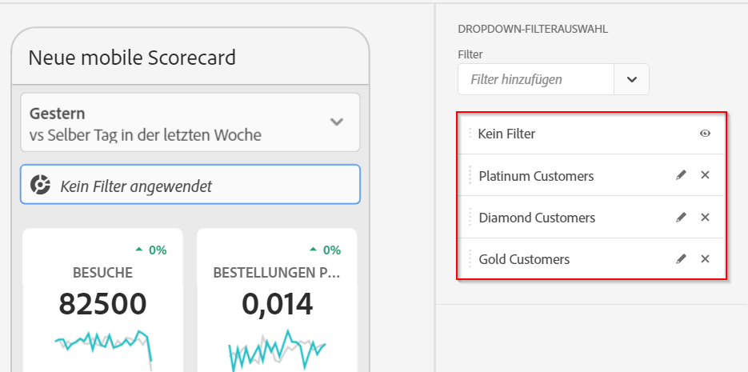
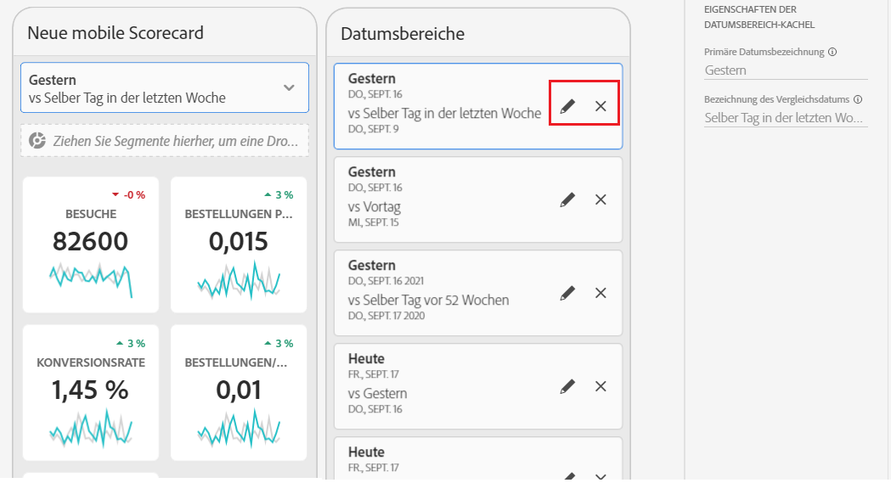
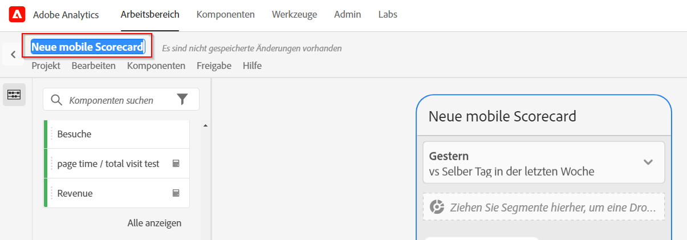

# Scorecard erstellen

Eine Adobe Analytics-Scorecard zeigt wichtige Datenvisualisierungen für ausführende Benutzer in einem gekachelten Layout an, wie unten dargestellt:

Als Kurator dieser Scorecard können Sie mit dem Scorecard Builder konfigurieren, welche Kacheln auf der Scorecard für Ihren ausführenden Verbraucher angezeigt werden. Sie können auch konfigurieren, wie die detaillierten Ansichten oder Aufschlüsselungen angepasst werden können, sobald auf die Kacheln getippt wird. Hier sehen Sie die Scorecard Builder-Oberfläche:

Zur Erstellung der Scorecard führen Sie folgende Schritte aus:

1. Zugriff auf die Vorlage für [!UICONTROL leere mobile Scorecards].
2. Konfigurieren Sie die Scorecard mit Daten und speichern Sie sie.

## Zugriff auf die Vorlage für [!UICONTROL leere mobile Scorecards]

Sie haben folgende Möglichkeiten, auf die Vorlage für [!UICONTROL leere mobile Scorecards] zuzugreifen:

**Neues Projekt erstellen**

1. Öffnen Sie Adobe Analytics und klicken Sie auf die Registerkarte **[!UICONTROL Workspace]**.
1. Klicken Sie auf **[!UICONTROL Projekt]** erstellen und wählen Sie die Projektvorlage **[!UICONTROL Leere mobile Scorecard]** aus.
1. Klicken Sie auf **[!UICONTROL Erstellen]**.

Oder

1. Gehen Sie ins Menü **[!UICONTROL Tools]** und wählen Sie **[!UICONTROL Analytics-Dashboards (Smartphone und Tablet)]** aus. 
1. Klicken Sie im nachfolgenden Bildschirm auf den Button **[!UICONTROL Neue Scorecard erstellen]**.

## Scorecard mit Daten konfigurieren und speichern

So implementieren Sie die Scorecard-Vorlage:

1. Geben Sie unter **[!UICONTROL Eigenschaften]** (in der rechten Leiste) eine **[!UICONTROL Report Suite des Projekts]** an, aus der Sie Daten verwenden möchten.

   

1. Um Ihrer Scorecard eine neue Kachel hinzuzufügen, ziehen Sie eine Metrik aus dem linken Bereich und legen Sie sie im Bereich **[!UICONTROL Metriken hierher ziehen und ablegen]** ab. Sie können auch eine Metrik zwischen zwei Kacheln einfügen, indem Sie einen ähnlichen Workflow verwenden.

   

   *Von jeder Kachel aus können Sie auf eine Detailansicht zugreifen, die zusätzliche Informationen über die Metrik anzeigt, wie z. B. die obersten Elemente in einer Liste verwandter Dimensionen.*

1. Um einer Metrik eine verwandte Dimension hinzuzufügen, ziehen Sie eine Dimension aus dem linken Bereich und legen Sie sie auf einer Kachel ab. Sie können beispielsweise geeignete Dimensionen (wie **[!DNL DMA Region]** in diesem Beispiel) zur Metrik **[!UICONTROL Unique Visitors]** hinzufügen, indem Sie sie auf die Kachel ziehen und dort ablegen. Dimensionen, die Sie hinzufügen, werden im Aufschlüsselungsabschnitt der kachelspezifischen **[!UICONTROL Eigenschaften]** angezeigt. Sie können jeder Kachel mehrere Dimensionen hinzufügen.

   

   Wenn Sie im Scorecard Builder auf eine Kachel klicken, zeigt die rechte Leiste die Eigenschaften und Merkmale an, die mit dieser Kachel verbunden sind. In dieser Leiste können Sie einen neuen **[!UICONTROL Titel]** für die Kachel angeben und alternativ die Kachel konfigurieren, indem Sie Komponenten angeben, anstatt sie aus der linken Leiste zu ziehen und abzulegen.

   

   Wenn Sie auf Kacheln klicken, wird in einem dynamischen Popup angezeigt, wie die Aufschlüsselungsansicht für ausführende Benutzer in der App dargestellt wird. Wenn keine Dimension auf die Kachel angewendet wurde, werden je nach Standarddatumsbereich entweder **Stunden** oder **Tage** als Aufschlüsselungsdimension verwendet.

   

   Jede der Kachel hinzugefügte Dimension wird in einer Dropdown-Liste in der Detailansicht der App angezeigt. Der ausführende Benutzer kann dann aus den in der Dropdown-Liste aufgelisteten Optionen auswählen.

1. Um ein Segment auf einzelne Kacheln anzuwenden, ziehen Sie es aus dem linken Bereich und legen Sie es direkt auf der Kachel ab. Wenn Sie das Segment auf alle Kacheln in der Scorecard anwenden möchten, legen Sie die Kachel oben auf der Scorecard ab. Sie können auch Segmente anwenden, indem Sie im Filtermenü unterhalb der Datumsbereiche Segmente auswählen. Sie [konfigurieren und wenden Filter für Ihre Scorecards](https://experienceleague.adobe.com/docs/analytics-learn/tutorials/analysis-workspace/using-panels/using-drop-down-filters.html?lang=de) genauso wie in Adobe Analytics Workspace an.

   

1. Um eine Komponente zu entfernen, die auf die gesamte Scorecard angewendet wird, klicken Sie auf eine beliebige Stelle außerhalb der Kacheln auf die Scorecard. Entfernen Sie die Komponente, indem Sie auf das **x** klicken, das angezeigt wird, wenn Sie den Mauszeiger über die Komponente bewegen, wie unten für das Segment **Erstbesuche** dargestellt:

   

1. Um Datumsbereichskombinationen, die in Ihrer Wertungsliste ausgewählt werden können, hinzuzufügen oder zu entfernen, wählen Sie die Dropdown-Liste „Datumsbereich“ aus.

   

   Jede neue Scorecard Beginn mit 6 Datumsbereichskombinationen, die sich auf den Datumsbereich von heute und gestern konzentrieren. Sie können unnötige Datumsbereiche entfernen, indem Sie auf das „x“ klicken, oder Sie können jede Datumsbereichskombination durch Klicken auf den Stift bearbeiten.

   

   Um ein Primärdatum zu erstellen oder zu ändern, wählen Sie über die Dropdown-Liste aus den verfügbaren Datumsbereichen aus oder ziehen Sie eine Datumskomponente aus der rechten Leiste in den Ablagebereich.

   

   Um ein Vergleichsdatum zu erstellen, können Sie im Dropdown-Menü aus praktischen Voreinstellungen für gängige Zeitvergleiche auswählen. Sie können auch eine Datumskomponente aus der rechten Leiste ziehen und ablegen.

   

   Wenn der gewünschte Datumsbereich noch nicht erstellt wurde, können Sie durch Klicken auf das Kalendersymbol einen neuen erstellen.

   

1. Dadurch gelangen Sie zum Generator für den Datumsbereich, in dem Sie eine neue Komponente für den Datumsbereich erstellen und speichern können. Um die Scorecard zu benennen, klicken Sie auf den Namensbereich in der oberen linken Ecke des Bildschirms und geben Sie den neuen Namen ein.

   

## Scorecard freigeben

So geben Sie die Scorecard für einen ausführenden Benutzer frei:

1. Klicken Sie auf das Menü **[!UICONTROL Freigeben]** und wählen Sie **[!UICONTROL Scorecard freigeben]**.

1. Füllen Sie die Felder im Formular **[!UICONTROL Mobile Scorecard freigeben]** aus, indem Sie:

   * den Namen der Scorecard angeben
   * eine Beschreibung der Scorecard angeben
   * relevante Tags hinzufügen
   * die Empfänger der Scorecard angeben

1. Klicken Sie auf **[!UICONTROL Freigabe]**.

Nachdem Sie eine Scorecard freigegeben haben, können Ihre Empfänger in ihren Analytics-Dashboards darauf zugreifen. Wenn Sie nachfolgende Änderungen an der Scorecard im Scorecard Builder vornehmen, werden diese automatisch in der freigegebenen Scorecard aktualisiert. Ausführende Benutzer sehen die Änderungen, nachdem sie die Scorecard in ihrer App aktualisiert haben.

Wenn Sie die Scorecard durch Hinzufügen neuer Komponenten aktualisieren, sollten Sie die Scorecard erneut freigeben (und die Option zum **[!UICONTROL Freigeben eingebetteter Komponenten]** aktivieren), um sicherzustellen, dass die ausführenden Benutzer Zugriff auf diese Änderungen haben.