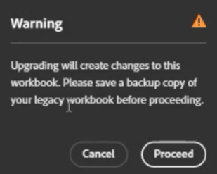

# Alte Report Builder-Arbeitsmappen in Datenblöcke konvertieren

Im Zuge der Umstellung auf eine neue Report Builder-Technologie können Sie Ihre aktuellen alten Arbeitsmappen schnell in JavaScript-basierte Arbeitsmappen konvertieren.

>[!IMPORTANT]
>
>Duplizieren Sie jede Arbeitsmappe und benennen Sie eine Version um, bevor Sie sie konvertieren. Auf diese Weise haben Sie immer noch eine Kopie der ursprünglichen Arbeitsmappe, falls Sie sie benötigen sollten.

>[!VIDEO](https://video.tv.adobe.com/v/3434957/?quality=12&learn=on)

1. Richten Sie den neuen Report Builder ein[ indem Sie die folgenden Anweisungen ](/help/analyze/report-builder/report-builder-setup.md).

1. Öffnen Sie Excel und klicken Sie oben rechts auf das Adobe Report Builder-Symbol .

1. Klicken Sie **[!UICONTROL Anmelden]** und melden Sie sich beim Report Builder an.

1. Das Report Builder-Add-in erkennt, ob diese Arbeitsmappe [Legacy-Report Builder ](/help/analyze/legacy-report-builder/home.md)-Anfragen enthält.

   

1. Wenn eine oder mehrere ältere Anforderungen gefunden werden, klicken Sie auf **[!UICONTROL Aktualisieren]**, um eine Arbeitsmappe zu aktualisieren.

   >[!NOTE]
   >
   >Sie müssen jede Anfrage einzeln aktualisieren. Massenaktualisierung wird nicht unterstützt.

1. Es wird eine Warnung angezeigt, die Sie auf Änderungen an der Arbeitsmappe hinweist, wenn Sie eine Aktualisierung durchführen. Außerdem werden Sie aufgefordert, eine Sicherungskopie Ihrer alten Arbeitsmappe zu erstellen, bevor Sie fortfahren.

   

1. Klicken Sie **[!UICONTROL Fortfahren]**, um mit dem Upgrade fortzufahren.

   Wenn das Upgrade erfolgreich durchgeführt wurde, wird die folgende Benachrichtigung angezeigt:

   

1. (Optional) Klicken Sie auf **[!UICONTROL Upgrade-Bericht herunterladen]**. Dieser Bericht enthält den Status für jeden Datenblock, der aktualisiert wurde.

Sie können [den Datenblock verwalten](/help/analyze/report-builder/manage-reportbuilder.md).

## Funktionen älterer Report Builder werden im neuen Report Builder nicht unterstützt {#unsupported}

Beim Vergleich der Funktionalität von Legacy-Report Builder mit dem neuen Report Builder-Add-in sind einige Legacy-Funktionen nicht mehr verfügbar:

- Echtzeit-Anfragen

- Pfad-/Fallout-Berichte

- FTP-Option für terminierte Berichte

- Besuchermetriken. Die folgenden Metriken werden alle in „Unique Visitors“ konvertiert, obwohl das Berichtsergebnis möglicherweise keine exakte Übereinstimmung aufweist: `visitorshourly`, `visitorsdaily`, `visitorsweekly`, `visitorsmonthly`, `visitorsquarterly` und `visitorsyearly`. Dies gilt auch für `mobilevisitorshourly`, `mobilevisitorsdaily`, `mobilevisitorsweekly`, `mobilevisitorsmonthly`, `mobilevisitorsquarterly` und `mobilevisitorsyearly`.

## Planen einer konvertierten Arbeitsmappe {#schedule}

Siehe [Planen einer konvertierten Arbeitsmappe](/help/analyze/report-builder/schedule-reportbuilder.md) im Artikel Planung .