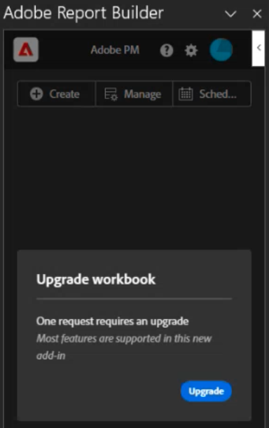

# Alte Report Builder-Arbeitsmappen in Datenbanksperren konvertieren

Im Rahmen der Umstellung auf eine neue Report Builder-Technologie können Sie Ihre aktuellen alten Arbeitsmappen schnell in Javascript-basierte Arbeitsmappen konvertieren.

>[!IMPORTANT]
>
>Duplizieren Sie jede Arbeitsmappe und benennen Sie eine Version um, bevor Sie sie konvertieren. Auf diese Weise erhalten Sie bei Bedarf weiterhin eine Kopie der ursprünglichen Arbeitsmappe.

>[!VIDEO](https://video.tv.adobe.com/v/3434957/?quality=12&learn=on)

1. Richten Sie den neuen Report Builder ein, indem Sie [diese Anweisungen befolgen](/help/analyze/report-builder/report-builder-setup.md).

1. Öffnen Sie Excel und klicken Sie oben rechts auf das Adobe Report Builder -Symbol.

1. Klicken Sie auf **[!UICONTROL Anmelden]** und melden Sie sich bei Report Builder an.

1. Das Report Builder-Add-in erkennt, ob diese Arbeitsmappe [Legacy Report Builder](/help/analyze/legacy-report-builder/home.md) -Anforderungen enthält.

   

1. Wenn eine oder mehrere ältere Anforderungen gefunden werden, klicken Sie auf **[!UICONTROL Aktualisieren]** , um eine Arbeitsmappe zu aktualisieren.

   >[!NOTE]
   >
   >Sie müssen jede Anfrage einzeln aktualisieren. Eine Massenaktualisierung wird nicht unterstützt.

1. Es wird ein Warnhinweis angezeigt, der Sie auf Änderungen an der Arbeitsmappe hinweist, wenn Sie ein Upgrade durchführen. Sie werden außerdem dringend aufgefordert, eine Sicherungskopie Ihrer alten Arbeitsmappe zu erstellen, bevor Sie fortfahren.

   

1. Klicken Sie auf **[!UICONTROL Fortfahren]** , um mit der Aktualisierung fortzufahren.

   Wenn das Upgrade erfolgreich durchgeführt wurde, wird der folgende Fertigstellungshinweis angezeigt:

   

1. (Optional) Klicken Sie auf **[!UICONTROL Aktualisierungsbericht herunterladen]**. Dieser Bericht enthält den Status jedes aktualisierten Datenblocks.

Sie können jetzt [den Datenblock](/help/analyze/report-builder/manage-reportbuilder.md) verwalten.

## In New Report Builder nicht unterstützte ältere Report Builder-Funktionen

Beim Vergleich der Funktionalität von Legacy Report Builder mit dem neuen Report Builder-Add-in sind einige ältere Funktionen nicht mehr verfügbar:

- Echtzeitanforderungen

- Pfad-/Fallout-Reporting

- FTP-Option für terminierte Berichte

- Besuchermetriken. Die folgenden Metriken werden in &quot;Unique Visitors&quot;konvertiert, auch wenn das Berichterstellungsergebnis möglicherweise nicht exakt übereinstimmt: `visitorshourly`, `visitorsdaily`, `visitorsweekly`, `visitorsmonthly`, `visitorsquarterly` und `visitorsyearly`. Dies gilt auch für `mobilevisitorshourly`, `mobilevisitorsdaily`, `mobilevisitorsweekly`, `mobilevisitorsmonthly`, `mobilevisitorsquarterly` und `mobilevisitorsyearly`.
