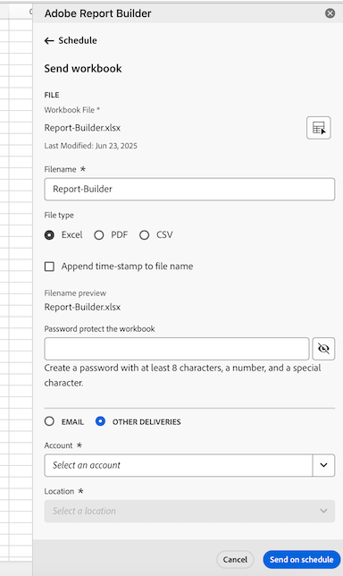

# Erstellen von Zeitplänen für Arbeitsmappen durch Exportieren in Cloud-Ziele

Sie können Customer Journey Analytics-Arbeitsmappen aus Report Builder an Cloud-Anbieter wie Google, Azure und Amazon exportieren.

[Der Export von Berichten aus Report Builder in die Cloud bietet ](#advantages-of-exporting-to-the-cloud) die Möglichkeit, Berichte in Tools von Drittanbietern zu verwenden oder sie mit externen Daten zu kombinieren.

Bevor Sie Arbeitsmappen aus Report Builder in ein Cloud-Ziel exportieren, stellen Sie sicher, dass Ihre Datenblöcke, Ihre Umgebung und Ihre Berechtigungen die [Exportanforderungen“ ](#export-requirements).

## Grundlegendes zum Exportprozess

Verwenden Sie den folgenden Prozess beim Exportieren von Arbeitsmappen aus Report Builder in die Cloud:

1. [Konfigurieren eines Cloud-Kontos](/help/components/locations/configure-import-accounts.md)

1. [Konfigurieren eines Speicherorts für das Konto](/help/components/locations/configure-import-locations.md)

1. [Exportieren eines Berichts aus Report Builder](#export-a-report-from-report-builder)

1. Zugreifen auf Daten in Ihrem Cloud-Konto und [Verwalten von Exporten in Adobe](/help/components/locations/configure-import-locations.md)

## Exportieren eines Berichts aus Report Builder

>[!NOTE]
>
>Bevor Sie Daten exportieren, wie in diesem Abschnitt beschrieben, erfahren Sie [ Abschnitt über den ](#understand-the-export-process) .

So exportieren Sie Berichte aus Report Builder:

1. Falls noch nicht geschehen, konfigurieren Sie ein Exportkonto und einen Speicherort, wie unter [Konfigurieren von Cloud-Exportkonten](/help/components/locations/configure-import-accounts.md) beschrieben.

1. Öffnen Sie in der Excel-Tabelle, die die zu exportierenden Daten enthält, das rechte Bedienfeld {**[!UICONTROL }Adobe Report Builder.]**

1. Wählen Sie [!UICONTROL **Zeitplan**] aus.

1. Wählen Sie auf **[!UICONTROL Registerkarte]** das Pluszeichen, um einen neuen Zeitplan zu erstellen

   Oder

   Um die Arbeitsmappe nach einem Zeitplan zu exportieren, den Sie bereits erstellt haben, wählen Sie den Zeitplan aus der Liste der Zeitpläne aus und klicken Sie auf **[!UICONTROL Planmäßig senden]**.

1. Geben Sie im rechten Bedienfeld [!UICONTROL **0}Adobe Report Builder&quot; die folgenden Informationen an, um mit der Erstellung eines neuen Zeitplans fortzufahren:**]

   

   | Feldname | Funktion |
   |---------|----------|
   | **[!UICONTROL Datei]** | Zeigt die Arbeitsmappe an, die derzeit für den Export ausgewählt ist. Wählen Sie das Arbeitsmappen-Symbol  neben dem Dateinamen aus, um die aktuelle Arbeitsmappe auszuwählen, falls diese noch nicht ausgewählt ist. |
   | **[!UICONTROL Dateiname]** <!--should be File name --> | Ermöglicht es Ihnen, den Dateinamen vor dem Exportieren der Arbeitsmappe zu ändern.
Der Dateiname der Arbeitsmappe entspricht standardmäßig dem Namen der Arbeitsmappe
 |
   | **[!UICONTROL Dateityp]** | Wählen Sie den Dateityp für die exportierte Datei. Sie können zwischen Excel, PDF oder CSV wählen. 
Beachten Sie bei Auswahl **[!UICONTROL CSV]**, dass die geplante Arbeitsmappe als ZIP-Anlage gesendet wird. Einige E-Mail-Administratoren in Unternehmen blockieren möglicherweise E-Mails mit ZIP-Anhängen. Dementsprechend wird eine Warnung angezeigt.
 |
   | **[!UICONTROL Zeitstempel an Dateinamen anhängen]** | Wählen Sie diese Option aus, um einen Zeitstempel an den Dateinamen anzuhängen, um das Datum der Aktualisierung der Arbeitsmappe anzugeben. Ein Zeitstempel ist hilfreich, um zu sehen, welche Version einer Arbeitsmappe an einem bestimmten Datum gesendet wurde. Wenn diese Option aktiviert ist, können Sie zwischen folgenden Optionen wählen: |
   | **[!UICONTROL Dateinamenvorschau]** <!--should be File name preview --> | Zeigt eine Vorschau davon an, wie der Dateiname nach dem Export angezeigt wird. |
   | **[!UICONTROL Passwortschutz für die Arbeitsmappe]** | Geben Sie ein Kennwort zum Schützen der exportierten Datei an, damit nur Benutzer mit dem Kennwort darauf zugreifen können. 
Kennwörter müssen mindestens 8 Zeichen lang sein und mindestens 1 Zahl und 1 Sonderzeichen enthalten (z. B. `!`, `@`, `#` und `$`).
 |
   | **[!UICONTROL E-Mail]** | Wählen Sie diese Option, um die Datei an eine bestimmte E-Mail-Adresse zu senden. Weitere Informationen finden Sie unter &quot;[ von Arbeitsmappen durch Freigabe per E-Mail](schedule-reportbuilder.md). |
   | **[!UICONTROL Andere Sendungen]** | Wählen Sie diese Option aus, um die Datei an ein Cloud-Konto zu senden, und verwenden Sie dann die Dropdown-Menüs **[!UICONTROL Konto]** und **[!UICONTROL Speicherort]**, die unten beschrieben werden, um das Konto und den Speicherort auszuwählen. |
   | **[!UICONTROL Konto]** | Wählen Sie das Cloud-Exportkonto aus, an das die Daten gesendet werden sollen. 
Wenn Sie noch kein Cloud-Konto konfiguriert haben, das Sie verwenden möchten, können Sie auch ein neues Konto konfigurieren:<ol><li>Wählen Sie [!UICONTROL **Konto hinzufügen**] aus und geben Sie dann die folgenden Informationen an:<ul><li>[!UICONTROL **Name des Standortkontos**]: Geben Sie einen Namen für das Standortkonto an. Dieser Name wird beim Erstellen eines Speicherorts angezeigt. </li><li>[!UICONTROL **Beschreibung des Standortkontos**]: Geben Sie eine kurze Beschreibung des Kontos ein, um es von anderen Konten desselben Kontotyps zu unterscheiden.</li><li>**[!UICONTROL Konto für alle Benutzer in Ihrer Organisation verfügbar machen]**: Wählen Sie diese Option, um anderen Benutzern in Ihrer Organisation die Verwendung des Kontos zu ermöglichen. Beachten Sie bei der Freigabe von Kontos Folgendes:<ul><li>Die Freigabe von Konten, die von Ihnen freigegeben wurden, kann nicht aufgehoben werden.</li><li>Freigegebene Konten können nur vom Kontoinhaber bearbeitet werden.</li><li>Alle Personen können einen Speicherort für das freigegebene Konto erstellen.</li></ul></li><li>[!UICONTROL **Kontotyp**]: Wählen Sie den Typ des Cloud-Kontos aus, in das Sie exportieren. Verfügbare Kontotypen sind Amazon S3 Role ARN, Google Cloud Platform, Azure SAS und Azure RBAC.</li></ul><li>Um die Konfiguration Ihres Kontos abzuschließen, fahren Sie mit Schritt 6 in [Konfigurieren von Cloud-Import- und -](/help/components/locations/configure-import-accounts.md)) fort und erweitern Sie dann den Abschnitt, der dem ausgewählten [!UICONTROL **Kontotyp**] entspricht. 
Die folgenden Kontotypen sind verfügbar:
<ul><li>Amazon S3 Role ARN</li><li>Google Cloud Platform</li><li>Azure SAS</li><li>Azure RBAC</li></ul></ol> |
   | **[!UICONTROL Ort]** | Wählen Sie den Speicherort in dem Konto aus, an den die Exportdaten gesendet werden sollen.
Falls Sie den Speicherort, den Sie für das ausgewählte Konto verwenden möchten, noch nicht konfiguriert haben, können Sie auch einen neuen Speicherort konfigurieren:<ol><li>Wählen Sie [!UICONTROL **Speicherort hinzufügen**] aus und geben Sie dann die folgenden Informationen an: <ul><li>[!UICONTROL **Name:**] Der Name des Speicherorts.</li><li>[!UICONTROL **Beschreibung**]: Geben Sie eine kurze Beschreibung des Speicherorts an, um ihn von anderen Speicherorten im Konto zu unterscheiden.</li><li>**[!UICONTROL Standort für alle Benutzer in Ihrer Organisation verfügbar machen]**: Wählen Sie diese Option, um anderen Benutzern in Ihrer Organisation die Verwendung des Standorts zu ermöglichen. Beachten Sie bei der Freigabe von Kontos Folgendes:<ul><li>Die Freigabe von Speicherorten, die Sie freigeben, kann nicht aufgehoben werden.</li><li>Freigegebene Speicherorte können nur vom Kontoinhaber bearbeitet werden.</li><li>Standorte können nur freigegeben werden, wenn das Konto, mit dem der Standort verknüpft ist, auch freigegeben ist.</li></ul></li><li>[!UICONTROL **Standortkonto**]: Wählen Sie das Konto aus, in dem Sie den Speicherort erstellen möchten.</li></ul><li>Um die Konfiguration Ihres Speicherorts abzuschließen, fahren Sie mit dem untenstehenden Link fort, der dem Kontotyp entspricht, den Sie im Feld [!UICONTROL **Standortkonto**] ausgewählt haben:<ul><li>[Amazon S3 Role ARN](/help/components/locations/configure-import-locations.md#amazon-s3-role-arn)</li><li>[Google Cloud Platform](/help/components/locations/configure-import-locations.md#google-cloud-platform)</li><li>[Azure SAS](/help/components/locations/configure-import-locations.md#azure-sas)</li><li>[Azure RBAC](/help/components/locations/configure-import-locations.md#azure-rbac)</li></ul> |
   | **[!UICONTROL Planungsoptionen anzeigen]** | Wählen Sie diese Option aus, um zusätzliche Optionen für die Planung des Exports anzuzeigen. Lassen Sie diese Option deaktiviert, wenn der Export nur einmal gesendet werden soll. Wenn diese Option deaktiviert ist, wird der Export sofort gestartet. |
   | **[!UICONTROL Start am]** | Der Tag und die Uhrzeit, an dem bzw. zu der der geplante Export beginnen soll. 
Diese Option ist nur bei Auswahl einer Häufigkeit für den geplanten Export verfügbar.
 |
   | **[!UICONTROL Endet am]** | Der Tag und die Uhrzeit, an dem bzw. zu der der geplante Export abläuft. Der geplante Export wird nach dem von Ihnen festgelegten Datum und der von Ihnen festgelegten Uhrzeit nicht mehr ausgeführt. 
Diese Option ist nur bei Auswahl einer Häufigkeit für den geplanten Export verfügbar.
 |
   | **[!UICONTROL Häufigkeit]** | Sie können die Häufigkeit auf stündlich, täglich, wöchentlich, monatlich oder jährlich an einem bestimmten Tag einstellen. Sie können beispielsweise einen Zeitplan einrichten, um die Arbeitsmappe am ersten Sonntagabend des Monats zu senden, sodass Ihre Empfänger und Empfängerinnen die E-Mail am Montagmorgen in ihrem Posteingang haben. |

   {style="table-layout:auto"}

1. Wählen Sie [!UICONTROL **Planmäßig senden**], um die Arbeitsmappe zu exportieren.

   Die Daten werden mit der von Ihnen angegebenen Häufigkeit an das von Ihnen angegebene Cloud-Konto gesendet.

## Vorteile des Exports in die Cloud

Das Exportieren von Adobe Analytics-Daten in die Cloud ermöglicht Ihnen Folgendes:

* Exportieren Sie an einen freigegebenen Speicherort, z. B. Google Cloud Platform, Microsoft Azure und Amazon S3.

* Speichern Sie große Mengen historischer Daten.

  Diese Art von Daten kann verwendet werden, um langfristige Trends zu erkennen, um Business Intelligence zu erhalten und letztendlich zu einer besseren geschäftlichen Entscheidungsfindung zu führen.

* Schließen Sie berechnete Metriken in die exportierten Adobe Analytics-Daten ein.

* Strukturieren Sie die Datenausgabe als verkettete Werte.

* Einmalige oder geplante Exporte

* Exportieren Sie Dateien im Excel-, PDF- oder CSV-Format.

* Datenblöcke mit mehreren Dimensionen exportieren

## Exportanforderungen {#export-requirements}

### Mindestanforderungen

Stellen Sie sicher, dass Ihre Datenblöcke, Ihre Umgebung und Ihre Berechtigungen die folgenden Anforderungen erfüllen:

* **Datenblöcke:** Alle Datenblöcke müssen mindestens eine Komponente zu einer Spalte, Zeile oder einem Wert enthalten.

* **Umgebung:** Stellen Sie sicher, dass [IP-Adressen](/help/technotes/ip-addresses.md) und [Domains](/help/technotes/domains.md), die von Adobe Analytics verwendet werden, durch die Firewall ihrer Organisation zugelassen werden.
