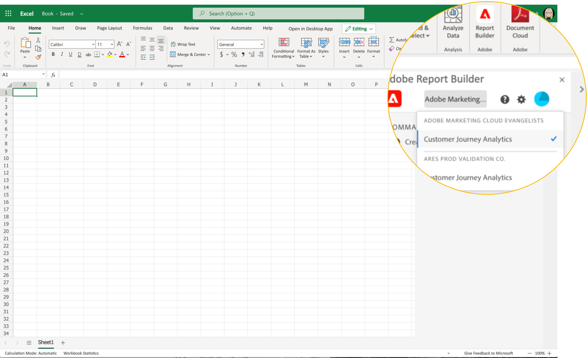

# Einrichten von Report Builder

Über das Excel-Add-in-Menü können Sie schnell auf Report Builder zugreifen.

## Voraussetzungen

Report Builder für Adobe Analytics wird von den folgenden Betriebssystemen und Webbrowsern unterstützt.

### macOS

- macOS-Version 10.x oder höher
- Alle Microsoft Excel-Versionen

### Windows

- Windows 10 Version 1904 oder höher
- Excel-Version 2106 oder höher

  Alle Windows-Desktop-Excel-Benutzer müssen Microsoft Edge Webview2 installieren, um das Add-in verwenden zu können. So installieren Sie den Controller:

   1. Öffnen von <https://aka.ms/webview2installer>.
   1. Wählen Sie das Evergreen Standalone-Installationsprogramm aus und laden Sie es herunter.
   1. Folgen Sie den Anweisungen bei der Installation.

### Web Office

- Unterstützt alle Browser und Versionen

## Report Builder Excel-Add-in

Sie müssen das Excel-Add-in für Report Builder installieren, um Report Builder für Adobe Analytics verwenden zu können. Nachdem Sie das Excel-Add-in für Report Builder installiert haben, können Sie über eine geöffnete Excel-Arbeitsmappe auf Report Builder zugreifen.

### Herunterladen und Installieren des Report Builder-Add-ins

So laden Sie das Report Builder-Add-in herunter und installieren es

1. Starten Sie Excel und öffnen Sie eine neue Arbeitsmappe.

1. Wählen **[!UICONTROL Einfügen]** > **[!UICONTROL Add-Ins abrufen]**.

1. Wählen Sie im Dialogfeld „Office-Add-ins“ die Registerkarte „Store“ aus.

1. Suchen Sie nach &quot;Report Builder&quot; und klicken Sie auf **[!UICONTROL Hinzufügen]**.

1. Klicken Sie im Dialogfeld Lizenzbedingungen und Datenschutzrichtlinien auf **[!UICONTROL Weiter]**.

**Wenn die Registerkarte „Store“ nicht angezeigt wird**

1. Wählen Sie in Excel „Datei“ > „Konto“ > „Einstellungen verwalten“ aus.

1. Aktivieren Sie das Kontrollkästchen neben „Optionale verbundene Erlebnisse aktivieren“

1. Starten Sie Excel neu.

**Wenn Ihre Organisation den Zugriff auf den Microsoft Store blockiert**

Wenden Sie sich an Ihre IT- oder Sicherheitsabteilung, um eine Genehmigung für das Report Builder-Add-in anzufordern. Nachdem die Genehmigung erteilt wurde, wählen Sie im Dialogfeld „Office-Add-Ins“ die Registerkarte „Admin Managed“ aus.

Nach der Installation des Report Builder-Add-ins wird das Report Builder-Symbol im Excel-Band auf der Registerkarte „Start“ angezeigt.

## Anmelden bei Report Builder

Nachdem Sie das Report Builder for Excel-Add-in für Ihr Betriebssystem oder Ihren Browser installiert haben, führen Sie die folgenden Schritte aus, um sich bei Report Builder anzumelden.

1. Öffnen Sie eine Excel-Arbeitsmappe.

1. Klicken Sie auf das Report Builder-Symbol, um Report Builder zu starten.

1. Klicken Sie in der Adobe Report Builder-Symbolleiste auf **[!UICONTROL Anmelden]**.

   

1. Geben Sie Ihre Adobe Experience ID-Kontoinformationen ein. Ihre Kontoinformationen sollten mit Ihren Adobe Analytics-Anmeldeinformationen übereinstimmen.

   

Nach der Anmeldung werden Ihr Anmeldesymbol und Ihre Organisation oben im Bedienfeld angezeigt

## Wechseln von Organisationen

Bei der ersten Anmeldung werden Sie bei der Ihrem Profil zugewiesenen Standardorganisation angemeldet.

1. Klicken Sie auf den Namen der Organisation, die bei der Anmeldung angezeigt wird.

1. Wählen Sie eine Organisation aus der Liste der verfügbaren Organisationen aus. Es werden nur Organisationen aufgelistet, auf die Sie Zugriff haben.

   

## Abmelden

Sie können sich über das Benutzerprofil von Report Builder abmelden.

1. Speichern Sie die Änderungen in allen geöffneten Arbeitsmappen.

1. Klicken Sie auf das Avatar-Symbol, um Ihr Benutzerprofil anzuzeigen.

   

1. Klicken Sie auf **Abmelden**.
