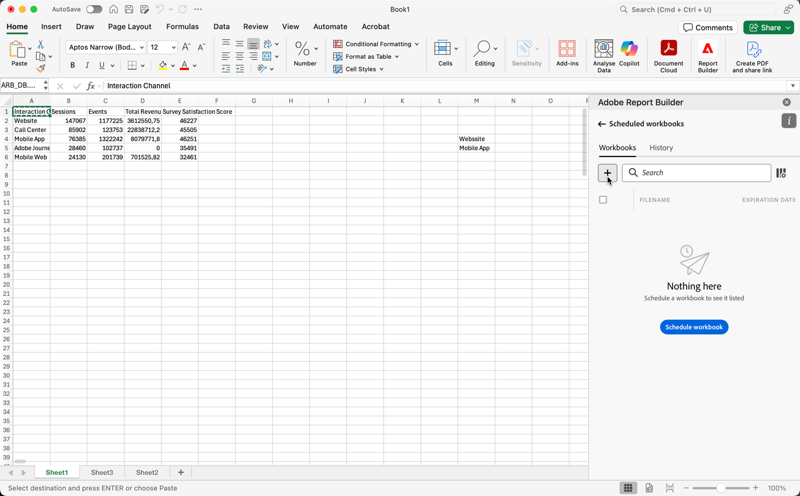

# Arbeitsmappen durch Freigabe per E-Mail planen

>[!NOTE]
>
>Zusätzlich zur Planung von Arbeitsmappen für die Freigabe per E-Mail, wie in diesem Abschnitt beschrieben, können Sie Arbeitsmappen für den Export in Cloud-Ziele planen, wie in [Arbeitsmappen für den Export in Cloud-Ziele planen](/help/analyze/report-builder/report-builder-export.md) beschrieben.

Nachdem Sie Ihre Arbeitsmappe gespeichert und Ihre Analyse abgeschlossen haben, können Sie die Arbeitsmappe mithilfe der Zeitplanfunktion für andere in Ihrem Team freigeben. Mit der Zeitplanfunktion können Sie einen Zeitplan erstellen, anhand dessen die Daten in der Arbeitsmappe automatisch aktualisiert werden und die Excel-Arbeitsmappe (.xlsx) als E-Mail-Anhang an Ihre ausgewählte Zielgruppe gesendet wird. Durch die Einrichtung eines Zeitplans erhalten die Empfänger und Empfängerinnen automatisch regelmäßige Aktualisierungen. Sie können die Zeitplanfunktion auch verwenden, um die Arbeitsmappe nur einmal zu senden, ohne automatische Aktualisierungen festzulegen.

Für eine Arbeitsmappe können mehrere Zeitpläne erstellt werden. So können Sie beispielsweise eine Arbeitsmappe täglich an Ihr Team und einmal wöchentlich an Ihren Vorgesetzten senden, indem Sie zwei verschiedene Zeitpläne erstellen.

Außerdem können Sie mit der Zeitplanfunktion einen Passwortschutz für eine Arbeitsmappe einrichten und zuvor geplante Arbeitsmappen bearbeiten.

>[!BEGINSHADEBOX]

Siehe  [Arbeitsmappen planen](https://video.tv.adobe.com/v/3413079?quality=12&learn=on){target="_blank"} für ein Demovideo.

>[!ENDSHADEBOX]

## Festlegen eines Zeitplans für eine Arbeitsmappe

Verwenden Sie die Schaltfläche Zeitplan im Report Builder-Hub, um schnell einen Zeitplan zu erstellen, sodass Sie automatisch eine Excel-Arbeitsmappe (.xlsx) an eine Einzelperson oder eine Gruppe verteilen können.

1. Klicken Sie im Report Builder-Hub auf die Schaltfläche „Planen“.

   {width="55%"}

1. Klicken Sie oben links auf „Arbeitsmappe planen“ oder auf die Plusschaltfläche, um eine neue Arbeitsmappe mit Zeitplan zu erstellen.

   {width="55%"}

   Im Zeitplanfenster werden einige vordefinierte Informationen zur Arbeitsmappe angezeigt, z. B. der Arbeitsmappenname und das Datum der letzten Änderung der Arbeitsmappe.

   {width="55%"}

1. (Optional) Geben Sie einen Dateinamen ein.

   Der Dateiname der Arbeitsmappe entspricht standardmäßig dem Namen der Arbeitsmappe. Sie können ihn jedoch bei Bedarf ändern. Das könnte beispielsweise der Fall sein, wenn Sie dieselbe Arbeitsmappe an mehrere Zielgruppen senden und für eine bestimmte Zielgruppe eine etwas benutzerfreundlichere Bezeichnung wählen möchten.

1. (Optional) Wählen Sie **Zeitstempel an Dateinamen anhängen**.

   Sie können einen Zeitstempel an den Dateinamen anhängen, um das Datum der Aktualisierung der Arbeitsmappe anzugeben. Dies ist hilfreich, wenn Sie schnell feststellen möchten, welche Version einer Arbeitsmappe an einem bestimmten Datum gesendet wurde. In der **Dateinamenvorschau** ist zu sehen, wie der Dateiname der Arbeitsmappe beim Versand in der E-Mail angezeigt wird. Das Zeitstempelformat ist JJJ-MM-TT.

1. (Optional) Wählen Sie **.zip-Komprimierung**, um die Datei zu komprimieren und einen Passwortschutz für die Datei einzurichten.

   Wenn Sie diese Auswahl treffen, werden Sie beim Öffnen der Datei aufgefordert, ein Passwort einzugeben. Dies ist hilfreich, wenn Sie Bedenken hinsichtlich der Datensicherheit haben und die Arbeitsmappe mit einem Passwort schützen möchten. Wenn Sie die Datei mit einem Passwort schützen möchten, wählen Sie **.zip-Komprimierung** aus. Das Passwort muss mindestens 8 Zeichen lang sein und eine Zahl und ein Sonderzeichen enthalten.

   {width="55%"}

1. Eingeben der **Empfänger und Empfängerinnen**. Sie können entweder den Namen einer in Ihrem Unternehmen bekannten Person oder eine E-Mail-Adresse einer unternehmensinternen oder -externen Person eingeben.

1. Geben Sie den **Betreff** Ihrer E-Mail und eine Beschreibung ein. Der Betreff verwendet standardmäßig den Namen der Arbeitsmappen-Datei. Sie können den Betreff jedoch bei Bedarf ändern. Im Beschreibungsabschnitt können Sie Informationen hinzufügen.

   {width="55%"}

1. Aktivieren Sie die Zeitplanoptionen, um das Datum und die Uhrzeit festzulegen, zu denen die Arbeitsmappe per E-Mail an Ihre Empfänger und Empfängerinnen gesendet werden soll.

   Wählen Sie das Start- und Enddatum sowie den Zeitrahmen aus. Dies kann das heutige Datum oder ein Datum in der Zukunft sein.

   Wählen Sie aus dem Dropdown-Menü die **Häufigkeit** aus. Sie können die Häufigkeit auf stündlich, täglich, wöchentlich, monatlich oder jährlich an einem bestimmten Tag einstellen. Sie können beispielsweise einen Zeitplan einrichten, um die Arbeitsmappe am ersten Sonntagabend des Monats zu senden, sodass Ihre Empfänger und Empfängerinnen die E-Mail am Montagmorgen in ihrem Posteingang haben.

   {width="55%"}

1. Nachdem Sie den Zeitplan festgelegt haben, klicken Sie auf **Planmäßig senden**.

   {width="55%"}

   Unten im Report Builder-Hub wird eine Bestätigungsmitteilung angezeigt, und die geplante Arbeitsmappe wird auf der Registerkarte „Arbeitsmappen“ aufgeführt.

   {width="55%"}

## Planen einer konvertierten Arbeitsmappe {#converted}

1. Planen Sie eine [konvertierte](/help/analyze/report-builder/convert-workbooks.md) ältere Arbeitsmappe.

   Es wird ein Popup angezeigt, in dem Sie gefragt werden, ob Sie die Zeitplanmetadaten aus der veralteten Arbeitsmappe verwenden möchten, um eine neue geplante Aufgabe zu erstellen.

1. Wenn Sie **[!UICONTROL Verwenden]** auswählen, füllt Report Builder automatisch die alten Zeitplaninformationen aus.

1. Stellen Sie sicher, dass diese Informationen korrekt sind und den Zeitplan einhalten.

1. Wenn Sie die Arbeitsmappe nach einem anderen Zeitplan senden möchten, planen Sie eine vollständig neue geplante Aufgabe.

## Einmaliges Senden der Arbeitsmappe

Sie können die Arbeitsmappe auch nur ein einziges Mal versenden.

1. Deaktivieren Sie die Option **Planungsoptionen anzeigen**.

   {width="40%"}

1. Klicken Sie auf **Jetzt senden**.

## Verwalten von geplanten Arbeitsmappen

Informationen zum Verwalten von bereits geplanten Arbeitsmappen finden Sie unter [Verwalten geplanter Arbeitsmappen](/help/analyze/report-builder/manage-schedules-reportbuilder.md).
