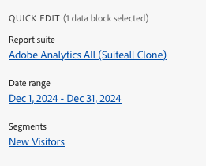

# Arbeiten mit Segmenten

Segmente können angewendet werden, wenn Sie einen neuen Datenblock erstellen oder wenn Sie **[!UICONTROL Datenblock bearbeiten]** im Bedienfeld **[!UICONTROL Befehle]** auswählen.

## Anwenden von Segmenten auf einen Datenblock

Um ein Segment auf den gesamten Datenblock anzuwenden, doppelklicken Sie auf ein Segment oder ziehen Sie Segmente aus der Komponentenliste in den Abschnitt Segmente der Tabelle.

## Filter auf einzelne Metriken anwenden

So wenden Sie mithilfe von Segmenten Filter auf einzelne Metriken an:

* Ziehen Sie ein oder mehrere Segmente aus **[!UICONTROL Segmente]** per Drag-and-Drop auf eine Metrik in der Tabelle.

* Alternativ:

   1. Wählen Sie  für eine bestimmte Metrik im Bereich **[!UICONTROL Tabelle]** aus und wählen Sie dann **[!UICONTROL Filtermetrik]**.

      {zoomable="yes"}

   1. Wählen Sie ein oder mehrere Segmente aus **[!UICONTROL Dropdown-Menü]** Segmente“ aus. Die Segmente werden der Liste **[!UICONTROL Segmente angewendet“]**.

      
   1. Wählen Sie  aus, um ein Segment aus der Liste **[!UICONTROL Segment angewendet]** zu entfernen. Oder wählen Sie **[!UICONTROL Alle löschen]** aus, um alle Segmente aus der Liste **[!UICONTROL Segment angewendet]** zu entfernen.
   1. Wählen Sie **[!UICONTROL Anwenden]** aus.

Um angewendete Filter anzuzeigen, bewegen Sie den Mauszeiger über eine Metrik im Tabellenbereich oder wählen Sie sie aus. Metriken mit angewendeten Segmenten zeigen ein Segmentsymbol an.

## Schnellbearbeitungssegmente

Sie können das Bedienfeld **[!UICONTROL Schnellbearbeitung]** verwenden, um Segmente für vorhandene Datenblöcke hinzuzufügen, zu entfernen oder zu ersetzen.

Wenn Sie einen Zellenbereich im Arbeitsblatt auswählen, wird der Link **[!UICONTROL Segmente]** im Bedienfeld **[!UICONTROL Schnellbearbeitung]** eine zusammenfassende Liste der Segmente anzeigen, die von den in dieser Auswahl enthaltenen Datenblöcken verwendet werden.

So bearbeiten Sie Segmente mithilfe des Bedienfelds **[!UICONTROL Schnellbearbeitung]**:

1. Wählen Sie einen Zellenbereich aus einem oder mehreren Datenblöcken aus.

1. Wählen Sie den Link **[!UICONTROL Segmente]** aus, um das Bedienfeld **[!UICONTROL Schnellbearbeitung]** **[!UICONTROL Segmente]** zu starten.

### Segmente hinzufügen oder entfernen

Mithilfe der Optionen „Hinzufügen“/„Entfernen“ können Sie Segmente hinzufügen oder entfernen.

1. Wählen Sie die **[!UICONTROL Hinzufügen/Entfernen]** im Bedienfeld **[!UICONTROL Schnellbearbeitung]** **[!UICONTROL Segmente]** aus.

   1. Wählen Sie ein oder mehrere Segmente aus **[!UICONTROL Dropdown-Menü]** Segmente“ aus. Die Segmente werden der Liste **[!UICONTROL Segmente angewendet“]**.
   1. Wählen Sie  aus, um ein Segment aus der Liste **[!UICONTROL Segment angewendet]** zu entfernen.
   1. Wählen Sie **[!UICONTROL Anwenden]** aus.

Report Builder zeigt eine Meldung zur Bestätigung der angewendeten Segmentänderungen an.

### Segmente ersetzen

Sie können ein vorhandenes Segment durch ein anderes Segment ersetzen, um die Segmentierung der Daten zu ändern.

1. Wählen Sie die **[!UICONTROL Ersetzen]** im Bedienfeld **[!UICONTROL Schnellbearbeitung]** **[!UICONTROL Segmente]** aus.

1. Suchen Sie mithilfe **Suchfelds** Suchliste“ nach bestimmten Segmenten.

1. Wählen Sie ein oder mehrere Segmente aus, die Sie ersetzen möchten.

1. Suchen Sie im Dropdown-Menü Ersetzen durch nach einem oder mehreren Segmenten, um das Segment zur Liste **[!UICONTROL Ersetzen durch]** hinzuzufügen.

1. Wählen Sie **[!UICONTROL Anwenden]** aus.

Report Builder aktualisiert die Segmentliste entsprechend der Ersetzung.

## Definieren von Datenblocksegmenten aus einer Zelle

Datenblöcke können auf Segmente aus einer Zelle verweisen. Mehrere Datenblöcke können dieselbe Zelle für Segmente referenzieren, sodass Sie Segmente einfach für mehrere Datenblöcke gleichzeitig wechseln können.

So wenden Sie Segmente aus einer Zelle an:

1. [Neuen Datenblock erstellen](create-a-data-block.md#create-a-data-block) oder einen vorhandenen Datenblock bearbeiten.
1. Wählen Sie die Registerkarte **[!UICONTROL Segmente]** aus, um Segmente zu definieren.
1. Wählen Sie .

   {zoomable="yes"}

1. Wählen Sie die Zelle aus, aus der die Datenblöcke auf ein Segment verweisen sollen.

1. Doppelklicken Sie auf , um der Zelle ein Segment hinzuzufügen. Alternativ können Sie ein oder mehrere Segmente per Drag-and-Drop in den Abschnitt **[!UICONTROL Enthaltene Segmente]** ziehen.

1. Wählen Sie **[!UICONTROL Anwenden]** aus, um die Referenzzelle zu erstellen.

1. Fügen Sie auf **Registerkarte** das neu erstellte Referenzzellensegment zu Ihrem Datenblock hinzu.

   {zoomable="yes"}

1. Wählen Sie **[!UICONTROL Beenden]** aus.

Um die Referenzzelle als Segment auf andere Datenblöcke anzuwenden, verwenden Sie die Zellreferenz als eines der Segmente in der Liste **[!UICONTROL Segmente]** auf der Registerkarte **[!UICONTROL Tabelle]**.

### Verwenden einer Referenzzelle zum Ändern von Datenblocksegmenten

1. Wählen Sie die Referenzzelle im Arbeitsblatt aus.

1. Wählen Sie den Link unter **[!UICONTROL Segmente aus Zelle]** im Menü **[!UICONTROL Schnellbearbeitung]** aus.

   {zoomable="yes"}

1. Wählen Sie Ihr Segment aus dem Dropdown-Menü aus.

1. Wählen Sie **[!UICONTROL Anwenden]** aus.

<!--
You can apply segments when you create a new data block or when you select the **Edit data block** option from the COMMANDS panel.

## Apply segments to a data block

To apply a segment to the entire data block, double-click a segment or drag and drop filters from the components list into the Segments section of the Table.

## Apply segments to individual metrics

To apply segments to individual metrics, drag and drop a segment onto a metric in the table. You can also click the **...** icon to the right of a metric in the Table pane and then select **[!UICONTROL Segment metric]**. To view applied segments, hover over or select a metric in the Table pane. Metrics with applied segments display a filter icon.

## Quick edit segments

You can use the Quick edit panel to add, remove, or replace segments for existing data blocks.

When you select a range of cells in the spreadsheet, the **[!UICONTROL Segments]** link in the Quick edit panel displays a summary list of the segments used by the data blocks in that selection.

To edit segments using the Quick edit panel

1. Select a range of cells from one or multiple data blocks.

    

1. Click the link underneath **[!UICONTROL Segments]** to launch the Quick edit - Filters panel.

    

### Add or remove a segment

You can add or remove segments using the Add/Remove options.

1. Select the **[!UICONTROL Add/Remove]** tab in the Quick edit-segments panel.

    All segments applied to the selected data blocks are listed in the Quick Edit-segments panel. Segments applied to all data blocks in the selection are listed under the **[!UICONTROL Applied to all selected data blocks]** heading. Segments applied to some but not all data blocks are listed under the **[!UICONTROL Applied to 1 or more selected data blocks]** heading.

    When multiple segments are present in the selected data blocks, you can search for specific segments using the **[!UICONTROL Add Filter]** search field.

    

1. Add segments by selecting segments from the **[!UICONTROL Add segment]** drop down menu.

    The list of searchable segments includes all segments accessible to the report suites that are present in one or more of the selected data blocks as well as all the segments that are available globally in the organization.

    Adding a segment applies the segment to all data blocks in the selection.

1. To remove segments, click the delete icon **x** to the right of segments in the **[!UICONTROL Segments applied]** list.

1. Click **[!UICONTROL Apply]** to save changes and return to the hub panel.

    Report Builder displays a message to confirm the applied segment changes.

### Replace a segment

You can replace an existing segment with another segment to change how the data is segmented.

1. Select the **[!UICONTROL Replace]** tab in the Quick edit-segment panel.

    

1. Use the **[!UICONTROL Search list]** search field to locate specific segments.

1. Choose one or more segments that you want to replace.

1. Search for one or more segments in the Replace with field.

    Selecting a filter adds it to the **[!UICONTROL Replace with]**... list.

1. Click **[!UICONTROL Apply]**.

    Report Builder updates the list of segments to reflect the replacement.

### Define data block segments from cell

Data blocks can reference segments from a cell. Multiple data blocks can reference the same cell for segments, allowing you to easily switch segments for multiple data blocks at a time.

To apply segments from a cell

1. Navigate to Step 2 in either the data block creation or editing process. See [Create a Data Block](./create-a-data-block.md).
1. Click the **[!UICONTROL Segments]** tab to define filters.
1. Click **[!UICONTROL Create segment from cell]**.

    

1. Select the cell from which you want the data blocks to reference a segment.
   
1. Add the segment choice you wish to add to the cell by either double clicking the segment, or by dragging and dropping it into the **[!UICONTROL Segments Included]** section. 
   
   Note: Only one choice may be selected for the given cell at one time.

    

1. Click **[!UICONTROL Apply]** to create the reference cell.

1. From the **[!UICONTROL Segments]** tab, add the newly created reference cell segments to your data block.

    

1. Click **[!UICONTROL Finish]**.

    Now this cell can be referenced by other data blocks in their segments. To apply the reference cell as a segment to other data blocks, simply add the cell reference to their segments from the Segments tab. 

#### Use the reference cell to change data block segments

1. Select the reference cell in your spreadsheet.

1. Click the link under **[!UICONTROL Segments from Cell]** in the Quick Edit menu.

    

1. Select your segment from the drop-down menu.

    

1. Click **[!UICONTROL Apply]**.
-->