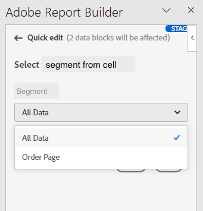

# Arbeiten mit Segmenten in Report Builder

Sie können Segmente anwenden, wenn Sie einen neuen Datenblock erstellen oder wenn Sie im Bedienfeld &quot;BEFEHLE&quot;die Option **Datenblock bearbeiten** auswählen.

## Segmente auf Datenblöcke anwenden

Um ein Segment auf den gesamten Datenblock anzuwenden, doppelklicken Sie auf ein Segment oder ziehen Sie Filter aus der Komponentenliste in den Abschnitt Segmente der Tabelle.

## Segmente auf einzelne Metriken anwenden

Um Segmente auf einzelne Metriken anzuwenden, ziehen Sie ein Segment auf eine Metrik in die Tabelle. Sie können auch auf das Symbol **...** rechts neben einer Metrik im Tabellenbereich klicken und dann **Segmentmetrik** auswählen. Um angewendete Segmente anzuzeigen, bewegen Sie den Mauszeiger über eine Metrik im Tabellenbereich oder wählen Sie sie aus. Metriken mit angewendeten Segmenten zeigen ein Filtersymbol an.

## Schnellbearbeitungs-Segmente

Sie können das Bedienfeld Schnelle Bearbeitung verwenden, um Segmente für vorhandene Datenblöcke hinzuzufügen, zu entfernen oder zu ersetzen.

Wenn Sie einen Zellenbereich im Arbeitsblatt auswählen, zeigt der Link **Segmente** im Bereich &quot;Quick edit&quot;eine Zusammenfassungsliste der Segmente an, die von den Datenblöcken in dieser Auswahl verwendet werden.

So bearbeiten Sie Segmente über das Bedienfeld &quot;Schnellbearbeitung&quot;

1. Wählen Sie einen Zellenbereich aus einem oder mehreren Datenblöcken aus.

   

1. Klicken Sie auf den Link Segmente , um den Bereich Schnellbearbeitung - Filter zu öffnen.

   

### Segment hinzufügen oder entfernen

Sie können Segmente mithilfe der Optionen Hinzufügen/Entfernen hinzufügen oder entfernen.

1. Wählen Sie die Registerkarte **Hinzufügen/Entfernen** im Bereich Schnellbearbeitungs-Segmente aus.

   Alle Segmente, die auf die ausgewählten Datenblöcke angewendet werden, werden im Bereich Schnellbearbeitungs-Segmente aufgeführt. Segmente, die auf alle Datenblöcke in der Auswahl angewendet werden, werden unter der Überschrift **Auf alle ausgewählten Datenblöcke angewendet** aufgeführt. Auf einige, aber nicht alle Datenblöcke angewendete Segmente werden unter der Überschrift **Auf 1 oder mehrere ausgewählte Datenblöcke angewendet** aufgeführt.

   Wenn in den ausgewählten Datenblöcken mehrere Segmente vorhanden sind, können Sie mithilfe des Suchfelds **Filter hinzufügen** nach bestimmten Segmenten suchen.

   

1. Fügen Sie Segmente hinzu, indem Sie Segmente aus dem Dropdownmenü **Segment hinzufügen** auswählen.

   Die Liste der durchsuchbaren Segmente enthält alle Segmente, die für die Report Suites zugänglich sind, die in einem oder mehreren der ausgewählten Datenblöcke vorhanden sind, sowie alle Segmente, die global in der Organisation verfügbar sind.

   Durch Hinzufügen eines Segments wird das Segment auf alle Datenblöcke in der Auswahl angewendet.

1. Um Segmente zu entfernen, klicken Sie auf das Löschsymbol **x** rechts neben den Segmenten in der Liste **Angewendete Segmente** .

1. Klicken Sie auf **Anwenden**, um Änderungen zu speichern und zum Hub-Bedienfeld zurückzukehren.

   Report Builder zeigt eine Meldung an, mit der die angewendeten Segmentänderungen bestätigt werden.

### Ersetzen eines Segments

Sie können ein vorhandenes Segment durch ein anderes ersetzen, um zu ändern, wie die Daten segmentiert werden.

1. Wählen Sie im Bereich Quick edit-segment die Registerkarte **Replace** aus.

   

1. Verwenden Sie das Suchfeld **Suchliste** , um bestimmte Segmente zu finden.

1. Wählen Sie ein oder mehrere Segmente aus, die Sie ersetzen möchten.

1. Suchen Sie im Feld Ersetzen durch nach einem oder mehreren Segmenten.

   Wenn Sie einen Filter auswählen, wird dieser der Liste **Ersetzen durch**... hinzugefügt.

   

1. Klicken Sie auf **Anwenden**.

   Report Builder aktualisiert die Segmentliste, um die Ersetzung widerzuspiegeln.

### Definieren von Datenblocksegmenten aus Zellen

Datenblöcke können auf Segmente aus Zellen verweisen. Mehrere Datenblöcke können für Segmente auf dieselbe Zelle verweisen, sodass Sie Segmente für mehrere Datenblöcke gleichzeitig einfach wechseln können.

So wenden Sie Segmente aus einer Zelle an

1. Navigieren Sie im Erstellungs- oder Bearbeitungsvorgang für Datenblöcke zu Schritt 2. Siehe [Erstellen eines Datenblocks](./create-a-data-block.md).
1. Klicken Sie auf die Registerkarte **Segmente** , um Filter zu definieren.
1. Klicken Sie auf **Segment aus Zelle erstellen**.

   

1. Wählen Sie die Zelle aus, von der aus die Datenblöcke auf ein Segment verweisen sollen.

1. Fügen Sie die Segmentauswahl hinzu, die Sie der Zelle hinzufügen möchten, indem Sie entweder auf das Segment doppelklicken oder es in den Abschnitt Einbezogene Segmente ziehen und dort ablegen.

   Hinweis: Es kann jeweils nur eine Auswahl für die jeweilige Zelle ausgewählt werden.

   

1. Klicken Sie auf **Anwenden** , um die Referenzzelle zu erstellen.

1. Fügen Sie im Tab **Segmente** die neu erstellten Referenzzellensegmente zu Ihrem Datenblock hinzu.

   

1. Klicken Sie auf **Fertig stellen**.

   Jetzt kann diese Zelle von anderen Datenblöcken in ihren Segmenten referenziert werden. Um die Referenzzelle als Segment auf andere Datenblöcke anzuwenden, fügen Sie einfach im Tab Segmente die Zellenreferenz zu ihren Segmenten hinzu.

#### Verwenden Sie die Referenzzelle, um Datenblocksegmente zu ändern.

1. Wählen Sie die Referenzzelle in Ihrer Tabelle aus.

1. Klicken Sie auf den Link unter **Segmente aus Zelle** im Menü &quot;Schnellbearbeitung&quot;.

    anzeigen

1. Wählen Sie Ihr Segment aus dem Dropdownmenü aus.

   

1. Klicken Sie auf **Anwenden**.
