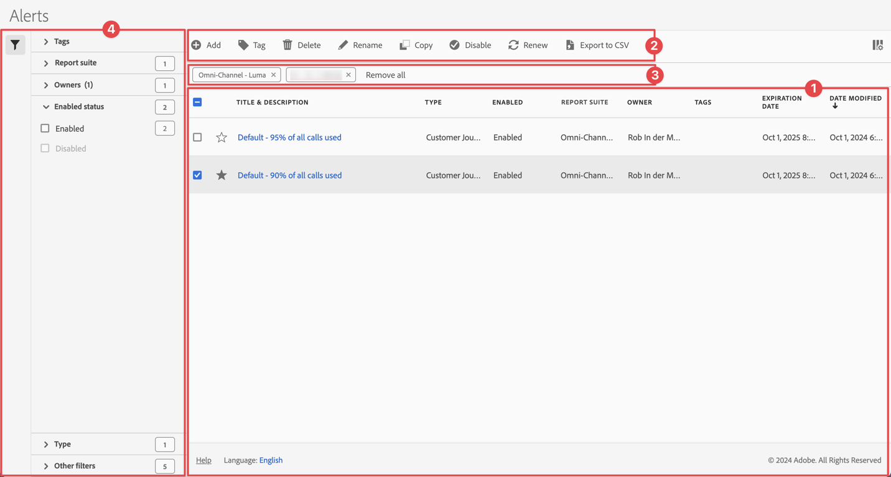

# Verwalten von Warnhinweisen

Sie können Warnhinweise über eine zentrale Verwaltungsoberfläche von [!UICONTROL Warnhinweise“ filtern, taggen, löschen, umbenennen, kopieren, aktivieren, deaktivieren, erneuern &#x200B;] exportieren. Warnhinweise verwalten:

* Wählen Sie **[!UICONTROL Hauptbenutzeroberfläche]** Komponenten“ und dann **[!UICONTROL Warnhinweise]** aus.

Der Warnhinweis-Manager ist wie der [Segment-Manager](/help/components/segmentation/segmentation-workflow/seg-manage.md) und der [Manager für berechnete Metriken](/help/components/calculated-metrics/workflow/cm-manager.md) strukturiert.

## Warnhinweis-Manager

Der Warnhinweis-Manager verfügt über die folgenden Elemente der Benutzeroberfläche:

### Liste der Warnhinweise

Die ➊ Warnhinweisliste zeigt alle Warnhinweise an, die Ihnen gehören, die Warnhinweise, die für alle Ihre Projekte gelten, und die Warnhinweise, die für Sie freigegeben wurden. Die Liste umfasst die folgenden Spalten:

| Spalte | Beschreibung |
|---|---|
|  | Wählen Sie ausStar“ oder  zu bevorzugen. |
| **[!UICONTROL Titel und Beschreibung]** | Um den Warnhinweis zu bearbeiten, klicken Sie auf den Titel-Link, über den der [Warnhinweiserstellung“ geöffnet &#x200B;](alert-builder.md#alert-builder). |
| **[!UICONTROL Typ]** | Der Typ des Warnhinweises: ein Adobe Analytics-Datenwarnhinweis oder ein Warnhinweis zur Nutzung von Server-Aufrufen. |
| **[!UICONTROL Aktiviert]** | Der Warnhinweis ist aktiviert oder deaktiviert. |
| **[!UICONTROL Report Suite]** | Die Report Suites, für die diese Warnung gilt. |
| **[!UICONTROL Inhabende]** | Der Besitzer des Warnhinweises. Wenn Sie kein Administrator sind, sehen Sie nur Warnhinweise, deren Inhaber Sie sind, oder Warnhinweise, die für Sie freigegeben wurden. |
| **[!UICONTROL Tags]** | Die Tags für diesen Warnhinweis. |
| **[!UICONTROL Ablaufdatum]** | Datum und Uhrzeit, zu der der Warnhinweis ablaufen soll. |
| **[!UICONTROL Änderungsdatum]** | Datum und Uhrzeit der letzten Änderung des Warnhinweises. |

<!-- 

When "Last used" column is added, add this information as the description: Shows the date when the alert was last used. 
This information can help you determine whether a component is valuable to users in your organization, where it is used, and if it needs to be deleted or modified.

Consider the following when viewing this column:
<ul><li>This information does not include usage from the API, Report Builder, or Data Warehouse.</li><li>For some components, this column might not contain data if the component was last used prior to September 2023.</li></ul>

-->

Verwenden Sie , um die anzuzeigenden Spalten anzugeben.

### Aktionsleiste

Sie können Aktionen für Warnhinweise mithilfe der Aktionsleiste ➋. Die Aktionsleiste ermöglicht die folgenden Aktionen:

| Symbol | Aktion | Beschreibung |
|:---:|---|---|
|  | **[!UICONTROL Hinzufügen]** | Fügen Sie mithilfe der [Warnhinweiserstellung“ einen weiteren &#x200B;](alert-builder.md#alert-builder) hinzu. |
|  | [!UICONTROL *Nach Titel suchen*] | Wenn kein Warnhinweis in der Liste ausgewählt ist, suchen Sie mithilfe dieses Suchfelds nach Warnhinweisen. |
|  | **[!UICONTROL Tag]** | Markieren Sie die ausgewählten Warnhinweise. Wählen Sie im **[!UICONTROL Warnhinweis]**-Dialogfeld die Tags für die ausgewählten Warnhinweise aus bzw. heben Sie die Auswahl auf. Klicken Sie **[!UICONTROL Speichern]**, um die Tags für die ausgewählten Warnhinweise zu speichern. |
|  | **[!UICONTROL Löschen]** | Löscht die ausgewählten Warnhinweise. Sie werden zur Bestätigung aufgefordert. |
|  | **[!UICONTROL Umbenennen]** | Umbenennen eines einzelnen ausgewählten Warnhinweises. Wenn ausgewählt, können Sie den Warnhinweis inline umbenennen. |
|  | **[!UICONTROL Kopieren]** | Kopieren Sie den ausgewählten Warnhinweis. Neue Warnhinweise werden mit demselben Namen und derselben Suffix-`(Copy)` erstellt. |
|  | **[!UICONTROL Aktivieren]** oder **[!UICONTROL Deaktivieren]** | Aktivieren oder Deaktivieren der ausgewählten Warnhinweise. |
|  | **[!UICONTROL Verlängern]** | Verlängert das Ablaufdatum für einen Warnhinweis. Das Ablaufdatum liegt unabhängig vom ursprünglichen Ablaufdatum 1 Jahr ab dem Tag, an dem Sie diese Option auswählen. |
|  | **[!UICONTROL In CSV exportieren]** | Exportieren Sie die Warnhinweise in eine `Alerts List.csv`. |

### Aktive Filterleiste

Die Filterleiste zeigt ➌ die aktiven Filter an, die vom Filterbereich auf die Liste der Warnhinweise (falls vorhanden) angewendet wurden. Mit  können Sie schnell einen Filter entfernen. Wenn mehr als ein Filter angegeben ist, können Sie alle Filter mit **[!UICONTROL Alle entfernen]** entfernen.

### Panel „Filter“

Sie können die Liste der Warnhinweise mithilfe der Filter **&#x200B;**&#x200B;Filter➍ im linken Bereich filtern. Das Bedienfeld „Filter“ zeigt den Filtertyp und die Anzahl der Warnhinweise an, die den spezifischen Filter berücksichtigen.

1. Wählen Sie  aus, um das Bedienfeld „Filter“ zu öffnen. Wenn Sie mehr Platz für die Liste „Warnhinweise“ benötigen, können Sie erneut  auswählen, um das Bedienfeld zu schließen.
1. Wählen Sie Filter aus einem der verfügbaren Filterabschnitte aus.

#### Abschnitt zum Tags-Filter

{{tagfiltersection}}

#### Report Suite-Filterabschnitt

{{reportsuitefiltersection}}

#### Filterabschnitt Besitzer

{{ownerfiltersection}}

#### Abschnitt zu Filtern nach aktivierten Status

{{enabledstatusfiltersection}}

#### Abschnitt zu Typenfiltern

{{typefiltersection}}

#### Abschnitt zu Filtern von anderen Filtern

{{otherfiltersfiltersection}}

## Warnhinweise bearbeiten

Sie können einen Warnhinweis bearbeiten

* Wählen Sie in [[!UICONTROL &#x200B; Liste &#x200B;]Warnhinweis](#alerts-list) den Titel des Warnhinweises aus.

Verwenden Sie die [Warnhinweiserstellung](alert-builder.md#alert-builder), um den Warnhinweis zu bearbeiten.

## Fehlerbehebung bei einem Warnhinweis

Wenn Sie ein Problem mit einem Warnhinweis beheben, geben Sie die JID-Nummer (Job Instance ID) an den Adobe-Support an. Die JID-Nummer befindet sich am unteren Rand der E-Mail-Benachrichtigung, die Sie erhalten.

<!--

# Manage alerts

You can manage existing alerts in the Alerts manager. You can perform various management tasks on alerts, such as tagging, renaming, deleting, and more.

The Alerts manager is structured very much like the [Segment Manager](/help/components/segmentation/segmentation-workflow/seg-manage.md) and the [Calculated Metric Manager](/help/components/calculated-metrics/calcmetric-workflow/cm-manager.md).

 

## Create alerts

To create alerts from the Alerts manager:

1. Select **[!UICONTROL Components]** > **[!UICONTROL Alerts]** to access the Alerts manager in Adobe Analytics.

   

1. Select [!UICONTROL **Add**] (or [!UICONTROL **Create new alert**] if you don't have any existing alerts).

1. Select the alert type that corresponds to the alert that you want to create:

   * [!UICONTROL **Analytics data alert**]: An alert to notify you when abnormal events occur in your data. 

     If you select this option, continue with [Create alerts](/help/components/alerts/alert-builder.md) for more details about creating alerts.

   * [!UICONTROL **Server call usage alert**]: An alert to notify you of the risk or occurrence of an overage in your server call consumption and commitment data. 

     If you select this option, continue with [Server call usage alerts](/help/admin/tools/server-call-usage/scu-alerts.md).

     >[!NOTE]
     >
     >You must be an Analytics administrator or a user with the Server call usage permission in order to have access to server call usage. 

## Manage existing alerts

You can perform various actions on existing alerts, such as tagging, renaming, deleting, and so forth.

To manage existing alerts in the Alerts manager:

1. Select **[!UICONTROL Components]** > **[!UICONTROL Alerts]** to access the Alerts manager in Adobe Analytics.

   

1. Select one or more alerts that you want to manage.

   

1. In the action bar, select any of the following options:

   | Action | Function | 
   |---------|----------|
   | [!UICONTROL **Tag**] | Apply a tag to an alert. This helps you to organize alerts for ease of use. | 
   | [!UICONTROL **Delete**] | Deletes the alert. | 
   | [!UICONTROL **Rename**] | Renames the alert. |
   | [!UICONTROL **Approve**] | Mark the alert as Approved. |
   | [!UICONTROL **Copy**] | Creates a copy (duplicate) of the alert. |
   | [!UICONTROL **Disable**] | Disables an alert that is currently enabled. |
   | [!UICONTROL **Enable**] | Enables an alert that is currently disabled. |
   | [!UICONTROL **Renew**] | Renews the alert expiration date. This extends the  expiration date to be 1 year from the day you selected this option, regardless of the original expiration date. |
   | [!UICONTROL **Export to CSV**] | Exports the alert to a .CSV file. |

## Edit an alert

To edit an existing alert:

1. Select **[!UICONTROL Components]** > **[!UICONTROL Alerts]** to access the Alerts manager in Adobe Analytics.

   

1. Select the alert name in the [!UICONTROL **Title and description**] column.

1. Edit the alert as desired. 

   Following are some of the things you can do when editing an alert:

   * Add alerts to other report suites
   * Add or modify the description
   * Modify the time granularity
   * Modify the recipients 
   * Modify the expiration date
   * Modify the metrics and filters

1. Select [!UICONTROL **Save**].

## Configure columns 

You can configure the information displayed for each alert in the Alerts manager by configuring the columns that are displayed.

To configure the visible columns in the Alerts manager:

1. In Adobe Analytics, select the **[!UICONTROL Components]** tab, then select **[!UICONTROL Alerts]**. 

1. In the Alert manager, select the **Customize columns** icon , then select the columns that you want to be displayed in the Alerts manager.

   The following columns are available:

   | Column title  | Description |
   |---|---|
   | Title and description | These values are provided in the Alert builder. To edit the title and description, select the title link to open the Alert builder.  |
   | Favorites  | Displays star icons next to each alert, allowing you to mark alerts as favorites. |
   | Type | Shows whether the alert is an Analytics data alert or a Server call usage alert. |
   | Enabled | Shows whether the alert is currently enabled or disabled. | 
   | Report suite | Indicates in which report suite the alert was last saved.  |
   | Owner | Indicates who owns the alert. As a non-admin, you can see only alerts you own or those that were shared with you.  |
   | Tags | Shows tags that were applied to the alert, either by you or by people who shared the alert with you.  |
   | Expiration date | Shows the date and time when the alert is set to expire. |
   | Date modified | Indicates the date when the alert was last modified.  |

   {style="table-layout:auto"}
   
   
    When "Last used" column is added, add this information as the description: Shows the date when the alert was last used. 
This information can help you determine whether a component is valuable to users in your organization, where it is used, and if it needs to be deleted or modified.

Consider the following when viewing this column:
<ul><li>This information does not include usage from the API, Report Builder, or Data Warehouse.</li><li>For some components, this column might not contain data if the component was last used prior to September 2023.</li></ul> 
   
-->

