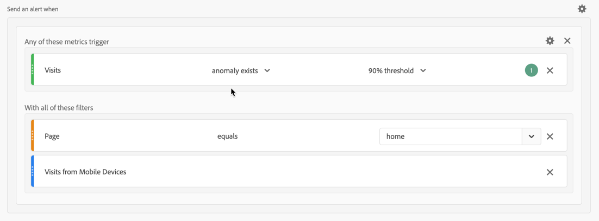

# Anwendungsfälle für Warnhinweise

Sie können Warnhinweise erstellen, wie unter [Erstellen von Warnhinweisen](alert-builder.md) beschrieben.

In den folgenden Abschnitten werden die beispielhaften Anwendungsszenarien beschrieben, die bei der Erstellung von Warnhinweisen zu berücksichtigen sind.

## Warnhinweise filtern

Sie können einfache Warnhinweise mithilfe von Segmenten erstellen. Definieren Sie beispielsweise einen Warnhinweis zur Anzahl von Sitzungen für Personen, die die Startseite über eine Mobile-App-Sitzung besuchen.

## Warnhinweise stapeln

Sie können Warnhinweise zusammenfassen (stapeln), anstatt mehrere Warnhinweise zu erstellen. Durch das Stapeln von Warnhinweisen wird sichergestellt, dass Warnhinweise kombiniert werden und nicht separat angezeigt werden. Im folgenden Beispiel wird ein Warnhinweis gesendet, wenn einer der Schwellenwerte der Metriken ausgelöst wird.

