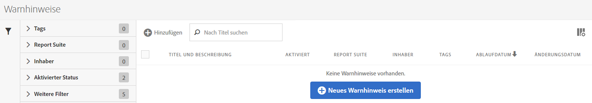

# Warnhinweis-Manager

Der Warnhinweis-Manager ähnelt sehr dem [Segment-Manager](https://experienceleague.adobe.com/docs/analytics/components/segmentation/segmentation-workflow/seg-manage.html?lang=de) und dem [Manager für berechnete Metriken](https://experienceleague.adobe.com/docs/analytics/components/calculated-metrics/calcmetric-workflow/cm-manager.html?lang=de).

## Zugriff auf den Warnhinweis-Manager

1. Wählen Sie in Adobe Analytics [!UICONTROL **Komponenten**] > [!UICONTROL **Warnhinweise**] aus.

## Verfügbare Aktionen im Warnhinweis-Manager

Im Warnhinweis-Manager haben Sie folgende Möglichkeiten:

* Die Warnhinweiserstellung per Klick auf **[!UICONTROL + Hinzufügen]** öffnen.
* Warnhinweise mit einem Tag versehen: Dadurch können Sie sie zur einfachen Anwendung organisieren.
* Warnhinweise löschen.
* Warnhinweise umbenennen.
* Warnhinweise genehmigen.
* Warnhinweise kopieren.
* Warnhinweise aktivieren/deaktivieren.
* Ein Ablaufdatum für den Warnhinweis **verlängern**: Wenn ein oder mehrere Warnhinweise ausgewählt sind, können diese durch Klicken auf **[!UICONTROL Verlängern]** verlängert werden. Dadurch werden die Ablaufdaten ab dem Tag, an dem auf **[!UICONTROL Verlängern]** geklickt wurde, unabhängig vom ursprünglichen Ablaufdatum um 1 Jahr verlängert.
* Einen Warnhinweis als .CSV-Datei exportieren.
* Warnhinweise durch Doppelklicken auf den Titel bearbeiten.
* Nach Warnhinweisen suchen.
* Warnhinweise zu anderen Report Suites hinzufügen.
* Den Eigentümer eines Warnhinweises angeben oder ändern.
* Andere Filter hinzufügen.
* Ein **Ablaufdatum** für den Warnhinweis definieren.

## Spalten konfigurieren

Sie können die für jeden Warnhinweis im Warnhinweis-Manager angezeigten Informationen konfigurieren, indem Sie die angezeigten Spalten konfigurieren.

So konfigurieren Sie die sichtbaren Spalten im Warnhinweis-Manager:

1. Wählen Sie in Adobe Analytics die Registerkarte **[!UICONTROL Komponenten]** und dann **[!UICONTROL Warnhinweise]** aus.

1. Wählen Sie im Warnhinweis-Manager das Symbol **Spalten anpassen**  und wählen Sie dann die Spalten aus, die im Warnhinweis-Manager angezeigt werden sollen.

   Die folgenden Spalten sind verfügbar:

   | Spaltentitel | Beschreibung |
   |---|---|
   | Titel und Beschreibung | Diese Werte werden in der Warnhinweiserstellung bereitgestellt. Um den Titel und die Beschreibung zu bearbeiten, wählen Sie den Titel-Link aus, um die Warnhinweiserstellung zu öffnen. |
   | Favoriten | Zeigt neben jedem Warnhinweis Sternensymbole an, mit denen Sie Warnhinweise als Favoriten markieren können. <!-- For more information, see [Mark calculated metrics as favorites](/help/components/c-calcmetrics/c-workflow/cm-workflow/cm-favorite.md). --> |
   | Typ | Zeigt an, ob es sich bei dem Warnhinweis um einen Warnhinweis zu Analytics-Daten oder eine Warnung zur Nutzung von Server-Aufrufen handelt. |
   | Aktiviert | Zeigt an, ob der Warnhinweis derzeit aktiviert oder deaktiviert ist. |
   | Report Suite | Gibt an, in welcher Report Suite die Warnung zuletzt gespeichert wurde. |
   | Verantwortlicher | Gibt an, wem der Warnhinweis gehört. Als Benutzer ohne Administratorrechte können Sie nur Warnhinweise sehen, deren Inhaber Sie sind, sowie solche, die für Sie freigegeben wurden. |
   | Tags | Zeigt Tags an, die entweder von Ihnen oder von Personen, die den Warnhinweis für Sie freigegeben haben, auf den Warnhinweis angewendet wurden. |
   | Ablaufdatum | Zeigt Datum und Uhrzeit des Ablaufs des Warnhinweises an. |
   | Änderungsdatum | Gibt das Datum der letzten Änderung des Warnhinweises an. |

   {style="table-layout:auto"}

   <!-- When "Last used" column is added, add this information as the description: Shows the date when the alert was last used. 
This information can help you determine whether a component is valuable to users in your organization, where it is used, and if it needs to be deleted or modified.

Consider the following when viewing this column:
<ul><li>This information does not include usage from the API, Report Builder, or Data Warehouse.</li><li>For some components, this column might not contain data if the component was last used prior to September 2023.</li></ul> -->

