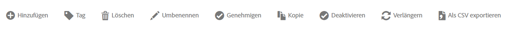

# Warnhinweis-Manager

Sie können vorhandene Warnhinweise im Warnhinweis-Manager verwalten. Sie können verschiedene Verwaltungsaufgaben für Warnhinweise ausführen, z. B. Tagging, Umbenennen, Löschen usw.

Der Warnhinweis-Manager ähnelt sehr dem [Segment-Manager](https://experienceleague.adobe.com/docs/analytics/components/segmentation/segmentation-workflow/seg-manage.html?lang=de) und dem [Manager für berechnete Metriken](https://experienceleague.adobe.com/docs/analytics/components/calculated-metrics/calcmetric-workflow/cm-manager.html?lang=de).

## Erstellen von Warnhinweisen

So erstellen Sie Warnhinweise vom Warnhinweis-Manager:

1. Wählen Sie **[!UICONTROL Komponenten]** > **[!UICONTROL Warnhinweise]** aus, um auf den Warnhinweis-Manager in Adobe Analytics zuzugreifen.

   

1. Wählen Sie [!UICONTROL **Hinzufügen**] (oder [!UICONTROL **Neuen Warnhinweis erstellen**] , wenn keine Warnhinweise vorhanden sind).

1. Wählen Sie den Warnhinweistyp aus, der dem zu erstellenden Warnhinweis entspricht:

   * [!UICONTROL **Analytics-Datenwarnung**]: Ein Warnhinweis, der Sie benachrichtigt, wenn in Ihren Daten anormale Ereignisse auftreten.

     Wenn Sie diese Option auswählen, fahren Sie mit [Warnhinweise erstellen](/help/analyze/analysis-workspace/c-intelligent-alerts/alert-builder.md) fort, um weitere Informationen zum Erstellen von Warnhinweisen zu erhalten.

   * [!UICONTROL **Warnung zur Nutzung von Server-Aufrufen**]: Ein Warnhinweis, der Sie über das Risiko oder das Auftreten einer Überschreitung der Daten zur Nutzung und Zusage Ihrer Server-Aufrufe informiert.

     Wenn Sie diese Option auswählen, fahren Sie mit den [Warnhinweisen zur Nutzung von Server-Aufrufen](/help/admin/admin/c-server-call-usage/scu-alerts.md) fort.

     >[!NOTE]
     >
     >Sie müssen Analytics-Administrator oder Benutzer mit der Berechtigung zur Nutzung von Server-Aufrufen sein, um Zugriff auf die Nutzung von Server-Aufrufen zu erhalten.

## Vorhandene Warnungen verwalten

Sie können verschiedene Aktionen für vorhandene Warnhinweise ausführen, z. B. Tagging, Umbenennen, Löschen usw.

So verwalten Sie vorhandene Warnhinweise im Warnhinweis-Manager:

1. Wählen Sie **[!UICONTROL Komponenten]** > **[!UICONTROL Warnhinweise]** aus, um auf den Warnhinweis-Manager in Adobe Analytics zuzugreifen.

   

1. Wählen Sie einen oder mehrere Warnhinweise aus, die Sie verwalten möchten.

   

1. Wählen Sie in der Aktionsleiste eine der folgenden Optionen aus:

   | Aktion | Funktion |
   |---------|----------|
   | [!UICONTROL **Tag**] | Wenden Sie ein Tag auf einen Warnhinweis an. Auf diese Weise können Sie Warnhinweise zur einfachen Verwendung organisieren. |
   | [!UICONTROL **Löschen**] | Löscht den Warnhinweis. |
   | [!UICONTROL **Umbenennen**] | Benennt die Warnung um. |
   | [!UICONTROL **Genehmigen**] | Markieren Sie den Warnhinweis als Genehmigt. |
   | [!UICONTROL **Kopieren**] | Erstellt eine Kopie (Duplikat) des Warnhinweises. |
   | [!UICONTROL **Deaktivieren**] | Deaktiviert eine Warnung, die derzeit aktiviert ist. |
   | [!UICONTROL **Aktivieren**] | Aktiviert einen Warnhinweis, der derzeit deaktiviert ist. |
   | [!UICONTROL **Verlängern**] | Verlängern Sie das Ablaufdatum des Warnhinweises. Dadurch wird das Ablaufdatum ab dem Tag, an dem Sie diese Option ausgewählt haben, auf 1 Jahr verlängert, unabhängig vom ursprünglichen Ablaufdatum. |
   | [!UICONTROL **In CSV exportieren**] | Exportiert den Warnhinweis in eine .CSV-Datei. |

## Warnhinweis bearbeiten

So bearbeiten Sie einen vorhandenen Warnhinweis:

1. Wählen Sie **[!UICONTROL Komponenten]** > **[!UICONTROL Warnhinweise]** aus, um auf den Warnhinweis-Manager in Adobe Analytics zuzugreifen.

   

1. Wählen Sie den Namen des Warnhinweises in der Spalte [!UICONTROL **Titel und Beschreibung**] aus.

1. Bearbeiten Sie den Warnhinweis nach Bedarf.

   Im Folgenden finden Sie einige Schritte, die Sie beim Bearbeiten eines Warnhinweises ausführen können:

   * Warnhinweise zu anderen Report Suites hinzufügen
   * Eigentümer ändern
   * Filter aktualisieren
   * Ablaufdatum aktualisieren

1. Bearbeiten Sie den Warnhinweis und wählen Sie dann [!UICONTROL **Speichern**] aus.

## Spalten konfigurieren

Sie können die für jeden Warnhinweis im Warnhinweis-Manager angezeigten Informationen konfigurieren, indem Sie die angezeigten Spalten konfigurieren.

So konfigurieren Sie die sichtbaren Spalten im Warnhinweis-Manager:

1. Wählen Sie in Adobe Analytics die Registerkarte **[!UICONTROL Komponenten]** und dann **[!UICONTROL Warnhinweise]** aus.

1. Wählen Sie im Warnhinweis-Manager das Symbol **Spalten anpassen**  und wählen Sie dann die Spalten aus, die im Warnhinweis-Manager angezeigt werden sollen.

   Die folgenden Spalten sind verfügbar:

   | Spaltentitel | Beschreibung |
   |---|---|
   | Titel und Beschreibung | Diese Werte werden in der Warnhinweiserstellung bereitgestellt. Um den Titel und die Beschreibung zu bearbeiten, wählen Sie den Titel-Link aus, um die Warnhinweiserstellung zu öffnen. |
   | Favoriten | Zeigt neben jedem Warnhinweis Sternensymbole an, mit denen Sie Warnhinweise als Favoriten markieren können. <!-- For more information, see [Mark calculated metrics as favorites](/help/components/c-calcmetrics/c-workflow/cm-workflow/cm-favorite.md). --> |
   | Typ | Zeigt an, ob es sich bei dem Warnhinweis um einen Warnhinweis zu Analytics-Daten oder eine Warnung zur Nutzung von Server-Aufrufen handelt. |
   | Aktiviert | Zeigt an, ob der Warnhinweis derzeit aktiviert oder deaktiviert ist. |
   | Report Suite | Gibt an, in welcher Report Suite die Warnung zuletzt gespeichert wurde. |
   | Verantwortlicher | Gibt an, wem der Warnhinweis gehört. Als Benutzer ohne Administratorrechte können Sie nur Warnhinweise sehen, deren Inhaber Sie sind, sowie solche, die für Sie freigegeben wurden. |
   | Tags | Zeigt Tags an, die entweder von Ihnen oder von Personen, die den Warnhinweis für Sie freigegeben haben, auf den Warnhinweis angewendet wurden. |
   | Ablaufdatum | Zeigt Datum und Uhrzeit des Ablaufs des Warnhinweises an. |
   | Änderungsdatum | Gibt das Datum der letzten Änderung des Warnhinweises an. |

   {style="table-layout:auto"}

   <!-- When "Last used" column is added, add this information as the description: Shows the date when the alert was last used. 
This information can help you determine whether a component is valuable to users in your organization, where it is used, and if it needs to be deleted or modified.

Consider the following when viewing this column:
<ul><li>This information does not include usage from the API, Report Builder, or Data Warehouse.</li><li>For some components, this column might not contain data if the component was last used prior to September 2023.</li></ul> -->

