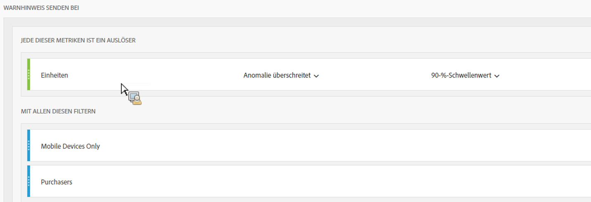

# Intelligente Warnhinweise – Anwendungsfälle

Sie können intelligente Warnhinweise erstellen, wie unter [Warnhinweise erstellen](/help/components/c-alerts/alert-builder.md) beschrieben.

Die folgenden Abschnitte veranschaulichen Beispielanwendungsfälle, die bei der Erstellung von Warnhinweisen berücksichtigt werden sollten.

## Erstellen eines einfachen Warnhinweises, der nach zwei Segmenten gefiltert wird {#section_2E96FFFA93D44F7D8DBCEC97203204AA}

<!-- 

Update screenshots for better readability.

 -->

## Warnhinweise zusammenfassen (stapeln), anstatt mehrere Warnhinweise zu erstellen {#section_B27B0856BA104B9FB6D0BBB317633F18}

Durch das Stapeln von Warnhinweisen wird dafür gesorgt, dass Warnhinweise kombiniert werden und nicht separat angezeigt werden.

