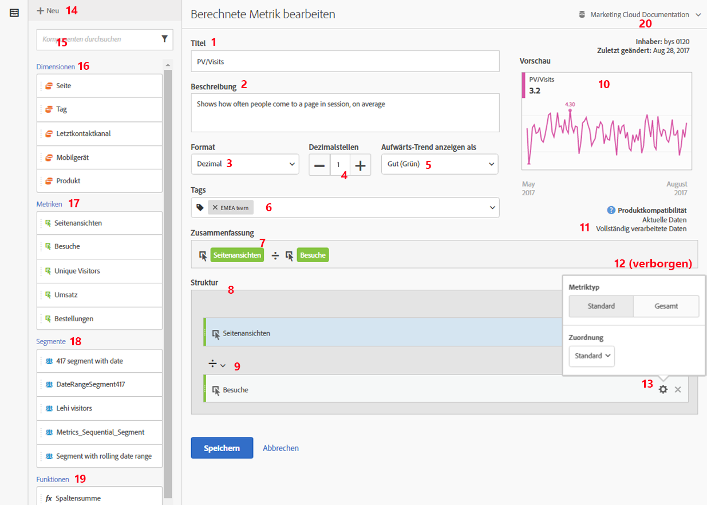

# Erstellen von Metriken {#build-metrics}

<!-- markdownlint-disable MD034 -->

>[!CONTEXTUALHELP]
>id="components_calculatedmetrics_productcompatibility"
>title="Produktkompatibilität"
>abstract="Gibt an, wo in Customer Journey Analytics diese berechnete Metrik verwendet werden kann, z. B. in Analysis Workspace und Report Builder. Einige berechnete Metriken können nicht mit Experimenten verwendet werden."
>additional-url="https://experienceleague.adobe.com/de/docs/analytics-platform/using/cja-workspace/panels/experimentation#use-in-experimentation" text="Verwenden von berechneten Metriken in Experimenten"

<!-- markdownlint-enable MD034 -->

<!-- markdownlint-disable MD034 -->

>[!CONTEXTUALHELP]
>id="components_calculatedmetrics_externalid"
>title="Externe ID"
>abstract="Eine Änderung der externen ID kann sich auf die Darstellung der berechneten Metrik in externen Quellen auswirken, z. B. auf Business Intelligence-Tools"

<!-- markdownlint-enable MD034 -->

Adobe Analytics bietet eine Arbeitsfläche zum Ziehen und Ablegen von Dimensionen, Metriken, Segmenten und Funktionen, um benutzerdefinierte Metriken basierend auf Container-Hierarchielogik, Regeln und Operatoren zu erstellen. Mit diesem integrierten Entwicklungstool können Sie einfache oder komplexe berechnete Metriken erstellen und speichern.

## Mit dem Aufbau einer berechneten Metrik beginnen

Sie können den Generator für berechnete Metriken verwenden, um berechnete Metriken zu erstellen. Wenn sie auf diese Weise erstellt werden, sind berechnete Metriken in der Komponentenliste verfügbar und können dann in Projekten in Ihrer gesamten Organisation verwendet werden. Alternativ können Sie eine schnell berechnete Metrik erstellen, wie in [Erstellen berechneter Metriken für ein einzelnes Projekt](/help/analyze/analysis-workspace/components/apply-create-metrics.md#create-calculated-metrics-for-a-single-project) in [Metriken](/help/analyze/analysis-workspace/components/apply-create-metrics.md) beschrieben.

Greifen Sie auf den Generator für berechnete Metriken zu, um mit der Erstellung einer berechneten Metrik zu beginnen, die in der Komponentenliste verfügbar ist.

1. Greifen Sie auf eine der folgenden Arten auf den Generator für berechnete Metriken zu:

   * Öffnen Sie in Analysis Workspace ein Projekt und wählen Sie **[!UICONTROL Komponenten]** > **[!UICONTROL Metrik erstellen]**.
   * Öffnen Sie in Analysis Workspace ein Projekt und wählen Sie dann in der linken Leiste **Plus**-Symbol neben [!UICONTROL **Abschnitt**] Metriken“ aus.
   * Gehen Sie [!DNL Customer Journey Analytics] zu **[!UICONTROL Komponenten]** > **[!UICONTROL Berechnete Metriken]** und wählen Sie dann **[!UICONTROL + Hinzufügen]** oben auf der Seite „Berechnete Metriken“ aus.

1. Fahren Sie mit [Bereiche des Generator für berechnete Metriken](#areas-of-the-calculated-metrics-builder) fort.

## Bereiche des Builders für berechnete Metriken

Die folgende Abbildung und die dazugehörige Tabelle erläutern einige der Hauptbereiche und -funktionen des Generator für berechnete Metriken.

| Position im Bild | Name und Funktion |
|---|---|
| 1 | **Titel** Die Benennung der Metrik ist obligatorisch. Sie können nur benannte Metriken speichern. |
| 2 | **Beschreibung:** Geben Sie ihr eine benutzerfreundliche Beschreibung, um anzuzeigen, wofür sie verwendet wird, und sie von ähnlichen zu unterscheiden. 
Die Beschreibung wird auch in Berichten angezeigt. Sie sollten die Formel NICHT in die Beschreibung aufnehmen. Erläutern Sie stattdessen, wofür diese Metrik verwendet werden sollte und wofür nicht. (Die Formel wird unter der Überschrift „Zusammenfassung“ generiert, während Sie die Metrik erstellen. Daher müssen Sie die Formel nicht noch der Beschreibung hinzufügen.) 
 |
| 3 | **Format:** Optionen sind „Dezimal“, „Zeit“, „Prozent“ und „Währung“. |
| 4 | **Dezimalstellen:** Gibt an, wie viele Dezimalstellen im Bericht angezeigt werden. Sie können maximal 10 Dezimalstellen angeben. |
| 5 | **Aufwärts-Trend anzeigen als:** Diese Metrikpolaritätseinstellung zeigt an, ob Analytics einen Aufwärts-Trend in der Metrik als gut (grün) oder schlecht (rot) betrachten sollte. Dementsprechend wird ein steigendes Diagramm des Berichts grün oder rot angezeigt. |
| 6 | **Tags:** Tagging ist eine gute Möglichkeit, Metriken zu organisieren. Alle Benutzer können Tags erstellen und eines oder mehrere Tags auf eine Metrik anwenden. Sie sehen Tags jedoch nur für die Segmente, deren Inhaber Sie sind oder die für Sie freigegeben wurden. Welche Arten von Tags sollten Sie erstellen? Hier finden Sie einige Vorschläge für nützliche Tags:<ul><li>**Team-Namen** wie Social-Media-Marketing und Mobile-Marketing.</li><li>**Projekte** (Analyse-Tags), z. B. die Einstiegsseitenanalyse.</li><li>**Kategorien**, z. B. Frauen; Geografie.</li><li>**Workflows** wie Zu genehmigen; Kuratiert für (eine bestimmte Geschäftseinheit)</li></ul> |
| 7 | **Zusammenfassung:** 
Die Formel unter Zusammenfassung wird jedes Mal, wenn Sie die Metrikdefinition ändern, aktualisiert. Diese Formel wird auch in der Metrikleiste auf der linken Seite angezeigt, wenn Sie den Mauszeiger über eine Metrik bewegen und auf die Schaltfläche . 
 |
| 8 | **Definition:** Ziehen Sie hier Metriken/berechnete Metriken, Segmente und/oder Funktionen hinein, um die berechnete Metrik zu erstellen. <ul><li>Wenn Sie eine berechnete Metrik hierhin ziehen, wird die zugehörige Metrikdefinition automatisch eingeblendet. </li> <li>Sie können Definitionen mit Containern verschachteln. Im Gegensatz zu Segmentcontainern funktionieren diese Container allerdings wie ein mathematischer Ausdruck und bestimmen die Reihenfolge der Vorgänge. </li> </ul> |
| 9 | **Operator:** Geteilt durch (  ) ist der Standardoperator. Darüber hinaus gibt es die Operatoren +, - und x. |
| 10 | **Vorschau** Bietet eine schnelle Ansicht möglicher Fehler. Die Vorschau deckt die letzten 90 Tage ab. So können Sie schnell einschätzen, ob Sie die richtigen Komponenten für die Metrik ausgewählt haben. Bei einem unerwarteten Ergebnis müssten Sie die Metrikdefinition noch einmal genauer prüfen. |
| 11 | **Produktkompatibilität:** Produktkompatibilität zeigt Ihnen, ob die Metrik mit <a href="https://experienceleague.adobe.com/docs/analytics/analyze/reports-analytics/current-data.html?lang=de"  > aktuellen </a>, mit vollständig verarbeiteten Daten oder nur mit Marketing-Kanal-Berichten (Zuordnung per Erstkontakt) kompatibel ist. 
Hinweis: Bei aktuellen Daten werden nicht alle Metriken unterstützt. Metriken mit Segmenten oder Funktionen sind nicht mit aktuellen Daten kompatibel. <a href="/help/components/c-calcmetrics/cm-compatibility.md"  > Mehr... </a> 
 
 |
| 12 | **Hinzufügen** Sie können der Definition für alle Arten berechneter Metriken Container und statische Zahlen hinzufügen. Für erweiterte berechnete Metriken können Sie auch Segmente und Funktionen hinzufügen. <ul><li>Container funktionieren wie mathematische Ausdrücke und bestimmen die Reihenfolge der Vorgänge. Jedes Element in einem Container wird also vor dem nächsten Vorgang verarbeitet.</li><li>Wenn Sie ein Segment in einen Container ziehen, werden alle Elemente in diesem Container segmentiert. (Nur erweiterte berechnete Metriken)</li><li>Sie können mehrere Segmente in einem Container stapeln.</li></ul> |
| 13 | **Zahnradsymbol (Metriktyp, Attribution):** Sie das Zahnradsymbol neben einer Metrik auswählen, können Sie den <a href="/help/components/c-calcmetrics/c-workflow/cm-workflow/c-build-metrics/m-metric-type-alloc.md"  > Metriktyp und die Attributionsmodelle </a>. |
| 14 | **Neu:** Ermöglicht die Erstellung einer neuen Komponente, z. B. eines neuen Segments (über das Sie zur <a href="/help/components/segmentation/segmentation-workflow/seg-build.md"  > Segment Builder-</a> gelangen). |
| 15 | **Suchkomponenten:** Mit dieser Suchleiste können Sie nach Dimensionen, Metriken, Segmenten (nur erweiterte berechnete Metriken) und Funktionen (nur erweiterte berechnete Metriken) suchen. |
| 16 | **Liste der Dimensionen:** Anstatt den Generator für berechnete Metriken zu verlassen, um ein einfaches Segment zu erstellen (im Segment Builder), z. B. „Seite = Startseite“, können Sie per Drag-and-Drop die Seite aufrufen und die Startseite direkt im Generator für berechnete Metriken auswählen.
So profitieren Sie von einem deutlich optimierten Arbeitsablauf bei der Erstellung segmentierter berechneter Metriken.
 |
| 17 | **Liste der Metriken:** Metriken sind in drei Kategorien unterteilt: <ul> <li>Standardmetriken () </li><li>Berechnete Metriken ( ) </li><li id="li_8735E76637ED4C3F983731A66E04C93E">Metrikvorlagen ( ) - am Ende der Liste. </li> </ul> 
Wenn Sie mit dem Mauszeiger auf eine Metrik zeigen, wird das Infosymbol rechts neben der Metrik angezeigt: . Durch Klicken auf dieses Symbol erhalten Sie die folgenden Informationen: 
<ul> <li>Die Formel für die Berechnung der Metrik. </li><li>Ein Vorschautrend der Metrik. </li><li>Ein Symbol zum Bearbeiten (Bleistift)  oben rechts, über die Sie zum Generator für berechnete Metriken gelangen, in dem Sie diese berechnete Metrik bearbeiten können. </li></ul> |
| 18 | **Liste der Segmente:** (Nur erweiterte berechnete Metriken) Als Administrator zeigt diese Liste alle Segmente an, die in Ihrem angemeldeten Unternehmen erstellt wurden. Wenn Sie kein Administrator sind, enthält diese Liste Segmente, deren Eigentümer Sie sind, sowie Segmente, die für Sie freigegeben wurden. <a href="https://experienceleague.adobe.com/docs/analytics/components/segmentation/segment-reference/seg-rights.html?lang=de"  > Mehr... </a> |
| 19 | **Liste der Funktionen:** (nur erweiterte berechnete Metriken) Funktionen sind in zwei Listen unterteilt: <a href="/help/components/c-calcmetrics/cm-reference/cm-functions.md"  > einfache </a> (am häufigsten verwendet) und <a href="/help/components/c-calcmetrics/cm-reference/cm-adv-functions.md"  > erweiterte </a>. |
| 20 | **Report Suite-Auswahl:** Ermöglicht den Wechsel zu einer anderen Report Suite. |

{style="table-layout:auto"}
