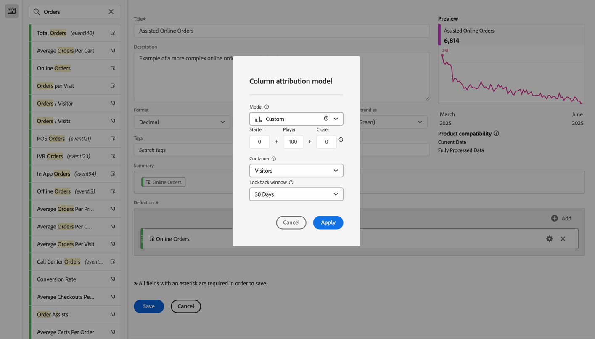

# Erstellen einer komplexeren berechneten Metrik

In diesem Artikel wird ein komplexeres Beispiel für eine berechnete Metrik erläutert. Diese berechnete Metrik zeigt an, welche Marketing-Kanäle bei Bestellungen helfen. Dieser Typ der berechneten Metrik kann an jede Dimension oder jedes Erfolgsereignis angepasst werden.

1. Beginnen Sie mit dem Erstellen einer berechneten Metrik, wie in [Metriken erstellen](/help/components/c-calcmetrics/c-workflow/cm-workflow/c-build-metrics/cm-build-metrics.md) beschrieben.

1. Benennen Sie im Generator für berechnete Metriken die Metrik `Assisted Online Orders` oder etwas Ähnliches.

1. Wählen Sie die Metrik **[!UICONTROL Online-Bestellungen]** aus den Komponenten **[!UICONTROL Metriken]** und ziehen Sie die Metrik in den Bereich **[!UICONTROL Definition]**.

   1. Wählen Sie Einstellung“ aus.
   1. Wählen **[!UICONTROL Nicht-standardmäßiges Attributionsmodell verwenden]**.
   1. Passen Sie das Attributionsmodell im **[!UICONTROL Spalten-Attributionsmodell]** an.
      1. Wählen Sie **[!UICONTROL Benutzerdefiniert]** für **[!UICONTROL Modell]** aus. Legen Sie **[!UICONTROL Starter]** auf `0`, **[!UICONTROL Player]** auf `100` und **[!UICONTROL Closer]** auf `0` fest.
      1. Wählen Sie **[!UICONTROL Besucher]** für **[!UICONTROL Container]** aus.
      1. Wählen Sie **[!UICONTROL 30 Tage]** für **[!UICONTROL Lookback-Fenster]**.

      1. Wählen Sie **[!UICONTROL Anwenden]** aus.

      

1. Wählen **[!UICONTROL Speichern]**, um die berechnete Metrik zu speichern.

So verwenden Sie die berechnete Metrik:

1. Erstellen Sie in Analysis Workspace eine Freiformtabelle mit der Dimension **[!UICONTROL Marketing]** Kanal“, **[!UICONTROL Online-Bestellungen]** und Ihrer neuen Metrik **[!UICONTROL Unterstützte Online-Bestellungen]**.

   

1. (Optional) Geben Sie die Metrik für andere Benutzer in Ihrer Organisation frei, wie unter [Freigeben berechneter Metriken](/help/components/c-calcmetrics/c-workflow/cm-workflow/cm-sharing.md) beschrieben.

Dies ist eine einfache Möglichkeit, um festzustellen, welche Marketing-Kanäle zur Erhöhung der Bestellungen beigetragen haben. Alternativ können Sie in einer Freiformtabelle eine beliebige Metrik auswählen und im Kontextmenü das Attributionsmodell direkt in der Tabelle anpassen.
