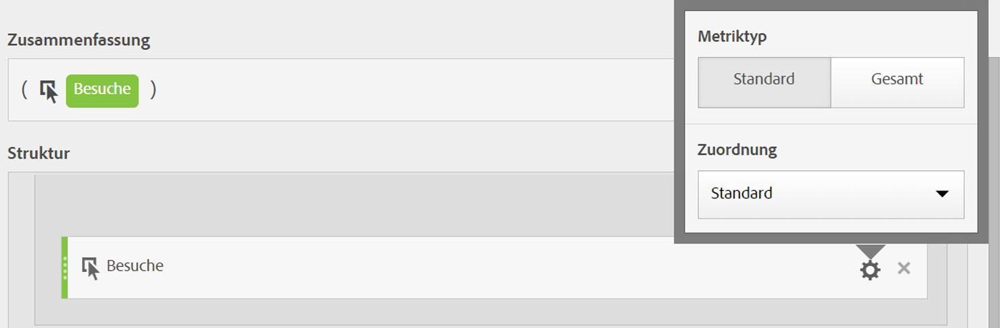

# Metriktyp und Attribution {#metric-type-attribution}

>[!CONTEXTUALHELP]
>id="components_calculatedmetrics_attributionmodel"
>title="Modell"
>abstract="Wählen Sie ein Attributionsmodell für die Metrik aus."

>[!CONTEXTUALHELP]
>id="components_calculatedmetrics_attribution_lasttouch"
>title="Letztkontakt"
>abstract="Die Credits gehen zu 100 % an den letzten Dimensionswert, den eine Besucherin bzw. ein Besucher gesehen hat."

>[!CONTEXTUALHELP]
>id="components_calculatedmetrics_attribution_firsttouch"
>title="Erstkontakt"
>abstract="Die Credits gehen zu 100 % an den ersten Dimensionswert, den eine Besucherin bzw. ein Besucher gesehen hat."

>[!CONTEXTUALHELP]
>id="components_calculatedmetrics_attribution_linear"
>title="Linear"
>abstract="Die Credits werden gleichmäßig auf alle Dimensionswerte verteilt."

>[!CONTEXTUALHELP]
>id="components_calculatedmetrics_attribution_participation"
>title="Beitrag"
>abstract="Die Credits gehen zu 100 % an jeden Dimensionswert, der von einer Besucherin oder einem Besucher gesehen wird. Spaltensummen werden erhöht."

>[!CONTEXTUALHELP]
>id="components_calculatedmetrics_attribution_sametouch"
>title="Selber Kontakt"
>abstract="Die Credits werden nur für Dimensionswerte erteilt, die bei demselben Ereignis wie die Konversion auftreten."

>[!CONTEXTUALHELP]
>id="components_calculatedmetrics_attribution_instance"
>title="Selber Kontakt"
>abstract="Die Credits werden nur für Dimensionswerte erteilt, die bei demselben Ereignis wie die Konversion auftreten."

>[!CONTEXTUALHELP]
>id="components_calculatedmetrics_attribution_ushaped"
>title="U-Form"
>abstract="Die Credits gehen zu zu 40 % an die erste Dimension, zu 40 % an die letzte und zu 20 % an die mittlere."

>[!CONTEXTUALHELP]
>id="components_calculatedmetrics_attribution_jcurve"
>title="J-Kurve"
>abstract="Die Credits gehen zu zu 60 % an den letzten Dimensionswert, zu 20 % an den ersten und zu 20 % an den mittleren."

>[!CONTEXTUALHELP]
>id="components_calculatedmetrics_attribution_jshaped"
>title="J-Kurve"
>abstract="Die Credits gehen zu zu 60 % an den letzten Dimensionswert, zu 20 % an den ersten und zu 20 % an den mittleren."

>[!CONTEXTUALHELP]
>id="components_calculatedmetrics_attribution_inversej"
>title="Umgekehrtes J"
>abstract="Die Credits gehen zu 60 % an den ersten Dimensionswert, zu 20 % an den letzten und zu 20 % an den mittleren."

>[!CONTEXTUALHELP]
>id="components_calculatedmetrics_attribution_reversejshaped"
>title="Umgekehrtes J"
>abstract="Die Credits gehen zu 60 % an den ersten Dimensionswert, zu 20 % an den letzten und zu 20 % an den mittleren."

>[!CONTEXTUALHELP]
>id="components_calculatedmetrics_attribution_timedecay"
>title="Zeitabfall"
>abstract="Die Dimensionswerte, die einer Konversion zeitlich am nächsten sind, erhalten die meisten Credits."

>[!CONTEXTUALHELP]
>id="components_calculatedmetrics_attribution_custom"
>title="Anpassen"
>abstract="Definieren Sie Ihre eigene positionsbasierte Attributionsgewichtung."

>[!CONTEXTUALHELP]
>id="components_calculatedmetrics_attribution_positionbased"
>title="Anpassen"
>abstract="Definieren Sie Ihre eigene positionsbasierte Attributionsgewichtung."

>[!CONTEXTUALHELP]
>id="components_calculatedmetrics_attribution_algorithmic"
>title="Algorithmisch"
>abstract="Die Credits werden anhand eines statistischen Algorithmus dynamisch bestimmt."

>[!CONTEXTUALHELP]
>id="components_calculatedmetrics_attribution_container"
>title="Container"
>abstract="Wählen Sie einen Container aus, um den gewünschten Umfang für die Attribution festzulegen."

>[!CONTEXTUALHELP]
>id="components_calculatedmetrics_attribution_lookbackwindow"
>title="Lookback-Fenster"
>abstract="Diese Einstellung bestimmt das Fenster der Datenattribution, das für jede Konversion angewendet wird."

Beim [Erstellen einer berechneten Metrik](/help/components/c-calcmetrics/c-workflow/cm-workflow/c-build-metrics/cm-build-metrics.md) können Sie den Metriktyp und das Attributionsmodell angeben.

## Metriktyp

So geben Sie den Metriktyp beim Erstellen einer berechneten Metrik an:

1. Wählen Sie das Zahnradsymbol neben der Metrik aus, deren Typ Sie auswählen möchten.

   

1. Wählen Sie aus den folgenden Optionen:

   | Metriktyp | Definition |
   |---|---|
   | Standard | Diese Metriken sind dieselben, die auch in der Standard-[!DNL Analytics]-Berichterstellung verwendet werden. Wenn eine Formel aus einer einzelnen Standardmetrik besteht, zeigt sie die gleichen Daten wie das nicht berechnete Metrikgegenstück an. Standardmetriken eignen sich zum Erstellen berechneter Metriken, die speziell für die einzelnen Einzelposten gelten. Beispiel: [Bestellungen]/[Besuche] teilt die Bestellungen für diesen Einzelposten durch die Anzahl der Besuche für den Posten. |
   | Gesamtsumme | Verwenden Sie die Gesamtsumme für den Berichtszeitraum in jedem Zeileneintrag. Wenn eine Formel aus einer einzelnen Gesamtsummenmetrik besteht, zeigt sie dieselbe Gesamtzahl für jeden Zeileneintrag an. Gesamtsummenmetriken eignen sich für die Erstellung berechneter Metriken, die mit den Gesamtdaten der Site verglichen werden. Beispiel: [Bestellungen]/[Gesamtbesuche] zeigt den Anteil der Bestellungen für ALLE Site-Besuche und nicht nur die Besuche für den speziellen Zeileneintrag. |

## Funktionsweise der linearen Zuordnung

Mit [Attribution](/help/analyze/analysis-workspace/attribution/overview.md) werden Zuordnungsmodelle in berechneten Metriken bewertet.

Eine vollständige Liste der nicht standardmäßigen Attributionsmodelle und unterstützten Lookback-Fenster finden Sie unter [Attributionsmodelle und Lookback-Fenster](/help/analyze/analysis-workspace/attribution/models.md).

Im folgenden Beispiel wird illustriert, wie berechnete Metriken mit linearen Zuordnungen beim Reporting funktionieren:

| | Treffer 1 | Treffer 2 | Treffer 3 | Treffer 4 | Treffer 5 | Treffer 6 | Treffer 7 |
|--- |--- |--- |--- |--- |--- |--- |--- |
| Eingereichte Daten | PROMO A | – | PROMO A | PROMO B | – | PROMO C | 10$ |
| Letztkontakt-eVar | PROMO A | PROMO A | PROMO A | PROMO B | PROMO B | PROMO C | 10$ |
| Erstkontakt-eVar | PROMO A | PROMO A | PROMO A | PROMO A | PROMO A | PROMO A | 10$ |
| Beispieleigenschaft | PROMO A | – | PROMO A | PROMO B | – | PROMO C | 10$ |

In diesem Beispiel wurden die Werte A, B und C in eine Variable für die Treffer 1, 3, 4 und 6 gesendet, bevor ein Kauf in Höhe von 10 USD bei Treffer 7 getätigt wurde. In der zweiten Zeile werden dieses Werte bei Treffern auf Grundlage von Letztkontaktbesuchen gespeichert. In der dritten Zeile wird das Speichern auf Grundlage des Erstkontaktbesuchs dargestellt. Zu guter Letzt stellt die letzte Zeile dar, wie Daten aus einer Eigenschaft aufgezeichnet würden, bei denen kein Speichern vorgesehen ist.

