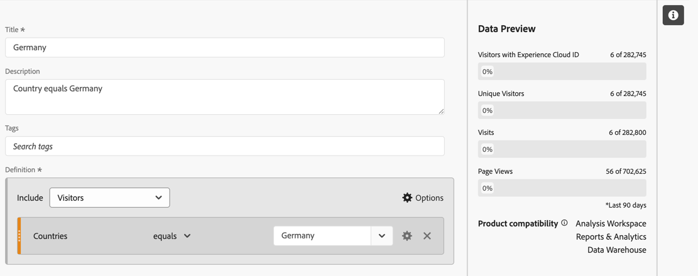
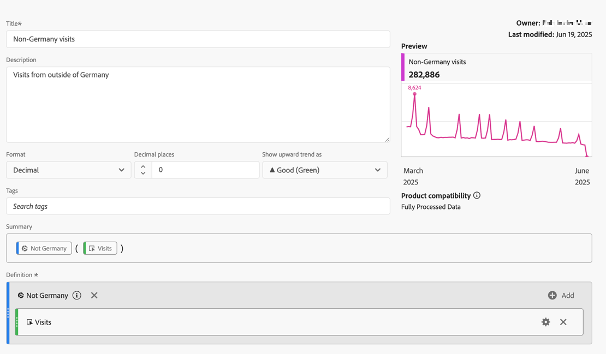

# Segmentierte Metriken

Im [Generator für berechnete Metriken](cm-build-metrics.md#definition-builder) können Sie Segmente innerhalb Ihrer Metrikdefinition anwenden. Das Anwenden von Segmenten ist hilfreich, wenn Sie Metriken für eine Teilmenge Ihrer Daten in Ihrer Analyse verwenden möchten.

>[!NOTE]
>
>Segmentdefinitionen werden über den [Segment Builder](/help/components/segmentation/segmentation-workflow/seg-build.md) aktualisiert. Wenn Sie eine Änderung an einem Segment vornehmen, wird das Segment automatisch aktualisiert, wo immer es verwendet wird, auch wenn das Segment Teil einer Definition für berechnete Metriken ist.
>

Sie möchten Metriken für deutsche Personen, die mit Ihrer Marke interagieren, mit denen für Personen außerhalb Deutschlands vergleichen. Sie können also Fragen beantworten wie:

1. Wie viele Deutsche bzw. internationale Personen besuchen Ihre beliebtesten [Seiten](#popular-pages).
1. Wie viele Deutsche bzw. internationale Personen [total](#totals) haben in diesem Monat online mit Ihrer Marke interagiert.
1. Was sind [Prozent](#percentages) der Deutschen und internationalen Menschen, die Ihre beliebten Seiten besucht haben?

In den folgenden Abschnitten erfahren Sie, wie Sie mithilfe segmentierter Metriken diese Fragen beantworten können. Gegebenenfalls wird auf eine ausführlichere Dokumentation verwiesen.

## Beliebte Seiten

1. [Erstellen Sie eine berechnete ](../cm-workflow.md) aus einem Workspace-Projekt namens `Germany`.
1. Erstellen Sie im [Generator für berechnete ](cm-build-metrics.md)[ ein Segment](/help/components/segmentation/segmentation-workflow/seg-build.md) mit dem Titel &quot;`Germany`&quot;, das das Feld „Länder“ verwendet.

   >[!TIP]
   >
   >Im Generator für berechnete Metriken können Sie ein Segment direkt mithilfe des Bedienfelds Komponenten erstellen.
   >   

   Ihr Segment könnte wie folgt aussehen.

   

1. Zurück im Generator für berechnete Metriken verwenden Sie das Segment , um die berechnete Metrik zu aktualisieren.

   

Wiederholen Sie die obigen Schritte für die internationale Version Ihrer berechneten Metrik.

1. Erstellen Sie aus Ihrem Workspace-Projekt eine berechnete Metrik mit dem Titel `Non Germany visits`.
1. Erstellen Sie im Generator für berechnete Metriken ein Segment mit dem Titel &quot;`Not Germany`&quot;, das das Feld „CRM-Land“ aus Ihren CRM-Daten verwendet, um zu bestimmen, woher eine Person kommt.

   Ihr Segment sollte wie folgt aussehen.

   

1. Zurück im Generator für berechnete Metriken verwenden Sie das Segment , um die berechnete Metrik zu aktualisieren.

   

1. Erstellen Sie ein Projekt in Analysis Workspace, in dem Sie sich die Seiten ansehen, die von deutschen und nichtdeutschen Besuchern besucht werden.

   

## Gesamt

1. Erstellen Sie zwei neue berechnete Metriken basierend auf der Gesamtsumme. Öffnen Sie jedes der zuvor erstellten Segmente, benennen Sie das Segment um, legen Sie **[!UICONTROL Metriktyp]** für **[!UICONTROL Personen]** auf **[!UICONTROL Gesamtsumme]** fest und verwenden Sie **[!UICONTROL Speichern unter]**, um das Segment unter dem neuen Namen zu speichern. Zum Beispiel:

   

1. Fügen Sie Ihrem Workspace-Projekt eine neue Freiformtabellen-Visualisierung hinzu, die die Gesamtseiten für dieses Jahr anzeigt.

   

## Prozentsatz

1. Erstellen Sie zwei neue berechnete Metriken, die einen Prozentsatz aus den zuvor erstellten berechneten Metriken berechnen.

   

1. Aktualisieren Sie Ihr Workspace-Projekt.

   

