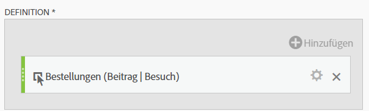
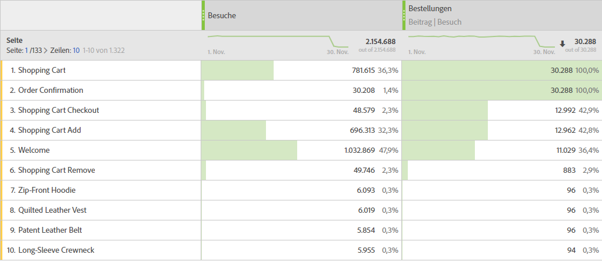

# Teilnahmemetriken

Teilnahmemetriken werden verwendet, um zu quantifizieren, wie einzelne Werte für eine Dimension (wie Seitenansichten) zu Besuchen, die eine bestimmte Metrik enthalten (wie Bestellungen), beitragen oder an ihnen teilnehmen.

Die folgenden Schritte zeigen, wie Sie eine Teilnahmemetrik erstellen können.

1. [Erstellen Sie eine berechnete ](../cm-workflow.md) und geben Sie der Metrik im [Generator für berechnete ](cm-build-metrics.md)&quot; einen `Orders (Visit Participation)` oder etwas Ähnliches.
1. Ziehen Sie eine Metrik, die ein Erfolgsereignis enthält, z. B. [!DNL Online Orders], in den Bereich [!UICONTROL **[!UICONTROL Definition]**].
1. Wählen Sie Zahnrad) aus.
1. Wählen Sie im angezeigten Popup die Option **[!UICONTROL Nicht standardmäßiges Attributionsmodell verwenden]**, um das [Attributionsmodell](m-metric-type-alloc.md#attribution-models) dieses Ereignisses für **[!UICONTROL Teilnahme]** zu definieren, und wählen Sie **[!UICONTROL Besuche]** für den [!UICONTROL Container]. Wählen Sie **[!UICONTROL Übernehmen]** zur Bestätigung aus.

   

   **(Teilnahme|Besuche|30 Tage)** wird zum Komponentennamen für die Metrik hinzugefügt.

1. Wählen [!UICONTROL **Speichern**], um die Metrik zu speichern.
1. Verwenden Sie die berechnete Metrik in Ihrem Bericht. Verwenden Sie beispielsweise die berechnete [!DNL Orders (Session Participation)]-Metrik in einem Bericht, um anzuzeigen, welche Kundenebene zu Sitzungen beigetragen hat, die eine Bestellung enthielten (oder daran teilgenommen hat).

   

<!--

The following information explains how to create a metric that shows which pages contributed to (or participated in) visits that contained an order.

This type of information could be useful for any content owner.

>[!NOTE]
>
>You can enable participation metrics in the Admin Tools, but only for custom events 1 - 100.

1. Begin creating a calculated metric, as described in [Build metrics](/help/components/c-calcmetrics/c-workflow/cm-workflow/c-build-metrics/cm-build-metrics.md).

1. In the Calculated metrics builder, name the metric "Participation".

1. Drag the success event "Orders" into the Definition canvas.

1. Change the [attribution model](/help/components/c-calcmetrics/c-workflow/cm-workflow/c-build-metrics/m-metric-type-alloc.md) of that event to **[!UICONTROL Participation]** under the **[!UICONTROL Settings]** gear. Select **[!UICONTROL Visit]** lookback. The definition should look similar to this:

   

1. Select [!UICONTROL **Save**] to save the metric.

1. Use the calculated metric in a **[!UICONTROL Pages]** report.

    

1. (Optional) Share the metric with other users in your organization, as described in [Share calculated metrics](/help/components/c-calcmetrics/c-workflow/cm-workflow/cm-sharing.md).
-->