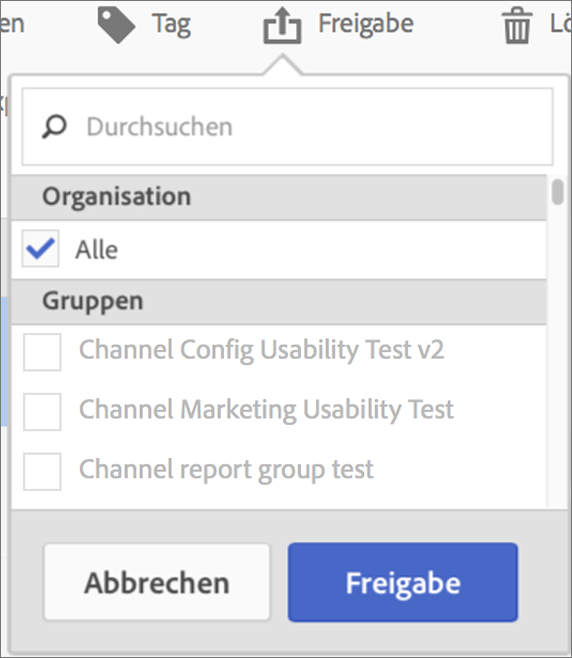

# Berechnete Metriken freigeben

Abhängig von Ihren Berechtigungen können Sie Metriken für Ihre gesamte Organisation, für Gruppen oder für einzelne Benutzer freigeben.

| Rolle | Zugriffsberechtigung |
|---|---|
| Administrator | Kann Metriken für alle, für Gruppen und für Benutzer freigeben. Gruppen werden in der Admin Console als Berechtigungsgruppen eingerichtet. |
| Nicht-Administrator | Kann Metriken nur für einzelne Benutzer freigeben. |

Freigeben einer berechneten Metrik:

1. Wählen Sie in Adobe Analytics die Registerkarte **[!UICONTROL Komponenten]** und dann **[!UICONTROL Berechnete Metriken]** aus.

1. Aktivieren Sie im Manager für berechnete Metriken das Kontrollkästchen links neben den Metriken, die Sie freigeben möchten.

1. Wählen Sie das Symbol **[!UICONTROL Freigeben]** aus. 

   Das Dialogfeld Berechnete Metrik freigeben wird angezeigt.

   

1. Wählen Sie **[!UICONTROL Freigeben]** aus.

1. Wählen Sie aus, für wen Sie freigeben möchten:

   * **[!UICONTROL Alle]** (nur Administratoren): Wird für alle Benutzer in der Organisation freigegeben.

     Erwägen Sie, nur dann für alle freizugeben, wenn dies für das gesamte Unternehmen von Nutzen ist und alle damit vertraut sind. In diesem Fall sollten Sie auch erwägen, daraus eine [genehmigte Metrik](/help/components/c-calcmetrics/c-workflow/cm-workflow/cm-approving.md) zu machen.

   * **[!UICONTROL Gruppen]** (nur Administratoren): Wählen Sie alle Gruppen aus, für die Sie eine Freigabe durchführen möchten.

     Erwägen Sie die Freigabe für eine Gruppe, wenn die Metrik einen guten Geschäftswert für dieses Team bietet.

   * **[!UICONTROL Individuelle Benutzer]**: Suchen Sie nach den einzelnen Benutzern, für die Sie freigeben möchten, und wählen Sie sie aus.

     Dies ist die einzige Freigabeoption, die allen Benutzern zur Verfügung steht. Administratoren sollten diese Option verwenden, um eine Metrik zu überprüfen und zu validieren, bevor sie sie einer Gruppe oder allen Personen zur Verfügung stellt. Wenn die Metrik nicht nützlich ist, kann sie verworfen werden. Administratoren sollten diesen Metriktyp nicht offiziell genehmigen.

1. Wählen Sie **[!UICONTROL Freigeben]** aus.

   Das Symbol Freigegeben wird neben der Metrik angezeigt: .

1. Sie können nach für Sie freigegebenen Metriken filtern, indem Sie **[!UICONTROL Filter]** > **[!UICONTROL Weitere Filter]** > **[!UICONTROL Für mich freigegeben]** verwenden.

1. (Optional) Um die Liste der berechneten Metriken im Manager für berechnete Metriken so zu filtern, dass nur die für Sie freigegebenen Metriken angezeigt werden, wählen Sie das Symbol **Filter** aus, erweitern Sie **[!UICONTROL Andere Filter]** und klicken Sie dann auf **[!UICONTROL Für mich freigegeben]**.

