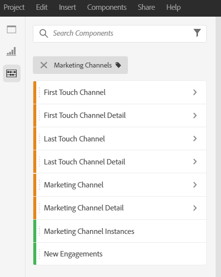

# Analysieren von Marketing-Kanälen

Sie möchten wahrscheinlich wissen, welche Ihrer Marketing-Kanal am effektivsten sind und mit wem, damit Sie Ihre Bemühungen besser Zielgruppe und eine bessere Rendite aus Ihren Marketing-Dollars erhalten. In Adobe Analytics sind die Dimensionen und Metriken der Marketing-Kanal in Workspace eines der Tools, mit dem Sie den Einfluss verschiedener Kanal auf Ihre Bestellungen, Umsatz usw. verfolgen können. und geben Ihnen nützliche Einblicke in den Kanal. Im Folgenden finden Sie die Dimensionen und Metriken, die Sie im Zusammenhang mit Marketing-Kanälen verwenden können:

| Dimension/Metrik | Definition |
|---|---|
| Marketingkanal | Dies ist die empfohlene Marketing-Kanal-Dimension. Zuordnungs-IQ-Modelle können zur Laufzeit darauf angewendet werden. Diese Dimension verhält sich genauso wie die Dimension &quot;Letztkontakt-Kanal&quot;, wird jedoch anders gekennzeichnet, um Verwirrung zu vermeiden, wenn sie mit einem anderen Zuordnungsmodell verwendet wird. |
| Letztkontakt Kanal | Legacy-Dimension, mit Last Touch-Zuordnungsmodell vorab angewendet und unveränderlich. |
| Erstkontakt Kanal | Legacy-Dimension, mit dem First Touch-Zuordnungsmodell vorab angewendet und unveränderbar. |
| Marketingkanal-Instanzen | Diese Metrik misst, wie oft ein Marketing-Kanal in einer Bildanforderung definiert wurde, einschließlich standardmäßiger Ansichten von Seiten und benutzerspezifischer Linkaufrufe. Enthält keine persistenten Werte. |
| Neue Interaktionen | Diese Metrik ähnelt Instanzen, wird jedoch nur inkrementiert, wenn in einer Bildanforderung First Touch-Marketing-Kanal definiert wird. |

## Basisanalyse

Diese Freiform-Tabelle zeigt die Metriken Online-Bestellungen, Online-Umsatz und den Konversionsrate für jeden Marketing-Kanal:

Hier sehen Sie die Online-Bestellungen und den Online-Umsatz der einzelnen Marketing-Kanal in einem Ringdiagramm:

Dieses Liniendiagramm zeigt Trends bei Online-Bestellungen für verschiedene Kanal im Zeitverlauf:

## Erweiterte Analyse

Marketing-Kanal Details tauchen tiefer in die einzelnen Kanal ein, um Ihnen bestimmte Kampagnen, Platzierungen usw. zu zeigen. Sie können jeden Marketing-Kanal in Details unterteilen:

## Zuordnungsmodelle anwenden

Sie können [Zuordnungs-IQ](https://docs.adobe.com/content/help/en/analytics/analyze/analysis-workspace/panels/attribution/use-attribution.html) verwenden, um verschiedene Zuordnungsmodelle sofort anzuwenden:

Beachten Sie, dass dieselbe Metrik (Online-Bestellungen) unterschiedliche Ergebnisse generiert, wenn Sie verschiedene Zuordnungsmodelle anwenden.

Im Folgenden finden Sie einige Videos, die Attribution IQ detaillierter erklären: [Zuordnung IQ-Playlist](https://www.youtube.com/playlist?list=PL2tCx83mn7GuDzYEZ8jQlaScruZr3tBTR).

## Tabulatorübergreifende Marketing-Analyse

Mithilfe des alten First Touch-Kanals und des Last Touch-Kanals erhalten Sie eine hilfreiche Ansicht zu den Interaktionen von Kanälen:

In [diesem Video](https://www.youtube.com/watch?v=M3EOdONa-3E)erhalten Sie weitere Informationen zur tabulatorübergreifenden Marketing-Analyse.
