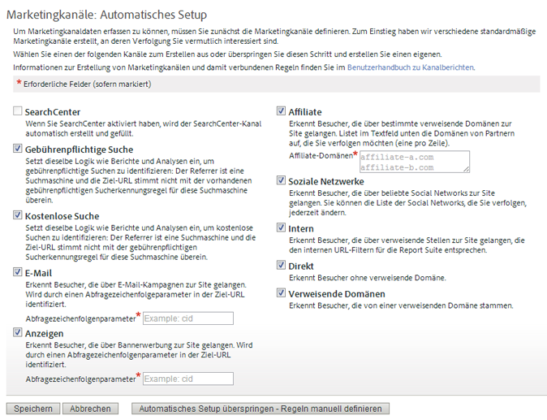

# Erste Schritte mit Marketing-Kanälen

>[!NOTE]
>
>Um die Effektivität von Marketing-Kanälen für Attribution und Customer Journey Analytics zu maximieren, haben wir einige [überarbeitete Best Practices](/help/components/c-marketing-channels/mchannel-best-practices.md) veröffentlicht.
>
>Analytics-Admins können Marketing-Kanäle für ihre Organisationen verwalten, wie unter [Verwalten von Marketing-Kanälen](/help/admin/tools/manage-rs/edit-settings/marketing-channels/c-channels.md) beschrieben.

Marketing-Kanäle geben Aufschluss darüber, wie Besucher auf Ihre Site gelangen. Sie können Ihre Verarbeitungsregeln für Marketing-Kanäle anpassen, je nachdem, welche Kanäle Sie verfolgen möchten und wie Sie diese verfolgen möchten.

Marketingkanäle kreisen um First- und Last-Touch-Metriken, die Komponenten von standardmäßigen Konversionsmetriken sind.

## Marketing-Kanal-Workflow

 Definieren jedes Kanals auf Grundlage Ihrer Geschäftsanforderungen.

Die Definition der von Ihnen verwendeten Kanäle ist eine der wichtigsten Komponenten von Marketing-Kanälen. Die Definition der Kanäle kann eine Zusammenarbeit verschiedener Personen in Ihrer Organisation erfordern. Hier sind einige Fragen, die Sie berücksichtigen sollten:

* Verwenden Sie Paid Search?
* Verwenden Sie E-Mail-Kampagnen? Verwenden Sie mehrere E-Mail-Kampagnen, die Sie separat verfolgen möchten?
* Haben Sie Partner, die Traffic auf Ihre Website leiten? Gibt es Partner, die Sie einzeln nachverfolgen möchten?
* Gibt es externe Kampagnen, bei denen ein separates Tracking vorteilhaft wäre?
* Möchten Sie alle sozialen Netzwerke zusammenfassen oder gibt es bestimmte Netzwerke, die Sie einzeln nachverfolgen möchten?
* Gibt es weitere Kanäle, die sich auf die Konversion auswirken könnten und die Sie nachverfolgen möchten?

Eine Liste der empfohlenen Kanäle finden Sie unter [Häufig gestellte Fragen und Beispiele](/help/components/c-marketing-channels/c-faq.md). Erstellen Sie eine Liste der Kanäle, die Sie nutzen möchten, um die Aktivierung und Definition beim Erstellen von Kanälen zu vereinfachen.

 Fügen Sie auf der Seite [!UICONTROL Marketing-Kanal-Manager] Marketing-Kanäle hinzu.

Nach der Definition der nachverfolgten Kanäle können Sie sie in **[!UICONTROL Admin]** > **[!UICONTROL Report Suites]** aktivieren.

Wichtige Voraussetzungen und grundlegende Informationen finden Sie unter [Kanäle und Regeln](/help/admin/tools/manage-rs/edit-settings/marketing-channels/c-channels.md).

Informationen zum Verfahren finden Sie unter [Hinzufügen von Marketing-Kanälen](/help/admin/tools/manage-rs/edit-settings/marketing-channels/c-channels.md).

>[!NOTE]
>
>Wenn Marketing-Kanäle noch nicht konfiguriert wurden, wird das [automatische Setup](/help/components/c-marketing-channels/c-getting-started-mchannel.md) angezeigt. Dieses Setup bietet mehrere vorkonfigurierte Kanäle, die Sie anpassen können. Adobe empfiehlt, diese Regeln als Vorlage zu verwenden. Wenn Sie jedoch bereits über solide Kanaldefinitionen verfügen, können Sie das automatische Setup überspringen.

 Konfigurieren oder grenzen Sie die Regeln jedes Kanals auf der Seite [!UICONTROL Marketingkanal-Verarbeitungsregeln] ein.

Konfigurieren Sie nach der Erstellung von Kanälen auf der Seite [!UICONTROL Marketing-Kanal-Manager] die Regeln, damit Kanäle Daten abrufen können und Berichte dazu erstellen können.

Weitere Informationen finden Sie unter [Marketing-Kanal-Verarbeitungsregeln](/help/admin/tools/manage-rs/edit-settings/marketing-channels/mc-proc-rules.md).

Wenn Kanäle im automatischen Setup erstellt wurden, sind die Regeln in diesen Kanälen bereits definiert. Sie können diese an Ihre Anforderungen anpassen.

## Automatische Einrichtung für Marketing-Kanäle {#run-auto-setup}

Der Marketing-Kanal-Bericht bietet zum Einstieg eine einmalige Setup-Seite. Hier finden Sie eine Vielzahl an Marketing-Kanälen, die Sie zur Nachverfolgung nutzen können. Wenn Sie mit der Erstellung von Kanälen und Regeln vertraut sind, können Sie dieses Setup überspringen. Adobe empfiehlt jedoch, die Kanäle durch den Assistenten erstellen zu lassen. Beim automatischen Setup können Sie sehen, wie Regeln aufgebaut sind, oder diese für Ihre eigenen Zwecke bearbeiten. Sie können die vordefinierten Kanäle jederzeit deaktivieren oder löschen.

So führen Sie das automatische Setup für Marketing-Kanäle aus.

1. Klicken Sie auf **[!UICONTROL Analytics]** > **[!UICONTROL Admin]** > **[!UICONTROL Report Suites]**.
1. Wählen Sie im [!UICONTROL Report Suite Manager] eine Report Suite aus.
1. Klicken Sie auf **[!UICONTROL Einstellungen bearbeiten]** > **[!UICONTROL Marketingkanäle]** > **[!UICONTROL Marketingkanal-Manager]**.

   

   >[!NOTE]
   >
   >Die Seite [!UICONTROL Marketing-Kanäle: Automatisches Setup] wird automatisch bei Zugriff auf die Kanalkonfigurationsanwendungen in „Admin Tools“ angezeigt. (Siehe [Marketing-Kanal-Manager](/help/admin/tools/manage-rs/edit-settings/marketing-channels/c-channels.md).) Diese Seite wird nicht angezeigt, wenn Ihre Report Suite einen oder mehrere Marketing-Kanäle enthält. Sie können auf diese Seite erst wieder zugreifen, wenn Sie eine andere Report Suite auswählen, die keine Marketing-Kanäle enthält.

1. Stellen Sie sicher, dass die gewünschten Kanäle ausgewählt sind.

   Bei Auswahl sind **[!UICONTROL E-Mail]**, **[!UICONTROL Anzeigen]** und **[!UICONTROL Affiliate]** erforderliche Felder.

1. Klicken Sie auf **[!UICONTROL Speichern]**.

## Übernehmen von Report Suite-Vorlageneinstellungen für mehrere Report Suites

Verwenden einer übergeordneten Report Suite als Vorlage zum Testen der Konfiguration Ihres Marketing-Kanals. Diese Vorlage kann zur Zeitersparnis in einer Massenaktualisierung für eine oder mehrere Produktions-Report Suites übernommen werden. Diese Aufgabe wird für Kanäle und Regelsätze separat ausgeführt.

>[!NOTE]
>
>Übernehmen Sie zunächst die Kanäle aus einer Vorlage, bevor Sie Regelsätze einsetzen. Bei diesem Ablauf müssen die Kanäle für alle Report Suites identisch sein.

1. Klicken Sie auf **[!UICONTROL Analytics]** > **[!UICONTROL Admin]** > **[!UICONTROL Report Suites]**.
1. Wählen Sie auf der Seite **[!UICONTROL Report Suite Manager]** die Vorlagen-Report Suite sowie eine oder mehrere Ziel-Report Suites aus.
1. Klicken Sie auf **[!UICONTROL Einstellungen bearbeiten]** > **[!UICONTROL Marketingkanäle]** > **[!UICONTROL Marketingkanal-Manager]**.
1. Wählen Sie auf der **[!UICONTROL Master Report Suites]**-Seite die Vorlage der Report Suite aus.
1. Klicken Sie auf **[!UICONTROL Alle speichern]**.
1. Übernehmen von Regeln aus einer Vorlage für mehrere Report Suites:
   1. Kehren Sie zur Seite [!UICONTROL Report Suite Manager] zurück.
   1. Wählen Sie auf der Seite Report Suite-Manager die Vorlagen-Report Suite sowie eine oder mehrere Ziel-Report Suites aus.
   1. Klicken Sie auf **[!UICONTROL Einstellungen bearbeiten]** > **[!UICONTROL Marketingkanäle]** > **[!UICONTROL Marketingkanal-Verarbeitungsregeln]**.
   1. Klicken Sie auf **[!UICONTROL Speichern]**. Wenn die Schaltfläche „Speichern“ deaktiviert ist, aktivieren Sie sie, indem Sie eine der Regeln erweitern.
