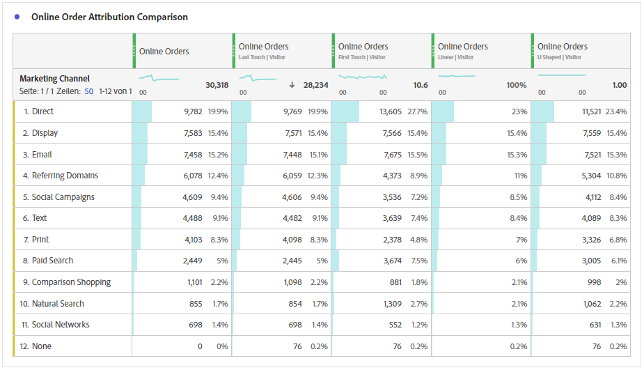
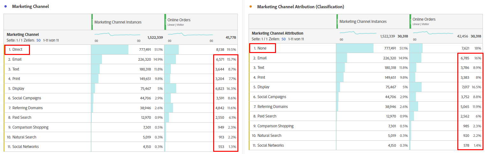
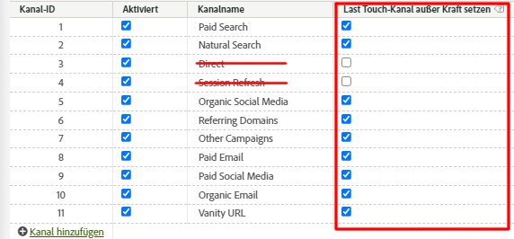
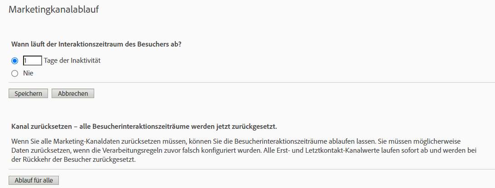

# Attribution mit Marketing-Kanälen – Best Practices

[Marketing-Kanäle](/help/components/c-marketing-channels/c-getting-started-mchannel.md) sind eine wertvolle und leistungsstarke Funktion von Adobe Analytics. Die aktuelle Anleitung zur Implementierung von Marketing-Kanälen wurde zu einem Zeitpunkt formuliert, als weder [Attribution](/help/analyze/analysis-workspace/attribution/overview.md) noch [Customer Journey Analytics](https://experienceleague.adobe.com/docs/analytics-platform/using/cja-usecases/marketing-channels.html?lang=de#cja-usecases) existierten.

Um Ihre Implementierung von Marketing-Kanälen zukunftssicher zu machen und sicherzustellen, dass Berichte mit Attribution und Customer Journey Analytics konsistent sind, stellen wir eine Reihe aktualisierter Best Practices bereit. Wenn Sie bereits Marketing-Kanäle verwenden, können Sie unter diesen neuen Richtlinien die besten Optionen auswählen. Wenn Sie mit Marketing-Kanälen noch nicht vertraut sind, empfehlen wir Ihnen, alle neuen Best Practices einzuhalten.

Als Marketing-Kanäle eingeführt wurden, hatten sie nur die Dimensionen „Erstkontakt“ und „Letztkontakt“. Explizite Dimensionen „Erstkontakt“ und „Letztkontakt“ sind mit der aktuellen Attributionsversion nicht mehr erforderlich. Adobe stellt allgemeine Dimensionen für „Marketing-Kanal“ und „Marketing-Kanal-Detail“ bereit, damit Sie diese mit Ihrem gewünschten Attributionsmodell verwenden können. Diese allgemeinen Dimensionen verhalten sich identisch mit den Dimensionen des Letztkontakt-Kanals, sind jedoch anders gekennzeichnet, um Verwirrung bei der Verwendung von Marketing-Kanälen mit einem anderen Attributionsmodell zu vermeiden.

Da die Marketing-Kanal-Dimensionen von einer traditionellen Besuchsdefinition abhängen (wie in den Verarbeitungsregeln definiert), kann ihre Besuchsdefinition nicht mit Virtual Report Suites geändert werden. Diese überarbeiteten Vorgehensweisen ermöglichen klare und kontrollierte Lookback-Fenster mit Attribution und Adobe Analytics.

## Best Practice 1: Attribution für kontrollierte Analysen nutzen

Es wird empfohlen, [Attribution](/help/analyze/analysis-workspace/attribution/overview.md) anstelle der vorhandenen Marketing-Kanal-Attribution zu verwenden, um die Marketing-Kanal-Analyse zu optimieren. Befolgen Sie die anderen Best Practices, um Konsistenz und zuverlässige Kontrollen Ihrer Analyse mit Attribution sicherzustellen.

* Die Konfiguration der Dimensionen „Marketing-Kanal“ und „Marketing-Kanal-Detail“ legt Touchpoints fest, die entsprechend den einzelnen Marketing-Kanal-Instanzen bewertet werden sollen.
* Bei der Metrikanalyse sollte Ihr Unternehmen ein oder mehrere Attributionsmodelle verwenden. Speichern Sie benutzerdefinierte Metriken mit diesem Modell zur einfachen Wiederverwendung.
* Standardmäßig werden Daten mithilfe von Letztkontakt und der Einstellung des Besucherinteraktionszeitraums zugeordnet. Attribution-Metrikmodelle bieten eine bessere Kontrolle über die Lookback-Fenster und eine größere Vielfalt, einschließlich [algorithmischer Attribution](/help/analyze/analysis-workspace/attribution/algorithmic.md#analysis-workspace).

## Best Practice 2: Keine Kanaldefinitionen für „Direkt“ und „Sitzungsaktualisierung“

Die Kanäle „Direkt“ und „Intern/Sitzungsaktualisierung“ werden nicht zur Verwendung mit benutzerdefinierten Attributionsmodellen empfohlen.

Was passiert, wenn für Ihr Unternehmen bereits „Direkt“ und „Sitzungsaktualisierung“ konfiguriert ist? In diesem Fall empfiehlt Adobe, [Klassifizierung“ für Erstkontakt/Letztkontakt ](/help/admin/tools/manage-rs/edit-settings/marketing-channels/classifications-mchannel.md) erstellen und die Kanäle „Direkt“ und „Sitzungsaktualisierung“ nicht klassifiziert zu lassen. Die klassifizierte Dimension liefert Attributionsergebnisse, die dem Fall ähneln, in dem diese Kanäle nie konfiguriert wurden.

Wenn Sie diese Kanäle deaktivieren und ihre Marketing-Kanal-Verarbeitungsregeln entfernen, unterscheiden sich die Ergebnisse geringfügig vom Klassifizierungsansatz. Der Wert `None` steht für Besuche, die keinen Marketing-Kanal-Verarbeitungsregeln entsprachen. Unterschiede können auftreten, wenn ein Besuch, der keinem Kanal entspricht, einem Besuch folgt, der einem Kanal entspricht.

Sie können weiterhin benutzerdefinierte Attributionsmodelle verwenden, um in beiden Fällen Lookback-Fenster und Attributionsmodelle anzuwenden.

## Best Practice 3: „Last Touch-Kanal außer Kraft setzen“ für alle Kanäle aktivieren

Benutzerdefinierte Attributionsmodelle, die mit der Dimension „Marketing-Kanal“ in Workspace verwendet werden, funktionieren am besten, wenn diese Einstellung aktiviert ist. Durch Aktivierung dieser Einstellung wird eine Marketing-Kanal-Instanz gezählt, wenn ein neuer Kanal/ein neues Detail gefunden wird. Sie sollten dies für alle Kanäle mit Ausnahme von „Direkt“ oder „Intern/Sitzungsaktualisierung“ aktivieren, die nicht mehr für die Verwendung mit benutzerdefinierten Attributionsmodellen empfohlen werden.

## Best Practice 4: Zeitraum der Besucherinteraktion minimieren

Wenn Sie den Zeitraum der Besucherinteraktion auf das Minimum „1 Tag“ setzen, wird die Wahrscheinlichkeit minimiert, dass Werte beibehalten werden. Da benutzerdefinierte Attributionsmodelle (AIQ) flexible Lookback-Fenster ermöglichen, empfehlen wir, den Mindestwert festzulegen, um die Auswirkungen dieser Einstellung zu minimieren.

## Best Practice Nr. 5: Verarbeitungsregeln für Marketing-Kanäle nur für aktivierte Kanäle

Stellen Sie sicher, dass Sie alle Verarbeitungsregeln für Marketing-Kanäle für deaktivierte Kanäle entfernen. Regeln sollten nur für Marketing-Kanäle vorhanden sein, die als aktiviert markiert sind.
