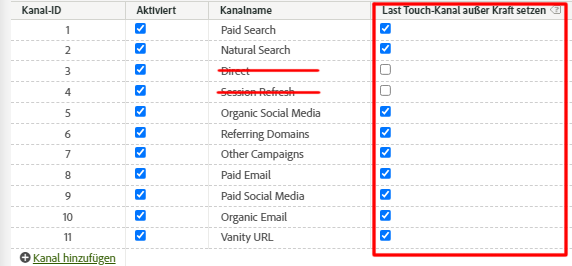
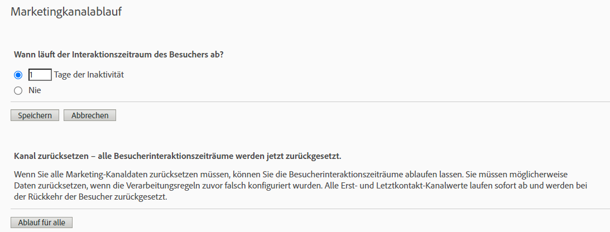

# Attribution IQ mit Marketing-Kanälen - Best Practices

[Marketing ](/help/components/c-marketing-channels/c-getting-started-mchannel.md) Channelsare sind ein wertvolles und leistungsstarkes Merkmal von Adobe Analytics. Die aktuellen Anleitungen zur Implementierung von Marketing-Kanälen wurden zu einer Zeit formuliert, als weder [Attribution IQ](https://experienceleague.corp.adobe.com/docs/analytics/analyze/analysis-workspace/attribution/overview.html?lang=en#analysis-workspace) noch [Customer Journey Analytics](https://experienceleague.adobe.com/docs/analytics-platform/using/cja-usecases/marketing-channels.html?lang=de#cja-usecases) existierten.

Um die Implementierung Ihrer Marketing-Kanal in Zukunft zu Testversand zu bringen und sicherzustellen, dass Berichte mit Attribution IQ und Customer Journey Analytics konsistent sind, stellen wir eine Reihe aktualisierter Best Practices zur Verfügung. Wenn Sie bereits Marketing-Kanal verwenden, können Sie unter diesen neuen Richtlinien die besten Optionen auswählen. Wenn Sie neu bei Marketing-Kanälen sind, empfehlen wir Ihnen, sich an alle neuen Best Practices zu halten.

Als die Marketing-Kanal zum ersten Mal eingeführt wurden, hatten sie nur First Touch- und Last Touch-Dimensionen. Explizite Dimensionen „Erstkontakt“ und „Letztkontakt“ sind mit der aktuellen Attributionsversion nicht mehr erforderlich. Adobe bietet allgemeine Dimensionen &quot;Marketing-Kanal&quot;und &quot;Marketing-Kanal-Detail&quot;, damit Sie sie mit Ihrem gewünschten Zuordnungsmodell verwenden können. Diese generischen Dimensionen verhalten sich identisch mit den Dimensionen des Last Touch-Kanals, sind jedoch anders beschriftet, um Verwirrung bei der Verwendung von Marketing-Kanälen mit einem anderen Zuordnungsmodell zu vermeiden.

Da die Dimensionen des Marketing-Kanals von einer herkömmlichen Besuchsdefinition abhängen (wie in ihren Verarbeitungsregeln definiert), kann ihre Besuchsdefinition nicht mit Virtual Report Suites geändert werden. Diese überarbeiteten Verfahren ermöglichen klare und kontrollierte Lookback-Fenster mit Attribution IQ und mit CJA.

## Best Practice Nr. 1: Nutzung von Attribution IQ für kontrollierte Analyse

Es wird empfohlen, [Attribution IQ](https://experienceleague.corp.adobe.com/docs/analytics/analyze/analysis-workspace/attribution/overview.html?lang=en#analysis-workspace) anstelle der vorhandenen Marketing-Kanal-Zuordnung zu verwenden, um Ihre Marketing-Kanal-Analyse zu präzisieren. Befolgen Sie die anderen bewährten Verfahren, um Konsistenz und stabile Kontrollen Ihrer Analyse mit Attribution IQ sicherzustellen.

* Die Konfiguration der Dimensionen Marketing Kanal- und Marketing Kanal-Detail legt Touchpoints fest, die entsprechend jeder Marketing Kanal-Instanz bewertet werden sollen.
* Zur Analyse von Metriken sollte Ihr Unternehmen ein oder mehrere Zuordnungsmodelle verwenden. Speichern Sie benutzerdefinierte Metriken mit diesem Modell, um sie einfach wiederzuverwenden.
* Standardmäßig werden die Daten mithilfe von &quot;Letztkontakt&quot;und der Einstellung des Besucher-Interaktionszeitraums zugeordnet. Attribution IQ-Metrikmodelle Angebot mehr Kontrolle über die Lookback-Fenster und mehr Vielfalt, einschließlich [algorithmische Zuordnung](https://experienceleague.adobe.com/docs/analytics/analyze/analysis-workspace/attribution/algorithmic.html?lang=en#analysis-workspace).

## Best Practice Nr. 2: Keine Kanal-Definitionen für &quot;Direkt aktualisieren&quot;und &quot;Sitzung aktualisieren&quot;

Kanal zur direkten und internen/Sitzungsaktualisierung werden nicht für die Verwendung mit benutzerdefinierten Zuordnungsmodellen (Attribution IQ) empfohlen.

Was ist, wenn Ihr Unternehmen bereits Direct und Session Refresh konfiguriert hat? In diesem Fall sollten Sie eine Klassifizierung für Ihre Marketing-Kanal erstellen und diese beiden Kanal nicht klassifizieren. Die klassifizierte Dimension liefert dieselben Attribution IQ-Ergebnisse, als ob diese Kanal nie konfiguriert wären.

## Best Practice Nr. 3: Last Touch-Kanal für alle Kanal überschreiben aktivieren

Benutzerdefinierte Zuordnungsmodelle, die mit der Marketing Kanal-Dimension in Workspace verwendet werden, funktionieren am besten, wenn diese Einstellung aktiviert ist. Wenn Sie diese Einstellung aktivieren, zählt eine Marketing Kanal-Instanz, wenn ein neuer Kanal/Details auftritt. Sie sollten dies für alle Kanal aktivieren, mit Ausnahme von Direct oder Internal/Session Refresh, das wir nicht mehr für die Verwendung mit benutzerdefinierten Zuordnungsmodellen (Attribution IQ) empfehlen.

## Best Practice Nr. 4: Besucher-Interaktionszeit minimieren

Wenn Sie den Zeitraum für die Besucher-Interaktion auf das Minimum von &quot;1 Tag&quot;setzen, wird die Wahrscheinlichkeit, dass Werte beibehalten werden, minimiert. Da benutzerdefinierte Zuordnungsmodelle (AIQ) flexible Lookback-Fenster ermöglichen, sollten Sie den Mindestwert festlegen, um die Auswirkungen dieser Einstellung zu minimieren.

## Best Practice #5: Verarbeitungsregeln für Marketing-Kanal sollten nur für aktivierte Kanal vorhanden sein

Stellen Sie sicher, dass Sie alle Verarbeitungsregeln für Marketing Kanal für deaktivierte Kanal entfernen. Regeln sollten nur für Marketing-Kanal vorhanden sein, die als aktiviert markiert sind.
