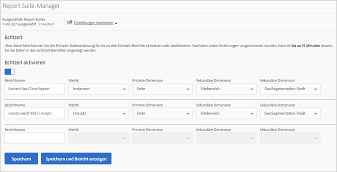
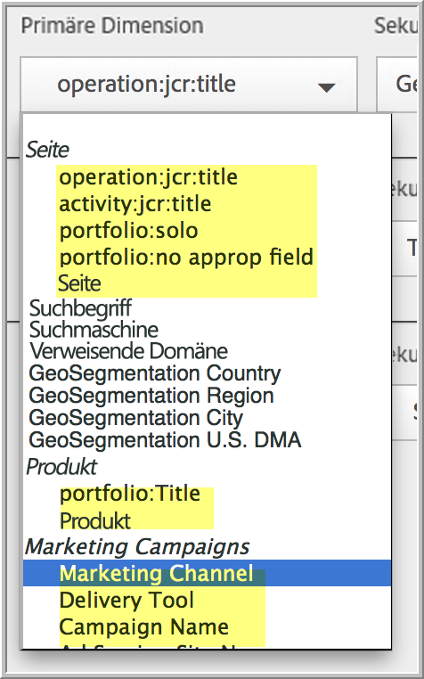

# Echtzeitberichte konfigurieren

Die folgenden Informationen enthalten administrative Schritte zum Einrichten von Echtzeitberichten.

Sie können dabei die Report Suite auswählen und bis zu drei Berichte dafür konfigurieren.

1. Wählen Sie die Report Suite aus, für die Sie Echtzeit-Berichte aktivieren möchten.

   1. Wählen Sie in Analysis Workspace die Registerkarte [!UICONTROL **Workspace**] und dann [!UICONTROL **Berichte**] > [!UICONTROL **Interaktion**] > **[!UICONTROL Echtzeit]**.

   1. Wählen Sie die Report Suite aus der Dropdownliste oben aus:

      

      Wenn Sie versuchen, Echtzeitberichte für eine Report Suite anzuzeigen, die nicht für Echtzeitberichte eingerichtet wurde, wird eine Meldung angezeigt, die Ihnen das Einrichten der Report Suite ermöglicht.

      

1. Wählen Sie **[!UICONTROL Konfigurieren]** aus, um den [!UICONTROL Report Suite Manager] auszuführen.

   (Auch verfügbar unter **[!UICONTROL Analytics]** > **[!UICONTROL Admin > Report Suites]** > **[!UICONTROL Einstellungen bearbeiten]** > **[!UICONTROL Echtzeit]**)

1. Aktivieren Sie die Einstellung **[!UICONTROL Echtzeit aktivieren]**.
1. Richten Sie die Echtzeit-Datenerfassung für bis zu drei Berichte ein, wobei pro Bericht eine Metrik und drei Dimensionen oder Classifications erstellt werden.

   

   Informationen zu unterstützten Echtzeit-Metriken und -Dimensionen finden Sie unter [Unterstützte Metriken und Dimensionen](/help/admin/tools/manage-rs/edit-settings/realtime/realtime-metrics.md).

   Falls Sie Classifications erstellt haben, werden sie unter der Dimension angezeigt, für die sie definiert wurden:

   

   >[!NOTE]
   >
   >Für einzelne Echtzeitberichte wird die Aktivierung doppelter Dimensionen derzeit nicht unterstützt, auch wenn für jede Dimension eine andere Classification ausgewählt wird.

   >[!NOTE]
   >
   >Manche Dimensionen wie „Keyword“ oder „Produkt“ sind im Gegensatz zu anderen Funktionsbereichen in Adobe Analytics in Echtzeit nicht persistent. Wenn Sie eine nicht persistente Metrik auswählen, erscheint folgende Warnmeldung:

   

1. Wählen Sie **[!UICONTROL Speichern]** oder **[!UICONTROL Speichern und Bericht anzeigen]**.

   Nach diesem ersten Bericht-Setup kann es bis zu 20 Minuten dauern, bis Daten gestreamt werden. Ab diesem Zeitpunkt sind die Daten sofort verfügbar.

1. Standardmäßig haben alle Benutzer Zugriff auf Echtzeitberichte.
