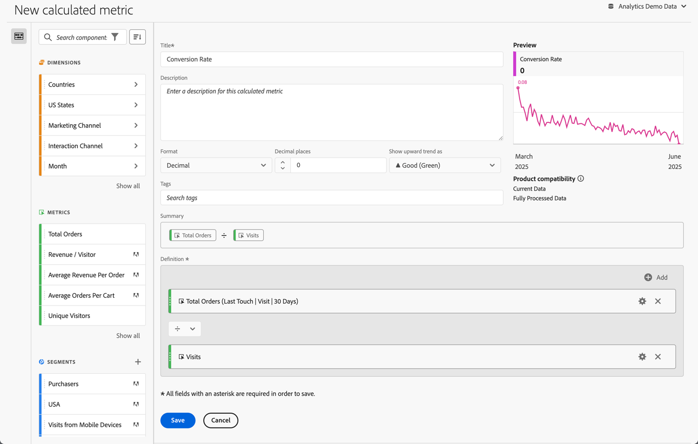
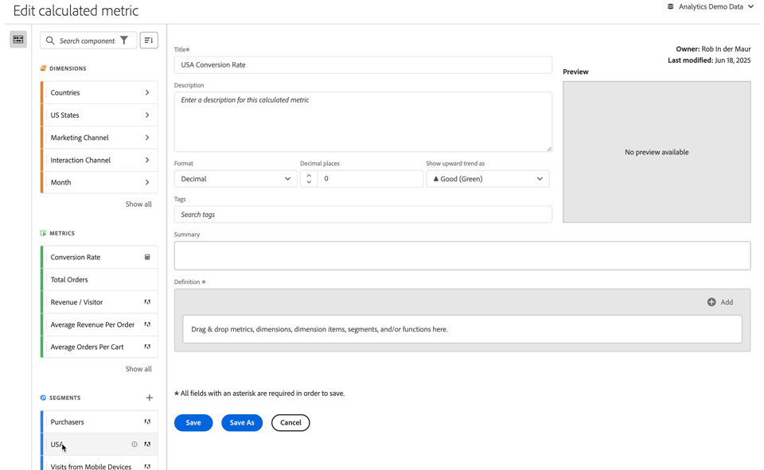

# Erstellen berechneter Metriken {#build-metrics}

Adobe Analytics bietet eine Arbeitsfläche, auf der Sie Dimensionen, Metriken, Segmente und Funktionen per Drag-and-Drop verschieben können, um benutzerdefinierte Metriken basierend auf Container-Hierarchielogik, Regeln und Operatoren zu erstellen. Mit diesem integrierten Entwicklungs-Tool können Sie einfache oder komplexe berechnete Metriken erstellen und speichern.

Sie können den Generator für berechnete Metriken verwenden, um berechnete Metriken zu erstellen oder zu bearbeiten. Wenn berechnete Metriken auf diese Weise erstellt werden, sind sie in der Komponentenliste verfügbar und können dann in Projekten in Ihrer gesamten Organisation verwendet werden. Alternativ können Sie schnell eine berechnete Metrik erstellen, die nur für das Projekt verfügbar ist, in dem sie erstellt wurde, wie in [Erstellen berechneter Metriken für ein einzelnes Projekt](/help/analyze/analysis-workspace/components/apply-create-metrics.md#create-calculated-metrics-for-a-single-project) in [Metriken](/help/analyze/analysis-workspace/components/apply-create-metrics.md) beschrieben.

Unter [Erstellen einer berechneten Metrik](../cm-workflow.md) finden Sie die verschiedenen Optionen zum Erstellen einer neuen berechneten Metrik.

## Bereiche des Generators für berechnete Metriken

Das Dialogfeld **[!UICONTROL Generator für berechnete Metriken]** wird zum Erstellen neuer oder Bearbeiten vorhandener berechneter Metriken verwendet. Das Dialogfeld hat den Titel **[!UICONTROL Neu berechnete Metrik]** oder **[!UICONTROL Berechnete Metrik bearbeiten]** für Metriken, die Sie über den Manager für [[!UICONTROL berechnete Metriken] erstellen oder verwalten](../cm-manager.md).

>[!BEGINTABS]

>[!TAB Generator für berechnete Metriken]

>[!TAB Berechnete Metrik erstellen oder bearbeiten]

>[!ENDTABS]

1. Geben Sie die folgenden Details an ( bedeutet erforderlich):

   | Element | Beschreibung |
   | --- | --- |
   | **[!UICONTROL Report Suite]** | Sie können die Report Suite für die berechnete Metrik auswählen.  Die von Ihnen definierte berechnete Metrik ist in Workspace-Projekten verfügbar, die auf der ausgewählten Report Suite basieren. |
   | **[!UICONTROL Projektspezifische Metrik]** | Oben in diesem Dialogfeld wird ein Informationsfeld angezeigt, wenn Sie eine berechnete Metrik bearbeiten, die für ein einzelnes Projekt erstellt wurde, wie unter [Erstellen berechneter Metriken für ein einzelnes Projekt](/help/analyze/analysis-workspace/components/apply-create-metrics.md#create-calculated-metrics-for-a-single-project) beschrieben. 
Wenn Sie diese berechnete Metrik für alle Projekte verfügbar machen möchten, wählen Sie die Option **[!UICONTROL Diese Metrik für alle Projekte verfügbar machen und der Komponentenliste hinzufügen]** aus.
 |
   | **[!UICONTROL Titel]**  | Benennen Sie die berechnete Metrik, beispielsweise mit `Conversion Rate`. |
   | **[!UICONTROL Beschreibung]** | Geben Sie eine Beschreibung für das Segment an, z. B. `Calculated metric to define the conversion rate.` Für die Formel für die berechnete Metrik ist keine Beschreibung erforderlich, da die Formel bereits automatisch in [!UICONTROL Zusammenfassung] verfügbar ist. |
   | **[!UICONTROL Format]** | Wählen Sie ein Format für die berechnete Metrik aus: Sie können zwischen **[!UICONTROL Dezimalzahl]**, **[!UICONTROL Zeit]**, **[!UICONTROL Prozent]** und **[!UICONTROL Währung]** wählen. |
   | **[!UICONTROL Dezimalstellen]** | Geben Sie die Anzahl der Dezimalstellen für das ausgewählte Format an. Nur aktiviert, wenn das ausgewählte Format „Dezimalzahl“, „Währung“ und „Prozent“ ist. |
   | **[!UICONTROL Aufwärts-Trend anzeigen als]** | Geben Sie an, ob ein Aufwärts-Trend der berechneten Metrik als ▲ **[!UICONTROL Gut (Grün)]** oder als ▼ **[!UICONTROL Schlecht (Rot)]** angezeigt wird. |
   | **[!UICONTROL Währung]** | Geben Sie die Währung der berechneten Metrik an. Nur aktiviert, wenn das ausgewählte Format „Währung“ ist. |
   | **[!UICONTROL Tags]** | Organisieren Sie die berechnete Metrik, indem Sie ein oder mehrere Tags erstellen oder anwenden. Beginnen Sie mit der Eingabe, um nach vorhandenen Tags zu suchen, die Sie auswählen können. Oder drücken Sie die **[!UICONTROL Eingabetaste]**, um ein neues Tag hinzuzufügen. Wählen Sie  aus, um ein Tag zu entfernen. |
   | **[!UICONTROL Vorschau]** | Die Vorschau umfasst die letzten 90 Tage und ist eine Möglichkeit, abzuschätzen, ob Sie Ihre Metrik richtig definiert haben. |
   | **[!UICONTROL Zusammenfassung]** | Hier wird eine Zusammenfassung der Definition der berechneten Metrik angezeigt.  Beispiel:   **[!UICONTROL Gesamtbestellungen]**   **[!UICONTROL SItzungen]**. |
   | **[!UICONTROL Definition]**  | Definieren Sie Ihr Segment mit dem [Definition Builder](#definition-builder). |

1. Um zu überprüfen, ob Ihre Definition der berechneten Metrik korrekt ist, verwenden Sie die ständig aktualisierte **[!UICONTROL Vorschau]** der Ergebnisse der berechneten Metrik. Der **[!UICONTROL Vorschau]** deckt die letzten 90 Tage ab und bewertet die Definition Ihrer berechneten Metrik kontinuierlich.

   Die **[!UICONTROL Produktkompatibilität]** gibt die Kompatibilität der berechneten Metrik mit Adobe Analytics-Funktionen an. Weitere Informationen finden Sie unter [Metrikkompabilität](/help/components/calculated-metrics/cm-compatibility.md).

1. Wählen Sie Folgendes aus:
   * **[!UICONTROL Speichern]**: Speichert die berechnete Metrik.
   * **[!UICONTROL Speichern unter]**: Speichert eine Kopie der berechneten Metrik.
   * **[!UICONTROL Abbrechen]**: Verwirft alle Änderungen, die Sie an der berechneten Metrik vorgenommen haben, oder bricht die Erstellung einer neuen berechneten Metrik ab.

## Definition Builder

Sie können mit dem Definition Builder Dimensionen, Metriken, Segmente und Funktionen per Drag-and-Drop verschieben, um benutzerdefinierte Metriken basierend auf Container-Hierarchielogik, Regeln und Operatoren zu erstellen. In dieser Konstruktion können Sie Standardmetriken, von Adobe definierte Metriken, berechnete Metriken, Segmente, Dimensionen und Funktionen verwenden. Alle diese Komponenten sind über das Panel „Komponenten“ im Generator für berechnete Metriken verfügbar. Darüber hinaus können Sie in der Definition Operatoren und Container verwenden.

Nur Metriken werden als einzelne Komponenten im Bereich **[!UICONTROL Definition]** festgelegt. Alle anderen Komponenten sind als Container, Wrapping-Metriken oder andere Container definiert. Weitere Informationen finden Sie unter [Container](#containers).

### Metriken

So fügen Sie eine Metrik hinzu:

* Ziehen Sie eine Komponente des Typs  **[!UICONTROL Metriken]** aus dem Panel „Komponenten“ auf **[!UICONTROL Platzieren Sie Metriken, Dimensionen, Dimensionselemente, Segmente und/oder Funktionen mittels Drag-and-Drop hier]**. Sie können  in der Komponentenleiste verwenden, um nach bestimmten Komponenten zu suchen.

Wenn Sie eine berechnete Metrik als Teil Ihrer Definition verwenden, wird die berechnete Metrik erweitert.

So ändern Sie eine Metrik:

1. Wählen Sie  in einer Metrikkomponente im Bereich **[!UICONTROL Definition]** aus.
1. Im Popup-Dialogfeld können Sie den Typ der Metrik und ein Attributionsmodell definieren. Siehe [Metriktyp und Attribution](m-metric-type-alloc.md).

So löschen Sie eine Metrik:

* Wählen Sie  in der Metric aus.

### Operatoren

Mit Operatoren können Sie den Operator zwischen Komponenten oder Containern angeben. Operatoren werden automatisch angezeigt zwischen

* zwei oder mehr Metriken in einem Container
* zwei oder mehr Containern in einem Container
* einer oder mehrere Metriken und einem oder mehreren Containern in einem Container.

Folgende Optionen stehen zur Auswahl:

| Symbol | Operator |
|:---:|---|
|  | Dividieren (Standard) |
|  | Multiplizieren |
|  | Subtrahieren |
|  | Hinzufügen |

### Statische Zahl

Sie können Ihrer Definition der berechneten Metrik eine statische Zahl hinzufügen. So fügen Sie eine statische Zahl hinzu:

* Wählen Sie  **[!UICONTROL Hinzufügen]** in einem Container aus.
* Wählen Sie **[!UICONTROL Statische Zahl]** aus. Ein statischer Zahlen-Container wird angezeigt.
* Wählen Sie [!UICONTROL *Mit Klick hinzufügen*] aus und geben Sie einen Wert ein.

### Container

Sie fügen Dimensionen, Segmente und Funktionen als Container zu einer Definition für berechnete Metriken hinzu. Sie können auch einen generischen Container hinzufügen. Container funktionieren wie mathematische Ausdrücke und bestimmen die Reihenfolge der Vorgänge. Alles in einem Container wird vor der nächsten Komponente oder dem nächsten Container verarbeitet.

#### Segment-Container

Sie verwenden das Konzept eines Segment-Containers, um eine [segmentierte Metrik](metrics-with-segments.md) zu erstellen. Sie können einen Segment-Container mithilfe eines Segments oder eines aus einer Dimension erstellten Segments erstellen.

* So fügen Sie einen Segment-Container aus einer Dimension hinzu:

   1. Ziehen Sie eine Komponente des Typs  **[!UICONTROL Dimensionen]** aus dem Panel „Komponenten“ auf **[!UICONTROL Platzieren Sie Metriken, Dimensionen, Dimensionselemente, Segmente und/oder Funktionen mittels Drag-and-Drop hier]**. Sie können die  in der Komponentenleiste verwenden, um nach bestimmten Komponenten zu suchen.
   1. Definieren Sie im Popup **[!UICONTROL Segment aus Dimension erstellen]** die Bedingung für das Segment. Wählen Sie in der Liste der Operatoren einen Wert aus oder geben Sie einen Wert ein, z. B. **[!UICONTROL Monat]** **[!UICONTROL gleich]**  `Sep 2024`.
   1. Wählen Sie **[!UICONTROL Fertig]** aus. Ein Segment-Container wird der **[!UICONTROL Definition]** hinzugefügt.

* Um einen Segment-Container aus einem Segment hinzuzufügen, können Sie wie folgt vorgehen:

   * Ziehen Sie eine Komponente des Typs  **[!UICONTROL Segmente]** aus dem Panel „Komponenten“ auf **[!UICONTROL Platzieren Sie Metriken, Dimensionen, Dimensionselemente, Segmente und/oder Funktionen mittels Drag-and-Drop hier]**. Sie können die  in der Komponentenleiste verwenden, um nach bestimmten Segmenten zu suchen.
Der **[!UICONTROL Definition]** wird automatisch ein Segment-Container mit dem Namen des Segments hinzugefügt.

   * Ziehen Sie eine Komponente des Typs  **[!UICONTROL Segment]** aus dem Panel „Komponenten“ in einen generischen Container. Der Container wird in einen Segment-Container geändert.

   * Wählen Sie  **[!UICONTROL Hinzufügen]** in einem Container aus:

      1. Wählen Sie **[!UICONTROL Segment]** aus. Der **[!UICONTROL Definition]** wird ein Segment-Container hinzugefügt.
      1. Wählen Sie im neuen Segment-Container ein Segment aus dem Dropdown-Menü [!UICONTROL *Auswählen…*] aus. 

  >[!TIP]
  >
  >Sie können einem Container mehr als ein Segment hinzufügen.

  Die Segmente im Container werden nach der Segmentkomponente benannt. z. B.  **[!UICONTROL Web-Sitzungen]**. Wählen Sie  aus, um ein Popup mit weiteren Details zum Segment anzuzeigen. Wählen Sie im Popup die Option  aus, um die Segmentdefinition zu bearbeiten.

So entfernen Sie ein Segment aus einem Container:

* Wählen Sie  neben dem Segmentnamen aus.

Weitere Informationen und Beispiele finden Sie unter [Segmentierte Metriken](metrics-with-segments.md).

#### Funktions-Container

Um einen Funktions-Container hinzuzufügen, können Sie wie folgt vorgehen:

* Verwenden Sie die Drag-and-Drop-Funktion:

   1. Ziehen Sie eine Komponente des Typs  **[!UICONTROL Funktionen]** aus dem Panel „Komponenten“ auf **[!UICONTROL Platzieren Sie Metriken, Dimensionen, Dimensionselemente, Segmente und/oder Funktionen mittels Drag-and-Drop hier]**. Sie können  in der Komponentenleiste verwenden, um nach bestimmten Funktionen zu suchen.
   1. Der **[!UICONTROL Definition]** wird automatisch ein Funktions-Container mit dem Namen der Funktion hinzugefügt.

* Wählen Sie  **[!UICONTROL Hinzufügen]** in einem Container aus:

   1. Wählen Sie **[!UICONTROL Funktion]**.
   1. Wählen Sie im Container eine Funktion aus dem Dropdown-Menü [!UICONTROL *Auswählen…*] aus. 

Der Funktions-Container ist nach der Funktionskomponente benannt. Beispiel:  **[!UICONTROL SQUARE ROOT (metric)]**. Wählen Sie  aus, um ein Popup mit weiteren Details zur Funktion anzuzeigen. Wählen Sie **[!UICONTROL Weitere Informationen]** aus, um weitere Informationen zur Funktion zu erhalten.

Unter [Verwenden von Funktionen](cm-using-functions.md) finden Sie Details zur Verwendung von Funktionen und dazu, welche Funktionen zum Erstellen einer berechneten Metrik verfügbar sind.

#### Allgemeiner Container 

So fügen Sie einen allgemeinen Container hinzu:

* Wählen Sie  **[!UICONTROL Hinzufügen]** in einem Container aus
* Wählen Sie **[!UICONTROL Container]** aus. Der **[!UICONTROL Definition]** wird ein neuer, leerer allgemeiner Container hinzugefügt. Mit einem allgemeinen Container können Sie eine Hierarchie in der Definition Ihrer berechneten Metrik verschachteln oder erstellen.

#### Löschen eines Containers

Wählen Sie zum Löschen eines Containers  auf Container-Ebene aus.

>[!MORELIKETHIS]
>
>[Funktionen verwenden](cm-using-functions.md)
>[Segmente](/help/components/segmentation/seg-overview.md)
>

<!--

Adobe Analytics provides a canvas to drag and drop dimensions, metrics, segments, and functions to create custom metrics based on container hierarchy logic, rules, and operators. This integrated development tool lets you build and save simple or complex calculated metrics.

## Begin building a calculated metric

You can use the calculated metric builder to create or edit calculated metrics. When created in this way, calculated metrics are available in the component list and can then be used in projects throughout your organization. Alternatively, you can quickly create a calculated metric that is available only for the project where it was created, as described in [Create calculated metrics for a single project](/help/analyze/analysis-workspace/components/apply-create-metrics.md#create-calculated-metrics-for-a-single-project) in [Metrics](/help/analyze/analysis-workspace/components/apply-create-metrics.md).

Access the calculated metric builder to begin creating a calculated metric that is available in the component list. 

1. Access the calculated metric builder in any of the follows ways:

   * In Analysis Workspace, open a project, then select **[!UICONTROL Components]** > **[!UICONTROL Create metric]**.
   * In Analysis Workspace, open a project, then select the **Plus** icon next to the [!UICONTROL **Metrics**] section in the left rail.
   * In [!DNL Adobe Analytics], go to **[!UICONTROL Components]** > **[!UICONTROL Calculated metrics]**, then select **[!UICONTROL + Add]** at the top of the Calculated metrics page.

1. Continue with [Areas of the calculated metric builder](#areas-of-the-calculated-metrics-builder).

## Areas of the Calculated metrics builder

The following image and accompanying table explain some of the main areas and features of the Calculated metrics builder.

| Location in image  | Name and function  |
|---|---|
| 1 | **Title:** Naming the metric is mandatory. You cannot save the metric unless it is named.  |
| 2 | **Description:** Give it a user-friendly description to show what it's used for and to distinguish it from similar ones. 
The description also appears within a report. It's best NOT to put the formula into the description - instead, describe what this metric should and should not be used for. (The formula is generated as you build the metric, underneath the Summary heading. As a result, there is no need to add the formula to the description.) 
  |
| 3 | **Format:** Choices include Decimal, Time, Percent, and Currency.  |
| 4 | **Decimal Places:** Shows how many decimal places will be shown in the report. The maximum number of decimal places you can specify is 10.  |
| 5| **Show Upward Trend As:** This metric polarity setting shows whether Analytics should consider an upward trend in the metric as good (green) or bad (red). As a result, the report's graph will show as green or red when it's going up.  |
| 6 | **Tags:** Tagging is a good way to organize metrics. All users can create tags and apply one or more tags to a metric. However, you can see tags only for those segments that you own or that have been shared with you. What kinds of tags should you create? Here are some suggestions for useful tags:<ul><li>**Team names**, such as Social Marketing, Mobile Marketing.</li><li>**Projects** (analysis tags), such as Entry-page analysis.</li><li>**Categories**, such as Women's; Geography.</li><li>**Workflows**, such as To be approved; Curated for (a specific business unit)</li></ul> |
| 7 | **Summary:** 
The Summary formula updates anytime you make a change to the metric definition. This formula also shows up in the metrics rail on the left when you hover over a metric and click the  icon. 
  |
| 8 | **Definition:** This is where you drag in metrics/calculated metrics, segments, and/or functions to build the calculated metric. <ul><li>If you drag in a calculated metric, it will expand its metric definition automatically. </li> <li>You can nest definitions with containers. However, unlike segment containers, these containers function like a math expression and determine the order of operations. </li> </ul>  |
| 9 | **Operator:** Divided by (  ) is the default operator, plus there are the +, -, and x operators. |
| 10 | **Preview:** Provides a quick read on any possible errors. The preview covers the last 90 days. This is a way of initially gauging whether you have selected the right components for your metric. An unexpected result would mean you need to take a second look at the metric definition.  |
| 11 | **Product compatibility:** Product compatibility shows you whether the metric is compatible with <a href="/help/analyze/reports-analytics/current-data.md"  > Current Data </a>, with Fully Processed Data, or only with Marketing Channel reports (first-touch allocation). 
Note:  Current Data does not support all metrics. Metrics that contain segments or functions are not compatible with current data. <a href="/help/components/calculated-metrics/cm-compatibility.md"  > More... </a> 
 
  |
| 12 | **Add:** For all types of calculated metrics, you can add containers and static numbers to the definition. For advanced calculated metrics, you can also add segments and functions. <ul><li>Containers function like a math expression and determine the order of operations. So anything in a container will get processed before the next operation.</li><li>Dragging a segment onto a container segments everything in that container. (Advanced calculated metrics only)</li><li>You can stack multiple segments in a container.</li></ul> |
| 13 | **Gear icon (Metric Type, Attribution):** Selecting the gear icon next to a metric lets you specify the <a href="/help/components/calculated-metrics/workflow/c-build-metrics/m-metric-type-alloc.md"  > metric type and attribution models </a>. |
| 14 | **New:** Lets you create a new component, such as a new segment (which takes you to the <a href="/help/components/segmentation/segmentation-workflow/seg-build.md"  > Segment Builder </a>.) |
| 15 | **Search Components:** This search bar lets you search for dimensions, metrics, segments (advanced calculated metrics only), and functions (advanced calculated metrics only). |
| 16 | **List of Dimensions:** Rather than leaving the Calculated Metric Builder in order to build a simple segment (in the Segment Builder), e.g. "Page = Homepage", you can drag in Page and select Homepage directly from the Calculated Metric Builder.
This results in a much more streamlined workflow for creating segmented calculated metrics.
 |
| 17 | **List of Metrics:** Metrics come in 3 categories: <ul> <li>Standard metrics () </li><li>Calculated metrics ( ) </li><li id="li_8735E76637ED4C3F983731A66E04C93E">Metrics templates ( ) - at the bottom of the list. </li> </ul> 
When you hover over a metric, you can see the Info icon to the right of it: . Clicking this icon gives you the following information: 
<ul> <li>The formula of how it is calculated. </li><li>A preview trend of the metric. </li><li>An edit (pencil) icon  at the top right that will take you to the Calculated Metrics Builder where you can edit this calculated metric. </li></ul> |
| 18 | **List of Segments:** (Advanced calculated metrics only) As an Admin, this list shows all segments created in your login company. If you are a non-Admin user, this list shows segments you own and those shared with you. <a href="/help/components/segmentation/segment-reference/seg-rights.md"  > More... </a> |
| 19 | **List of Functions:** (Advanced calculated metrics only) Functions are divided into two lists: <a href="/help/components/calculated-metrics/cm-reference/cm-functions.md"  > Basic </a> (used most often) and <a href="/help/components/calculated-metrics/cm-reference/cm-adv-functions.md"  > Advanced </a>. |
| 20 | **Report Suite selector:** Lets you switch to a different report suite. |

{style="table-layout:auto"}

-->
