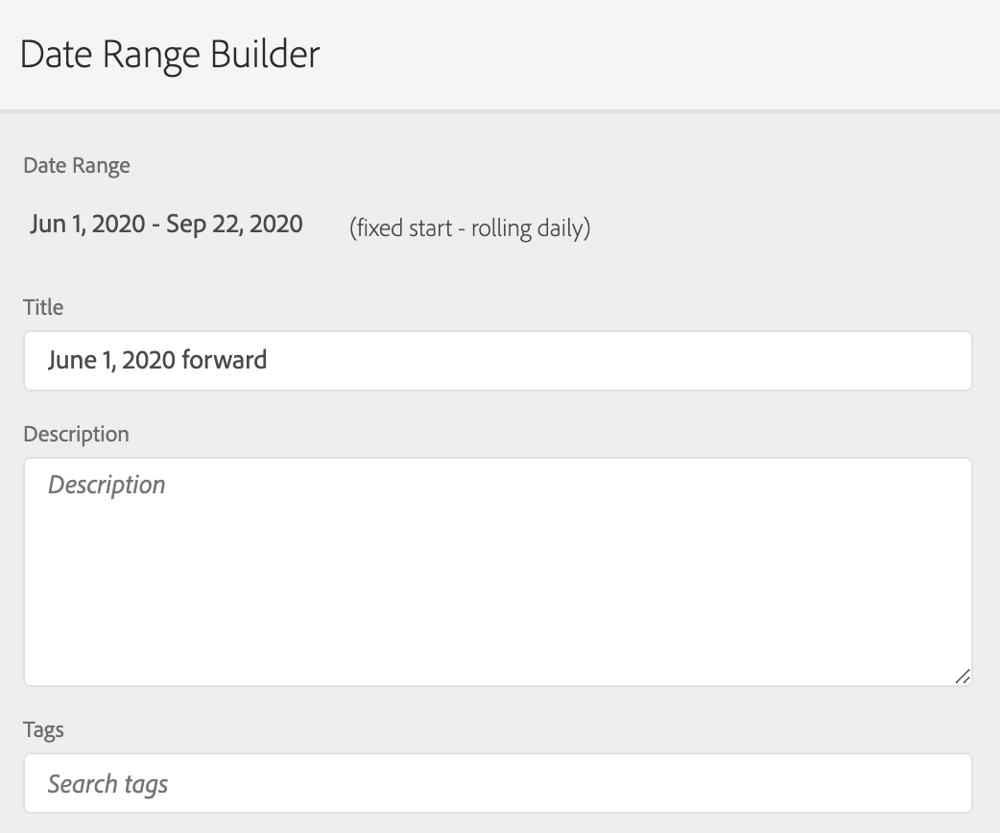

# Beschränken einer Virtual Report Suite auf bestimmte Daten

{{available-existing-customers}}

Wenn wir das Zusammenfügen von Daten einschalten, beginnt dieses Zusammenfügen an einem bestimmten Datum. Angenommen, dieses Datum ist der 1. Juni. Die Virtual Report Suite für geräteübergreifende Analyse enthält nicht zugeordnete Daten, die vor dem 1. Juni vorlagen. Möglicherweise möchten Sie Daten in der Virtual Report Suite vor dem 1. Juni ausblenden, damit sich Ihre Analyse auf Datumsbereiche nach dem Beginn des Zusammenfügens konzentrieren kann.

Sie können die Virtual Report Suite-Daten wie folgt auf bestimmte Daten beschränken:

## Schritt 1: Erstellen einer Virtual Report Suite mit einem rollierenden täglichen Datumsbereich

Wenn Sie die Virtual Report Suite unter „Komponenten“ einrichten, fügen Sie einen Datumsbereich mit einem festen Start und einem rollierenden täglichen Datumsbereich hinzu. Der feste Beginn sollte der Tag sein, an dem das Zusammenfügen begann.

## Schritt 2: Segment „exclude-exclude“ erstellen

Erstellen Sie anschließend ein Treffersegment, das den Datumsbereich in einen Ausschluss-Container innerhalb eines anderen Ausschluss-Containers einfügt. Es handelt sich um ein „Ausschließen des Ausschließens“.

Der Grund für den Ausschluss ist, dass Datumsbereiche den Datumsbereich des Berichts überschreiben sollen. Wenn Sie also nur den Bereich ab dem 1. Juni mit einbeziehen, wird der Datumsbereich des Berichts immer ab dem 1. Juni sein. Dies führt zu unerwünschten Ergebnissen. Wenn Sie „exclude exclude“ auswählen, wird dieses Verhalten außer Kraft gesetzt und die Daten, aus denen Sie Daten ziehen können, werden auf den entsprechenden Datumsbereich beschränkt.

## Schritt 3: Dieses Segment auf Ihre Virtual Report Suite in Cross-Device Analytics anwenden

## Schritt 4: Ergebnisse im Reporting ansehen

Beachten Sie, dass das Reporting jetzt am gewünschten Datum beginnt, dem Tag, an dem das Zusammenfügen zum ersten Mal implementiert wurde:

