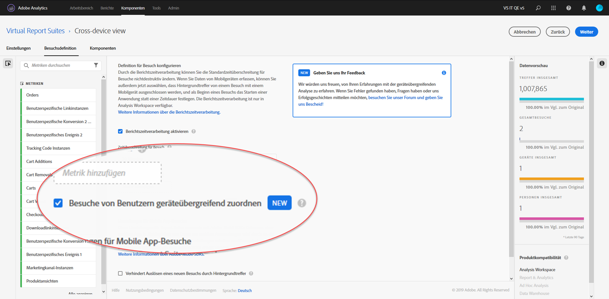

# Geräteübergreifende Analyse einrichten

{{available-existing-customers}}

Wenn alle Voraussetzungen erfüllt sind, aktivieren Sie die geräteübergreifende Analyse mit den folgenden Schritten. Sie müssen einer Produktprofil-Administratorgruppe angehören oder über Administratorrechte in Adobe Analytics verfügen, um diese Schritte ausführen zu können.

>[!IMPORTANT]
>
>Alle Voraussetzungen müssen erfüllt sein, bevor Sie diese Schritte durchführen. Wenn nicht alle Voraussetzungen erfüllt sind, ist die Funktion nicht verfügbar oder sie funktioniert nicht. Informationen [ Voraussetzungen und Einschränkungen finden Sie ](overview.md) der Seite „Übersicht[ und der gewünschten ](field-based-stitching.md) (Feldbasiertes Stitching) .

## &#x200B;1. Eröffnen Sie ein Ticket bei der Kundenunterstützung, um die geräteübergreifende Report Suite mit geräteübergreifender Analyse zu versorgen

CDA wird für Ihre geräteübergreifende Report Suite durch Adobe Engineering bereitgestellt. Wenden Sie sich zunächst an die Kundenunterstützung und stellen Sie folgende Informationen bereit:

* Ihre Adobe Experience Cloud-Organisations-ID (eine alphanumerische Zeichenfolge, die mit @AdobeOrg endet)
* Die Report Suite-ID für die geräteübergreifende Report Suite, die mit CDA zu aktivieren ist
* Welche CDA-Methode Sie verwenden möchten (feldbasiertes Stitching)
* Wenn Sie die feldbasierte Zuordnung nutzen möchten, verwenden Sie die Prop oder die eVar, die die Benutzer-ID enthält
* Ihre Voreinstellung für die Häufigkeit der Wiederholungen und die Lookback-Länge. Zu den verfügbaren Optionen gehören eine Wiederholung pro Woche mit einem 7-tägigen Lookback-Fenster oder eine tägliche Wiederholung mit einem 1-tägigen Lookback-Fenster.
Die Standardeinstellung ist eine wöchentliche Wiederholung mit einem 7-tägigen Lookback-Fenster. In diesem Fall können sich die Daten der letzten Woche ändern (da sie nach und nach zugeordnet und aktualisiert werden).

Sobald Sie der Kundenunterstützung diese Informationen zur Verfügung gestellt haben, kann diese mit Adobe Engineering zusammenarbeiten, um Ihre ausgewählte Report Suite für die geräteübergreifende Analyse zu aktivieren.

## &#x200B;2. Erstellen Sie eine geräteübergreifende Virtual Report Suite, um die geräteübergreifende Ansicht anzuzeigen

Administratoren mit Zugriff auf Virtual Report Suites können Virtual Report Suites für die geräteübergreifende Analyse wie folgt erstellen:

1. Navigieren Sie zu [experiencecloud.adobe.com](https://experiencecloud.adobe.com) und melden Sie sich mit Ihren Adobe ID-Anmeldeinformationen an.
2. Klicken Sie oben auf das 9-Raster-Symbol und dann auf Analytics.
3. Bewegen Sie den Mauszeiger **[!UICONTROL Komponenten]** oben und klicken Sie dann auf **[!UICONTROL Virtual Report Suites]**.
4. Klicken Sie auf Hinzufügen.
5. Geben Sie einen Namen für Ihre Virtual Report Suite ein und stellen Sie sicher, dass die für die geräteübergreifende Analyse aktivierte Report Suite ausgewählt ist.
6. (Optional) Wenden Sie ein Segment auf die Virtual Report Suite an. Sie können beispielsweise ein Segment anwenden, das die Virtual Report Suite auf Daten beschränkt, die nach dem Datum liegen, an dem die geräteübergreifende Analyse aktiviert wurde und die Suche begonnen hat. Mit diesem Segment können Benutzende nur zugeordnete Datumsbereiche innerhalb der Virtual Report Suite sehen.
7. Aktivieren Sie das Kontrollkästchen „Berichtszeitverarbeitung aktivieren“, wodurch mehrere weitere Optionen, einschließlich der geräteübergreifenden Analyse, aktiviert werden.
8. Aktivieren Sie das Kontrollkästchen „Besuche von Benutzern geräteübergreifend zuordnen“.
9. Klicken Sie auf „Weiter“, konfigurieren Sie die Virtual Report Suite und klicken Sie dann auf „Speichern“.

## Hinzufügungen und Änderungen an geräteübergreifenden Virtual Report Suites

Wenn die geräteübergreifende Analyse für eine Virtual Report Suite aktiviert ist, beachten Sie die folgenden Änderungen:

* Neben dem Namen der Virtual Report Suite wird ein neues geräteübergreifendes Symbol angezeigt. Dieses Symbol ist ausschließlich für geräteübergreifende Virtual Report Suites vorgesehen.
* Eine neue Dimension mit der Bezeichnung [Identifizierter Status](../dimensions/identified-state.md) ist verfügbar.
* Es sind neue Metriken mit den Bezeichnungen [Personen](../metrics/people.md), [Eindeutige Geräte](../metrics/unique-devices.md), [Identifizierte Personen](../metrics/identified-people.md), [Nicht identifizierte Personen](../metrics/unidentified-people.md) und [Personen mit Experience Cloud ID](../metrics/people-with-exp-cloud-id.md) verfügbar.
* Die Metrik [Unique Visitors](../metrics/unique-visitors.md) ist nicht verfügbar, da sie durch „Personen“ und „Eindeutige Geräte“ ersetzt wurde.
* Beim Erstellen von Segmenten wird der Segmentcontainer „Besucher“ durch den Container „Person“ ersetzt.
