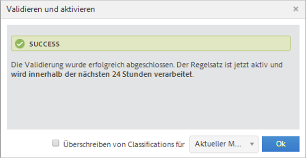
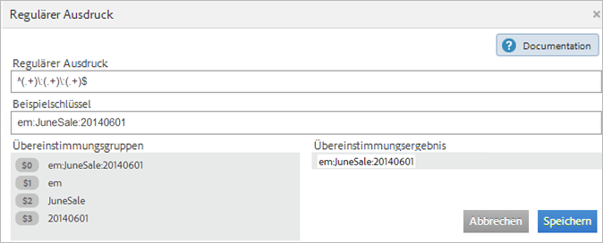
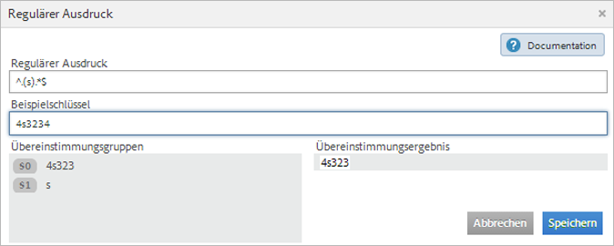
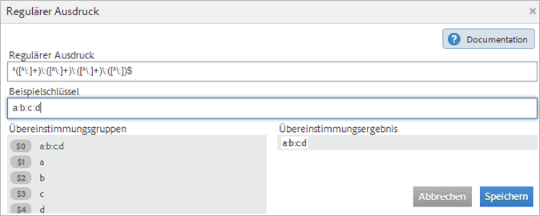
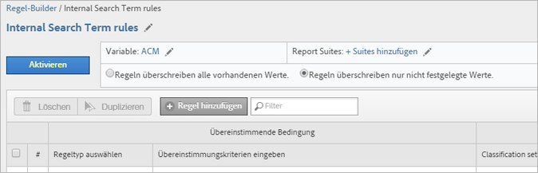
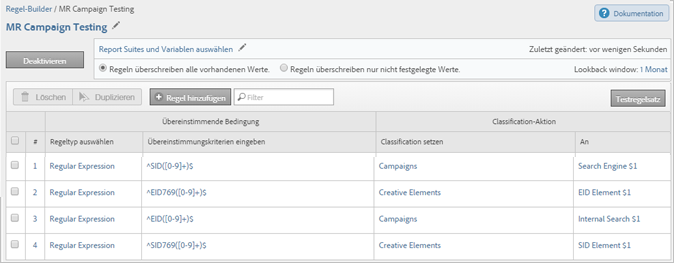
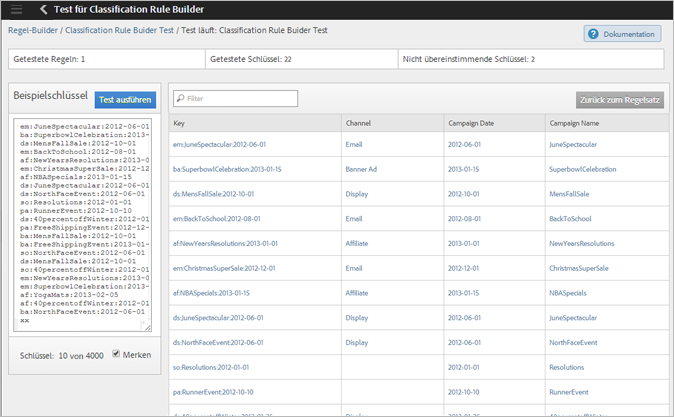

# Klassifizierungsregeln (veraltet)

{{classification-rulebuilder-deprecation}}

Klassifizierungsregeln suchen regelmäßig nach nicht klassifizierten Begriffen. Wenn eine Regelübereinstimmung gefunden wird, fügen die Regeln die Begriffe automatisch zu Ihren Klassifizierungsdatentabellen hinzu. Sie können auch Klassifizierungsregeln verwenden, um vorhandene Schlüssel zu überschreiben.

**[!UICONTROL Analytics]** > **[!UICONTROL Admin]** > **[!UICONTROL Classification Rule Builder]**

Mit dem Rule Builder können Sie einen *Classification-Regelsatz* erstellen – eine Liste von *Classification-Regeln*. Eine Regel entspricht den von Ihnen angegebenen Kriterien und führt dann eine Aktion aus.

Klassifizierungsregeln sind praktisch für:

* **E-Mail-** und **Display-Anzeigen:** Erstellen Sie Klassifizierungsregeln, die die einzelnen Display-Anzeigekampagnen gruppieren, sodass ersichtlich wird, wie die Display-Kampagnen im Vergleich zu den E-Mail-Kampagnen abschneiden.

* **Trackingcodes:** Erstellen Sie Klassifizierungsregeln, die die aus den Zeichenfolgen in den Trackingcodes abgeleiteten Schlüsselwerte kategorisieren, und prüfen Sie dann, ob diese Schlüsselwerte mit den von Ihnen definierten Kriterien übereinstimmen.
* **Suchbegriffe**: Verwenden Sie [reguläre Ausdrücke](/help/components/classifications/crb/classification-quickstart-rules.md) und Platzhalter, um die Klassifizierung von Suchbegriffen zu vereinfachen. Wenn ein Suchbegriff beispielsweise *`baseball`* enthält, können Sie eine *`Sports League`*-Classification auf *`MLB`* festlegen.

Der Trackingcode für eine E-Mail-Kampagnen-ID lautet beispielsweise:

`em:Summer:20XX:Sale`.

Sie können drei Regeln in einem Regelsatz festlegen, die die Teile der Zeichenfolge ermitteln, und dann die Werte klassifizieren:

| Regeltyp auswählen | Übereinstimmungskriterien eingeben | Classification auswählen | Hierzu |
|---|---|---|---|
| Beginnt mit | em: | Kanal | E-Mail |
| Endet mit | Verkauf | Typ | Verkauf |
| Enthält | 20XX | Jahr | 20XX |

## Verarbeitung der Regeln {#how-rules-are-processed}

Wichtige Informationen zur Verarbeitung von Klassifizierungsregeln.

<!-- 

about_classification_rules.xml

 -->

* [Wichtige Informationen zu Regeln](/help/components/classifications/crb/classification-rule-builder.md)
* [Wann klassifizieren Regeln keine Schlüssel?](/help/components/classifications/crb/classification-rule-builder.md)
* [Informationen zur Regelpriorität](/help/components/classifications/crb/classification-quickstart-rules.md)

>[!NOTE]
>
>Der [!UICONTROL Rule Builder] unterstützt keine „Nummerisch 2“-Klassifizierungen.

## Wichtige Informationen zu Regeln

* **Reguläre Ausdrücke**: Hilfe finden Sie unter [Reguläre Ausdrücke in Classification-Regeln](/help/components/classifications/crb/classification-quickstart-rules.md).

* **Report Suites**: Sie können erst dann eine Klassifizierung auswählen, wenn mindestens eine Report Suite ausgewählt ist. Sie können die Report Suite erst anwenden, nachdem Sie den Regelsatz erstellt und eine Variable zugewiesen haben.

  Verwenden Sie beim Testen des Regelsatzes Schlüssel (die zu klassifizierende Variable) aus dem Bericht, um zu sehen, wie sich der Regelsatz auf sie auswirkt. (Der [Schlüssel](/help/components/classifications/importer/c-saint-data-files.md) ist die Variable, die klassifiziert wird, oder die erste Spalte in der Tabelle zum Hochladen von Klassifizierungen.)

* **Regelpriorität**: Wenn ein Schlüssel mit mehreren Regeln übereinstimmt, die dieselbe Klassifizierung festlegen (in der Spalte [!UICONTROL Klassifizierung festlegen] wird die letzte Regel verwendet, die der Klassifizierung entspricht. Siehe [Über die Regelpriorität](/help/components/classifications/crb/classification-quickstart-rules.md).

* **Begrenzung der Anzahl von Regeln**: Für die Anzahl der Regeln, die Sie erstellen können, gibt es keine feste Begrenzung. Eine große Anzahl von Regeln kann sich jedoch auf die Browser-Leistung auswirken.
* **Verarbeitung**: Regeln werden in regelmäßigen Abständen verarbeitet, je nach dem Volumen des klassifizierungsbezogenen Traffics.

  Aktive Regeln werden alle vier Stunden verarbeitet und untersuchen Klassifizierungsdaten, die in der Regel einen Monat zurückgehen. Die Regeln überprüfen automatisch auf neue Werte und laden die Klassifizierungen mit dem Import-Tool hoch.

* **Überschreiben von vorhandenen Classifications:** Siehe [In welchen Fällen werden Schlüssel nicht durch Regeln klassifiziert?](/help/components/classifications/crb/classification-quickstart-rules.md) Bei Bedarf können Sie vorhandene Klassifizierungen mithilfe des Imports löschen oder entfernen.

## Wann klassifizieren Regeln keine Schlüssel?

Wenn Sie Regeln aktivieren, können Sie vorhandene Klassifizierungen überschreiben. In den folgenden Situationen klassifiziert eine Klassifizierungsregel keinen [Schlüssel](/help/components/classifications/importer/c-saint-data-files.md)(Variable), wenn:

* Der Schlüssel wurde bereits klassifiziert, und Sie haben nicht die Option [Überschreiben von Classifications für](/help/components/classifications/crb/classification-rule-definitions.md) ausgewählt.

  Sie können Klassifizierungen überschreiben[ wenn Sie eine Regel hinzufügen ](/help/components/classifications/crb/classification-quickstart-rules.md) aktivieren oder eine Data Connectors-Integration aktivieren. (Für Daten-Connectoren werden Regeln von Partnern im Dev Center erstellt und im [!UICONTROL Classification Rule Builder) ].

* Nach einem Zeitrahmen, der beim Überschreiben eines Schlüssels angegeben wurde, wird kein klassifizierter Schlüssel in den Daten angezeigt, auch wenn Sie die Option [Klassifizierungen überschreiben](/help/components/classifications/crb/classification-rule-definitions.md) aktivieren.
* Der Schlüssel wird nicht klassifiziert, und nach Beginn des Zeitrahmens (vor etwa einem Monat) wurde der Schlüssel auch nicht in [!DNL Adobe Analytics] übergeben.

  >[!NOTE]
  >
  >In Berichten gelten Klassifizierungen für jeden beliebigen angegebenen Zeitrahmen, sofern ein Schlüssel existiert. Der Datumsbereich eines Berichts wirkt sich nicht auf die Berichterstellung aus.



## Reguläre Ausdrücke in Klassifizierungsregeln {#regex-in-classification-rules}

Verwenden Sie reguläre Ausdrücke, um konsistent formatierte Zeichenfolgenwerte mit einer Klassifizierung abzugleichen. Sie können beispielsweise eine Classification aus bestimmten Zeichen in einem Trackingcode erstellen. Sie können bestimmte Zeichen, Wörter oder Zeichenmuster zuordnen.

>[!NOTE]
>
>Reguläre Ausdrücke eignen sich als Best Practice für Trackingcodes, in denen Trennzeichen verwendet werden; dies gehört zu den bewährten Verfahren.

## Regulärer Ausdruck – Beispiel für Trackingcode {#section_2EF7951398EB4C2F8E52CEFAB4032669}

>[!NOTE]
>
>Wenn der Trackingcode URL-kodiert ist, **er** vom Regel-Builder klassifiziert.

In diesem Beispiel wird angenommen, dass die folgende Kampagnen-ID klassifiziert werden soll:

Beispielschlüssel: `em:JuneSale:20XX0601`

Die folgenden Teile des Trackingcodes sind zu klassifizieren:

* `em` = email
* `JuneSale` = Kampagnenname
* `20XX0601` = date

Regulärer Ausdruck: `^(.+)\:(.+)\:(.+)$`

Korrelation zwischen regulärem Ausdruck und Kampagnen-ID:


Übereinstimmungsgruppen: Zeigt, wie der reguläre Ausdruck den Zeichen der Kampagnen-ID entspricht, damit Sie eine Position in der Kampagnen-ID klassifizieren können.



In diesem Beispiel gilt die Regel, dass sich das Kampagnendatum `20XX0601` in der dritten Gruppe `(.+)` befindet, identifiziert durch `$3`.

**[!UICONTROL Regel-Builder]**

Konfigurieren Sie die Regel im [!UICONTROL Regel-Builder] wie folgt:

| Regeltyp auswählen | Übereinstimmungskriterien eingeben | Classification auswählen | Hierzu |
|---|---|---|---|
| Regulärer Ausdruck | &amp;Hat;(.+)\:(.+)\:(.+) $ | Kampagnendatum | 3$ |

**Syntax**

| Regulärer Ausdruck | Zeichenfolge oder Übereinstimmungsergebnis | Entsprechende Übereinstimmungsgruppen |
|--- |--- |--- |
| `^(.+)\:(.+)\:(.+)$` | `em:JuneSale:20XX0601` | `$0`: `em:JuneSale:20XX0601` `$1`: em `$2`: Juni`$3`: 20XX0601 |
| Aufbauen der Syntax | `^` = Beginn einer Zeile () = gruppiert Zeichen und ermöglicht das Extrahieren von übereinstimmenden Zeichen in den Klammern.  `(.+)` = erfasst ein ( . ) Zeichen und ( + ) beliebige mehr \ = Beginn einer Zeichenfolge.  `$` = gibt an, dass das vorhergehende Zeichen (oder die vorhergehende Zeichengruppe) das letzte Element in der Zeile ist. | |

Weitere Informationen zur Bedeutung der Zeichen in einem regulären Ausdruck finden Sie unter [Reguläre Ausdrücke – Referenztabelle](/help/components/classifications/crb/classification-quickstart-rules.md).

## Regulärer Ausdruck – Klassifizieren eines bestimmten Zeichens  {#section_5D300C03FA484BADACBFCA983E738ACF}

Ein regulärer Ausdruck kann verwendet werden, indem ein bestimmtes Zeichen in einer Zeichenfolge klassifiziert wird. Angenommen, der folgende Trackingcode enthält zwei wichtige Zeichen:

Beispielschlüssel: `4s3234`

* `4` = Markenname
* `s` = Suchmaschine, z. B. Google



**[!UICONTROL Regel-Builder]**

Konfigurieren Sie die Regel im [!UICONTROL Regel-Builder] wie folgt:

| Regeltyp auswählen | Übereinstimmungskriterien eingeben | Classification auswählen | Hierzu |
|--- |--- |--- |--- |
| Regulärer Ausdruck | `^.(s).*$` | Marke und Suchmaschine | `$0` (Erfasst die ersten beiden Zeichen für den Markennamen und die Suchmaschine.) |
| Regulärer Ausdruck | `^.(s).*$` | Suchmaschine | `$1` (Erfasst das zweite Zeichen für Google.) |

## Reguläre Ausdrücke – Abgleichen von Trackingcodes unterschiedlicher Länge {#section_E86F5BF5C2F44ABC8FFCE3EA67EE3BB2}

Dieses Beispiel zeigt, wie Sie zwischen Doppelpunkt-Trennzeichen bestimmte Zeichen identifizieren, wenn Sie Trackingcodes mit unterschiedlichen Längen haben. Adobe empfiehlt, für jeden Trackingcode einen regulären Ausdruck zu verwenden.

Beispielschlüssel:

* `a:b`
* `a:b:c`
* `a:b:c:d`

**Syntax**




**[!UICONTROL Regel-Builder]**

Konfigurieren Sie die Regel im [!UICONTROL Regel-Builder] wie folgt:

| Regeltyp auswählen | Übereinstimmungskriterien eingeben | Classification auswählen | Hierzu |
|--- |--- |--- |--- |
| Regulärer Ausdruck: Für Übereinstimmungszeichenfolgen-`a:b` | `^([^\:]+)\:([^\:]+)$` | a | `$1` |
| Regulärer Ausdruck: Für Übereinstimmungszeichenfolgen-`a:b` | `^([^\:]+)\:([^\:]+)$` | b | `$2` |
| Regulärer Ausdruck: Für Übereinstimmungszeichenfolgen-`a:b:c` | `^([^\:]+)\:([^\:]+)\:([^\:]+)$` | a | `$1` |
| Regulärer Ausdruck: Für Übereinstimmungszeichenfolgen-`a:b:c` | `^([^\:]+)\:([^\:]+)\:([^\:]+)$` | b | `$2` |
| Regulärer Ausdruck: Für Übereinstimmungszeichenfolgen-`a:b:c` | `^([^\:]+)\:([^\:]+)\:([^\:]+)$` | c | `$3` |
| Regulärer Ausdruck: Für Übereinstimmungszeichenfolgen-`a:b:c:d` | `^([^\:]+)\:([^\:]+)\:([^\:]+)\:([^\:])$` | d | `$4` |

## Reguläre Ausdrücke – Beispiel für „enthält nicht“  {#section_FCA88A612A4E4B099458E3EF7B60B59C}

Dieses Beispiel zeigt einen regulären Ausdruck, mit dem alle Zeichenfolgen abgeglichen werden, die bestimmte Zeichen nicht enthalten (in diesem Fall `13`).

Regulärer Ausdruck:

`^(?!.*13.*).*$`

Testzeichenfolgen:

```
a:b:
a:b:1313
c:d:xoxo
c:d:yoyo
```

Übereinstimmende Ergebnisse:

```
a:b:
c:d:xoxo
c:d:yoyo
```

In diesem Ergebnis zeigt `a:b:1313` keine Übereinstimmung an.

## Reguläre Ausdrücke – Referenztabelle {#section_0211DCB1760042099CCD3ED7A665D716}

| Ausdruck | Beschreibung |
|---|---|
| `(?ms)` | Sucht den gesamten regulären Ausdruck nach einer mehrzeiligen Eingabe und ermöglicht so das . Platzhalter für alle Zeilenumbruchzeichen |
| (`?i`) | Regulären Ausdrücke sind nicht mehr von der Schreibweise abhängig |
| [`abc`] | Beliebiges einzelnes Zeichen aus: a, b oder c |
| [`^abc`] | Beliebiges einzelnes Zeichen, außer: a, b oder c |
| [`a-z`] | Beliebiges einzelnes Zeichen im Bereich a-z |
| [`a-zA-Z`] | Beliebiges einzelnes Zeichen im Bereich a-z oder A-Z |
| `^` | Zeilenanfang (Übereinstimmung mit dem Zeilenanfang) |
| `$` | Übereinstimmung mit dem Zeilenende (oder vor dem Umbruch am Ende) |
| `\A` | Beginn der Zeichenfolge |
| `\z` | Ende der Zeichenfolge |
| `.` | Übereinstimmung mit einem beliebigen Zeichen (außer Umbruch) |
| `\s` | Beliebiges Whitespace-Zeichen |
| `\S` | Beliebiges Zeichen, außer Whitespace-Zeichen |
| `\d` | Beliebige Ziffer |
| `\D` | Beliebiges Zeichen, außer Ziffern |
| `\w` | Beliebiges Zeichen, das in Wörtern zulässig ist (Buchstabe, Ziffer, Unterstrich) |
| `\W` | Beliebiges Zeichen, das nicht in Wörtern zulässig ist |
| `\b` | Beliebige Wortgrenze |
| `(...)` | Alles erfassen zwischen |
| `(a\b)` | a oder b |
| `a?` | Null oder eins von a |
| `a*` | Null oder mehr von a |
| `a+` | Ein oder mehr von a |
| `a{3}` | Genau 3 von a |
| `a{3,}` | 3 oder mehr von a |
| `a{3,6}` | Zwischen 3 und 6 von a |

[https://rubular.com/](https://rubular.com/) ist eine gute Ressource, mit der Sie die Gültigkeit regulärer Ausdrücke testen können.

## Informationen zur Regelpriorität

Wenn ein Schlüssel mit mehreren Regeln übereinstimmt, die dieselbe Classification-Spalte festlegen (wie in der Spalte [!UICONTROL Classification auswählen] angegeben), wird die jeweils letzte Regel verwendet. Daher empfiehlt es sich, das Wichtigste in Ihrem Regelsatz nach hinten zu ordnen.

<!-- 

rule_priority.xml

 -->

Wenn Sie mehrere Regeln erstellen, die nicht dieselbe Klassifizierung verwenden, spielt die Verarbeitungsreihenfolge keine Rolle.

Im Folgenden finden Sie ein Beispiel für eine Suchbegriffregel, die Suchtypen für einen Athleten klassifiziert:

| Nummer der Regel | Regeltyp | Übereinstimmung | Classification auswählen | Hierzu |
|---|---|---|---|---|
| 1 | Enthält | Cowboys | Suchtyp | Team |
| 2 | Enthält | Einbildung | Suchtyp | Einbildung |
| 3 | Enthält | Zimmer | Suchtyp | Player |

Wenn ein(e) Benutzende(r) nach *`Cowboys fantasy Tony Romo`* sucht, wird der Begriff *`Player`* klassifiziert, da er mit der zuletzt in der Spalte Klassifizierungssatz angezeigten Klassifizierung übereinstimmt.

Angenommen, Sie richten zwei Regeln in einem Satz für die folgenden Suchbegriffe ein:

| Nummer der Regel | Regeltyp | Übereinstimmung | Classification auswählen | Hierzu |
|---|---|---|---|---|
| 1 | Enthält | Cowboys | Stadt | Dallas |
| 2 | Enthält | Broncos | Stadt | Denver |

Ein Benutzer sucht nach *`Cowboys vs. Broncos`*. Wenn der Regel-Builder einen Konflikt bei der Regelübereinstimmung feststellt, gilt für diese Suche die Classification für die zweite Regel (Denver).

## Hinzufügen einer Klassifizierungsregel zu einem Regelsatz {#add-classification-to-rule-set}

<!-- 

t_classification_rule.xml

 -->

Zum Hinzufügen einer Regel ordnen Sie eine Bedingung einer Klassifizierung zu, und legen Sie die gewünschte Aktion fest.

>[!NOTE]
>
>Im Rahmen dieses Verfahrens müssen Sie die Regeln auf eine oder mehrere Report Suites anwenden. Es wird empfohlen, zwischen 500 und 1000 Regeln in einen Regelsatz aufzunehmen. Es gibt allerdings keine Begrenzungen. Wenn Sie über 100 Regeln haben, vereinfachen Sie Ihren Regelsatz ggf. mithilfe von [Unterklassifizierungen](/help/components/classifications/importer/subclassifications.md).

So können Sie eine Klassifizierungsregel hinzufügen oder bearbeiten:

1. [Erstellen Sie einen Klassifizierungsregelsatz](/help/components/classifications/crb/classification-rule-set.md).
1. Klicken Sie auf der Regelsatzseite auf **[!UICONTROL Regel hinzufügen]**.

   

1. Klicken Sie neben **[!UICONTROL Report Suites]** auf **[!UICONTROL Suites hinzufügen]** und wählen Sie mindestens eine Report Suite aus, die diesem Regelsatz zugeordnet werden soll.

   Die Seite **[!UICONTROL Report Suites auswählen]** wird angezeigt.

   >[!NOTE]
   >
   >Report Suites werden *nur dann* auf dieser Seite angezeigt, wenn die folgenden Bedingungen erfüllt sind:
   >
   >* Mindestens eine Classification ist für die Variable in [!UICONTROL Admin Tools] für die Report Suites definiert.
   >
   >   (Eine Erläuterung zu dieser Voraussetzung finden Sie unter *Variable* unter [Klassifizierungsregelsätze](/help/components/classifications/crb/classification-rule-set.md).)
   >
   >* Sie haben die Report Suite auf der Seite **[!UICONTROL Verfügbare Report Suites]** ausgewählt, die angezeigt wird, wenn Sie auf [Regelsatz hinzufügen](/help/components/classifications/crb/classification-rule-set.md) klicken, um den Regelsatz zu erstellen.

1. Festlegen, ob vorhandene Werte überschrieben werden sollen:

   | **Regeln überschreiben vorhandene Werte** | (Standardeinstellung) Überschreiben Sie immer vorhandene Klassifizierungsschlüssel, einschließlich der über das Importtool (SAINT) hochgeladenen Klassifizierungen. |
   |---|---|
   | **Regeln überschreiben nur nicht eingestellte Werte** | Nur leere (nicht aktivierte) Zellen ausfüllen. Bestehende Klassifizierungen werden nicht geändert. |

1. [Definieren Sie die Regel(n)](/help/components/classifications/crb/classification-rule-definitions.md#section_4A5BF384EEEE4994B6DC888339833529).

   

   Beispiele zum Erstellen von Regeln finden Sie unter [Classifications Rule Builder](/help/components/classifications/crb/classification-rule-builder.md) und [Reguläre Ausdrücke in Classification-Regeln](/help/components/classifications/crb/classification-quickstart-rules.md).

   >[!NOTE]
   >
   >Wenn ein Schlüssel mit mehreren Regeln übereinstimmt, die dieselbe Classification festlegen (in der Spalte „Classification auswählen“), wird die jeweils letzte mit der Classification übereinstimmende Regel verwendet. Weitere Informationen zum Sortieren der Regeln finden Sie unter **Informationen zur Regelpriorität**.

1. [Testen Sie den Regelsatz](/help/components/classifications/crb/classification-quickstart-rules.md).
1. Klicken Sie nach Abschluss der Tests auf **[!UICONTROL Aktiv]**. Damit wird die Regel validiert und aktiviert.

   Beim Aktivieren einer Regel wird die Datei automatisch erstellt und hochgeladen.

   Felddefinitionen: Vollständige Definitionen der Optionen auf dieser Seite finden Sie unter [Classification Rule Builder](/help/components/classifications/crb/classification-rule-definitions.md).

## Testen eines Klassifizierungsregelsatzes

<!-- 

t_classifications_test_rule.xml

 -->

Sie können eine Klassifizierungsregel oder einen Regelsatz testen. Im Rahmen des Tests werden alle Regeln innerhalb eines Satzes überprüft.

Testen eines Klassifizierungsregelsatzes:

1. [Erstellen Sie einen Klassifizierungsregelsatz](/help/components/classifications/crb/classification-rule-set.md).
1. Klicken Sie im [!UICONTROL Classification Rule Builder] auf den Namen des Regelsatzes.
1. Stellen Sie sicher, dass der Regelsatz einer Report Suite zugeordnet ist.
1. Klicken Sie im Regeleditor auf **[!UICONTROL Testregelsatz]**.

   

1. Geben oder fügen Sie Testschlüssel in das Feld [!UICONTROL Beispielschlüssel] ein.

   Zu den Beispielschlüsseln gehören:

   * Trackingcodes
   * Keywords oder Phrasen suchen

   Informationen [ Testen regulärer Ausdrücke finden Sie ](/help/components/classifications/crb/classification-quickstart-rules.md) „Reguläre Ausdrücke in Klassifizierungsregeln“.
1. Klicken Sie auf **[!UICONTROL Test ausführen]**.

   Passende Regeln werden in der [!UICONTROL Ergebnistabelle] angezeigt.
1. (Optional) Klicken Sie auf **[!UICONTROL Aktivieren]**, um die Regel zu aktivieren und bestehende Klassifizierungen zu überschreiben.

   Weitere Informationen zum Überschreiben vorhandener Klassifizierungen mithilfe von Regeln finden Sie hier.

## Validieren und Aktivieren von Klassifizierungsregeln

<!-- 

t_validate_rules.xml

 -->

So validieren und aktivieren Sie Klassifizierungsregeln:

1. [Erstellen Sie einen Classification-Regelsatz](/help/components/classifications/crb/classification-rule-set.md) und [fügen Sie dem Satz dann Classification-Regeln](/help/components/classifications/crb/classification-quickstart-rules.md) hinzu.
1. Klicken Sie im Regeleditor auf **[!UICONTROL Aktivieren]**.

   

1. (Optional) Um Klassifikationen zu überschreiben, aktivieren Sie **[!UICONTROL Überschreiben von Klassifikationen für]** &lt;*Auswahl*>.

   Mit dieser Option können Sie vorhandene Klassifizierungen für betroffene Schlüssel überschreiben.

   Eine [ dieser Option finden ](/help/components/classifications/crb/classification-rule-definitions.md#section_4A5BF384EEEE4994B6DC888339833529) unter „Regelseite“.
