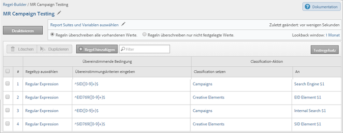
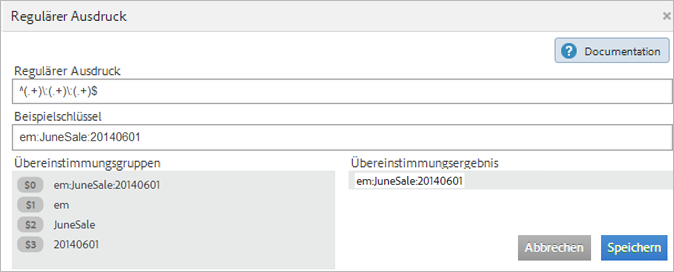

# Klassifizierungsregeldefinitionen (veraltet)

{{classification-rulebuilder-deprecation}}

Definitionen der Elemente auf den Seiten im Classification Rule Builder.

## Seite „Regeln“

Auf dieser Seite werden die Regeln in einem Regelsatz angezeigt.

**Definitionen**

<table id="table_2B3A8BB7BDE14836ACA6A1D444B011CD"> 
 <thead> 
  <tr> 
   <th colname="col1" class="entry"> Element </th> 
   <th colname="col2" class="entry"> Beschreibung </th> 
  </tr> 
 </thead>
 <tbody> 
  <tr> 
   <td colname="col1"> 
Report Suites und Variablen auswählen 
 </td> 
   <td colname="col2"> 
<b>Report Suite</b> 
 
Die Report Suites, für die der Regelsatz gilt. 
 
<b>Variable</b> 
 
Sie können beim Erstellen eines Klassifizierungsregelsatzes nur eine Variable anwenden. Wenn Sie mehrere Regelsätze für eine Variable erstellen möchten, müssen Sie jeden Regelsatz auf mehrere Report Suites anwenden. 
 
Hinweis: Sie können nur die Variablen verwenden, auf die Sie in Ihren Report Suites Zugriff haben. Variablen werden erst im Bereich Neuer Regelsatz angezeigt, nachdem mindestens eine Classification für diese Variable definiert wurde. 
 
 Sie können Classifications für eine Variable unter Admin &gt; Report Suites &gt; Traffic &gt; Traffic-Classifications (oder Konversion &gt; Konversion-Classifications) erstellen. Wählen Sie dann die Variable aus und klicken Sie auf Classification hinzufügen. 
 
Weitere Informationen finden Sie in der Admin-Hilfe unter <a href="/help/admin/tools/manage-rs/edit-settings/c-traffic-variables/traffic-classifications.md"  >Traffic-Classifications</a> und <a href="/help/admin/tools/manage-rs/edit-settings/conversion-var-admin/conversion-classifications.md"  >Konversion-Classifications</a>. 
 </td> 
  </tr> 
  <tr> 
   <td colname="col1"> 
 Aktivieren 
 </td> 
   <td colname="col2"> 
Validiert und aktiviert eine Regel. Aktive Regeln werden täglich verarbeitet und untersuchen Klassifizierungsdaten, die in der Regel einen Monat zurückgehen. Die Regeln überprüfen automatisch auf neue Werte und laden die Klassifizierungen hoch. 
 </td> 
  </tr> 
  <tr> 
   <td colname="col1"> 
 Deaktivieren 
 </td> 
   <td colname="col2"> 
Deaktiviert die Regeln, so dass Sie sie bearbeiten und testen können. 
 </td> 
  </tr> 
  <tr> 
   <td colname="col1"> 
Konfigurieren von Report Suites und Variablen 
 </td> 
   <td colname="col2"> 
Zeigt die Seite Verfügbare Report Suites an, auf der Sie verfügbare Report Suites auswählen können, die für alle Regelsätze verwendet werden sollen. (Diese Seite wird auch angezeigt, wenn Sie den Classification Rule Builder zum ersten Mal ausführen.) 
 
Mit dieser Funktion soll die Ladezeit für Report Suites reduziert werden, falls Hunderte Report Suites verfügbar sind. 
 
Die hier gewählten Report Suites werden auf Regelebene verfügbar gemacht, wenn Sie auf Suites hinzufügen klicken, während Sie eine Regel erstellen. 
 
Hinweis: Eine Report Suite steht  nur zur Verfügung, wenn in den Report Suites mindestens eine Classification für die Variable in den  Admin Tools definiert ist. 
(Eine Erläuterung zu dieser Voraussetzung finden Sie unter Variable unter <a href="/help/components/classifications/crb/classification-rule-set.md"  >Klassifizierungsregelsätze</a>.) 
 
 </td> 
  </tr> 
  <tr> 
   <td colname="col1"> 
Regeln überschreiben alle vorhandenen Werte. 
 </td> 
   <td colname="col2"> 
 (Standardeinstellung) Überschreiben Sie immer vorhandene Klassifizierungsschlüssel, einschließlich der über das Importtool (SAINT) hochgeladenen Klassifizierungen. 
 </td> 
  </tr> 
  <tr> 
   <td colname="col1"> 
Regeln überschreiben nur nicht festgelegte Werte. 
 </td> 
   <td colname="col2"> 
Nur leere (nicht aktivierte) Zellen ausfüllen. Bestehende Klassifizierungen werden nicht geändert. 
 </td> 
  </tr> 
  <tr> 
   <td colname="col1"> 
Lookback-Fenster 
 </td> 
   <td colname="col2"> 
Wenn Sie Regeln aktivieren und validieren, können Sie angeben, ob die Regeln vorhandene Classifications für die betroffenen Schlüssel überschreiben sollen. (Hiervon sind ausschließlich klassifizierte Schlüssel betroffen, die vorher im angegebenen Zeitraum an Adobe Analytics übergeben wurden.) 
 
Wenn Sie kein  Lookback-Fenster angeben sehen die Regeln ungefähr einen Monat zurück (je nach aktuellem Tag des Monats). Bestehende Klassifizierungen werden nur überschrieben, wenn Sie diese Option aktivieren. 
 
<b>Entwicklungszentrum</b>: Partner können im Entwicklungszentrum Classification-Regeln erstellen. Diese Regeln werden bereitgestellt, wenn der Kunde eine Integration aktiviert. Mit der Option „Seit“ überschreiben im Entwicklungszentrum kann der Partner angeben, ob der Kunde den Überschreibungswert festlegen kann, wenn er eine Integration aktiviert oder bearbeitet. 
 
Weitere Informationen zur Verarbeitung von Regeln finden Sie unter <a href="/help/components/classifications/crb/classification-quickstart-rules.md"  >Verarbeitung der Regeln</a>. 
 </td> 
  </tr> 
  <tr> 
   <td colname="col1"> <a href="/help/components/classifications/crb/classification-quickstart-rules.md"  > Regel hinzufügen </a> </td> 
   <td colname="col2"> 
Hier können Sie Regeln zum Regelsatz hinzufügen. 
 
Hinweis: Wenn für einen Wert zwei oder mehr Übereinstimmungen in einem Regelsatz vorliegen, wird dieser Wert anhand der jeweils letzten Regel klassifiziert. 
 </td> 
  </tr> 
  <tr> 
   <td colname="col1">  Entwurf </td> 
   <td colname="col2"> Hier können Sie angeben, dass sich eine Regel im Entwurfsmodus befindet. Mit dem Entwurfsstatus können Sie die Regel testen, bevor Sie sie ausführen. </td> 
  </tr> 
  <tr> 
   <td colname="col1">  Duplizieren </td> 
   <td colname="col2"> Dupliziert (kopiert) einen Regelsatz, so dass Sie diesen Regelsatz auf eine andere Variable anwenden können (oder auch auf dieselbe Variable in einer anderen Report Suite). </td> 
  </tr> 
  <tr> 
   <td colname="col1"> 
 <a href="/help/components/classifications/crb/classification-quickstart-rules.md"  > Testregelsatz </a> 
 </td> 
   <td colname="col2"> 
Hier testen Sie die Validität eines Regelsatzes. 
 </td> 
  </tr> 
  <tr> 
   <td colname="col1">  Übereinstimmende Bedingung </td> 
   <td colname="col2"> Bestimmt die Bedingungen für die Regel. </td> 
  </tr> 
  <tr> 
   <td colname="col1">  Classification-Aktion </td> 
   <td colname="col2"> 
Gibt die Aktion an, die bei Auftreten der Übereinstimmungsbedingung ausgeführt werden soll. 
 
Sie legen beispielsweise einen Kampagnennamen auf $2 fest, wodurch Position 2 in einem Trackingcode als Kampagnenname identifiziert wird. 
 </td> 
  </tr> 
  <tr> 
   <td colname="col1">  # </td> 
   <td colname="col2"> 
Die Nummer der Regel. 
 
Weitere Informationen finden Sie unter <a href="/help/components/classifications/crb/classification-quickstart-rules.md"  > Verarbeitung </a> Regeln . 
 </td> 
  </tr> 
  <tr> 
   <td colname="col1">  Regeltyp auswählen </td> 
   <td colname="col2"> 
Jeder Regelsatz gilt für eine bestimmte Variable. Gültige Auswahlen sind: 
 
    <ul id="ul_6A8E06BB4AF2402B99C215823CB3D59D"> 
     <li id="li_5C702D4F460841D38A59621A5161A3BC">Beginnt mit </li> 
     <li id="li_8052A741D9F34A2FBC136C181600193E">Endet mit </li> 
     <li id="li_D0FA6EA4F09644FFBC9E6BC568BE80AC">Enthält </li> 
     <li id="li_48675FE5253942ED887C6A72D1DCEF54"> <a href="/help/components/classifications/crb/classification-quickstart-rules.md"  > Regulärer Ausdruck </a> </li> 
    </ul> </td> 
  </tr> 
  <tr> 
   <td colname="col1">  Übereinstimmungskriterien eingeben </td> 
   <td colname="col2"> Das gesuchte Textmuster in einer Taste. Bei diesen Kriterien kann es sich um Suchbegriffe, Zeichen oder reguläre Ausdrücke handeln. </td> 
  </tr> 
  <tr> 
   <td colname="col1">  Classification auswählen </td> 
   <td colname="col2"> Die Classification-Spalte, die festgelegt werden soll, wenn die Übereinstimmungskriterien erfüllt sind. </td> 
  </tr> 
  <tr> 
   <td colname="col1">  Hierzu </td> 
   <td colname="col2"> Der Wert, den Sie für die ausgewählte Classification-Spalte angeben möchten, wenn die Übereinstimmungskriterien erfüllt sind. </td> 
  </tr> 
  <tr> 
   <td colname="col1"> Filter </td> 
   <td colname="col2"> Ermöglicht die Suche nach Regeln. </td> 
  </tr> 
 </tbody> 
</table>

## Seite Regulärer Ausdruck {#section_C932A5469E774841B2229965A154163C}

Sie können reguläre Ausdrücke auf der Seite &quot;[!UICONTROL &quot; ].

**Definitionen**

| Element | Beschreibung |
|---|---|
| Beispielschlüssel | Die zu verwendende Testzeichenfolge. Sie können beispielsweise eine Classification aus bestimmten Zeichen in einem Trackingcode erstellen. Sie können bestimmte Zeichen, Wörter oder Zeichenmuster zuordnen. |
| Übereinstimmungsgruppen | Zeigt, wie der reguläre Ausdruck den Kampagnen-ID-Zeichen entspricht, damit Sie eine Position in der Kampagnen-ID klassifizieren können. |
| Übereinstimmungsergebnis | Zeigt die Teile einer Zeichenfolge an, die dem regulären Ausdruck erfolgreich entsprechen. |

Siehe [Reguläre Ausdrücke in Klassifizierungsregeln](/help/components/classifications/crb/classification-quickstart-rules.md).

## Seite „Tests“ {#section_EC926F97901C4E65901413F9683AA70A}

Auf dieser Seite können Sie Regeln in einem Satz testen.

**Definitionen**

| Element | Beschreibung |
|---|---|
| Test ausführen | Verwenden Sie beim Testen des Regelsatzes die Schlüssel des Berichts, um zu sehen, wie sich der Regelsatz auf sie auswirkt. |
| Filter | Filtert die Werte im Bedienfeld [!UICONTROL Ergebnisse]. |
