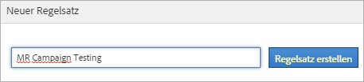

# Klassifizierungsregelsätze (veraltet)

{{classification-rulebuilder-deprecation}}

*Auf dieser Seite werden Klassifizierungsregelsätze als Teil des [Classification Rule Builders“ &#x200B;](classification-rule-builder.md). Unter [Klassifizierungssätze](../sets/overview.md) finden Sie die aktuelle Methode zur Klassifizierung von Daten in Adobe Analytics.*

Ein Regelsatz ist eine Gruppe von Classification-Regeln für eine bestimmte Variable. Sie wenden eine Variable auf den Regelsatz an. Wenn Sie mehrere Regelsätze für eine Variable erstellen möchten, müssen Sie jeden Regelsatz auf mehrere Report Suites anwenden.

## Classification Rule Builder-Seite {#section_C60B0888C76D49C596EF19F11808B718}

**[!UICONTROL Analytics]** > **[!UICONTROL Admin]** > **[!UICONTROL Classification Rule Builder]**

Die folgenden Felder und Optionen sind im [!UICONTROL Classifications Rule Builder“ &#x200B;].

<table id="table_A5D92409969747E39E041216A5AA32CD"> 
 <thead> 
  <tr> 
   <th colname="col1" class="entry"> Element </th> 
   <th colname="col2" class="entry"> Beschreibung </th> 
  </tr> 
 </thead>
 <tbody> 
  <tr> 
   <td colname="col1"> 
<a href="/help/components/classifications/crb/classification-rule-set.md"  > Regelsatz hinzufügen</a> 
 </td> 
   <td colname="col2"> 
Erstellt einen Regelsatz. 
 </td> 
  </tr> 
  <tr> 
   <td colname="col1"> 
Regeln 
 </td> 
   <td colname="col2"> Zeigt die Anzahl der im Satz enthaltenen Regeln an. </td> 
  </tr> 
  <tr> 
   <td colname="col1"> 
Status 
 </td> 
   <td colname="col2"> Zeigt den Aktivitätsstatus des Regelsatzes an, z. B. Entwurf oder Aktiv. Aktive Regeln werden täglich verarbeitet und untersuchen Klassifizierungsdaten, die in der Regel einen Monat zurückgehen. Die Regeln überprüfen automatisch auf neue Werte und laden die Klassifizierungen hoch. </td> 
  </tr> 
  <tr> 
   <td colname="col1"> 
Zuletzt geändert 
 </td> 
   <td colname="col2"> Gibt an, wann der Regelsatz bearbeitet wurde. </td> 
  </tr> 
  <tr> 
   <td colname="col1"> 
Duplizieren 
 </td> 
   <td colname="col2"> Dupliziert (kopiert) einen Regelsatz, so dass Sie diesen Regelsatz auf eine andere Variable anwenden können (oder auch auf dieselbe Variable in einer anderen Report Suite). </td> 
  </tr> 
 </tbody> 
</table>

## Erstellen eines Klassifizierungsregelsatzes {#create-classification-rule-set}

Benennen Sie den Klassifizierungsregelsatz, wenden Sie die Variable an und legen Sie die Einstellungen für das Überschreiben fest.

1. (Voraussetzung) Definieren Sie die Classification-Struktur in **[!UICONTROL Admin]** > **[!UICONTROL Report Suites]**.

   Variablen werden erst im Bereich [!UICONTROL Neuer Regelsatz] angezeigt, nachdem mindestens eine Classification für diese Variable definiert wurde.

   Sie können Classifications für eine Variable unter **[!UICONTROL Admin]** > **[!UICONTROL Report Suites]** > **[!UICONTROL Traffic]** > **[!UICONTROL Traffic-Classifications]** (oder **[!UICONTROL Konversion]** > **[!UICONTROL Konversion-Classifications]**) erstellen. Wählen Sie dann die Variable aus und klicken Sie auf **[!UICONTROL Classification hinzufügen]**.

1. Um den Regelsatz zu erstellen, klicken Sie auf **[!UICONTROL Admin]** > **[!UICONTROL Classification Rule Builder]** > **[!UICONTROL Regelsatz hinzufügen]**.

   

1. Geben Sie dem Regelsatz einen Namen und klicken Sie auf **[!UICONTROL Regelsatz erstellen]**.
1. Wählen Sie den zu bearbeitenden Regelsatz aus.

   

1. Klicken Sie auf **[!UICONTROL Report Suites und Variablen auswählen]**.

   Die Report Suite und Variablenliste wird mit allen klassifizierten Variablen gefüllt, die in allen Report Suites Ihres Anmeldeunternehmens verfügbar sind. Eine einzelne Variable in einer Report Suite kann nur zu einem Regelsatz gehören.

   Weitere Informationen finden Sie unter *`Variable`* in den Definitionen [&#x200B; Seite „Classification Rule Builder](/help/components/classifications/crb/classification-rule-definitions.md) .
1. Geben Sie die zu verwendenden Report Suites und Variablen an und klicken Sie auf **[!UICONTROL Speichern]**.
1. Fahren Sie fort, indem Sie [Classification-Regeln zum Regelsatz hinzufügen](/help/components/classifications/crb/classification-rule-set.md).
