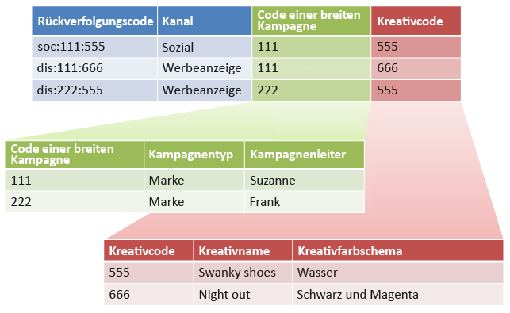

# Unterklassifizierungen und der Regel-Builder (veraltet)

{{classification-rulebuilder-deprecation}}

Sie können den Classification Rule Builder mit Unterklassifizierungen kombinieren, wenn Sie sicherstellen, dass jede Unterklassifizierung über einen übergeordneten Wert verfügt.

Die Kombination von Classification Rule Builder mit Unterklassifizierungen kann die Verwaltung von Klassifizierungen vereinfachen und die Anzahl der erforderlichen Regeln reduzieren. Dies empfiehlt sich zum Beispiel, wenn Ihr Trackingcode aus Codes besteht, die Sie einzeln klassifizieren möchten.

Grundlegende Informationen zu Unterklassifizierungen finden Sie unter [Unterklassifizierungen](/help/components/classifications/importer/subclassifications.md).

## Beispiel

Nehmen Sie als Beispiel den folgenden Trackingcode an:

`channel:broad_campaign:creative`

Mit einer Classification-Hierarchie können Sie eine Classification auf eine andere Classification (*`sub-classification`*) anwenden. Das bedeutet, Sie können den Importeur wie eine relationale Datenbank mit vielen Tabellen verwenden. In der einen Tabelle werden die vollständigen Trackingcodes Schlüsseln zugeordnet, während in einer anderen Tabelle diese Schlüssel dann anderen Tabellen zugeordnet werden.

Sobald Sie diese Struktur eingerichtet haben, können Sie den [Classifications Rule Builder) verwenden](/help/components/classifications/crb/classification-rule-builder.md) um kleine Dateien hochzuladen, die nur die Suchtabellen (die grünen und roten Tabellen im vorherigen Bild) aktualisieren. Außerdem können Sie den Classification Rule Builder dazu verwenden, die Haupt-Classification-Tabelle stets auf dem aktuellsten Stand zu halten.

In der folgenden Aufgabe wird beschrieben, wie Sie das machen.

## Einrichten von Unterklassifizierungen mit dem Regel-Builder

Beispielschritte, die beschreiben, wie Sie Unterklassifizierungen mit dem Regel-Builder hochladen können.

1. Erstellen Sie Klassifizierungen und Unterklassifizierungen im Classification Manager.

   Beispiel:

   

1. Klassifizieren [ im Classifications](/help/components/classifications/crb/classification-rule-builder.md)Regel-Builder den Unterklassifizierungsschlüssel aus dem ursprünglichen Trackingcode.

   Verwenden Sie dazu einen regulären Ausdruck. In diesem Beispiel würde die Regel zum Ausfüllen von *`Broad Campaign code`* diesen regulären Ausdruck verwenden:

   | `#` | Regeltyp | Übereinstimmung | Classification auswählen | Hierzu |
   |---|---|---|---|---|
   |   | Regulärer Ausdruck | `[^\:]:([^\:]):([^\:])` | Code einer breiten Kampagne | `$1` |
   |   | Regulärer Ausdruck | `[^\:]:([^\:]):([^\:])` | Kreativer Code | `$2` |

   >[!NOTE]
   >
   >An dieser Stelle füllen Sie nicht die Unterklassifizierungen *`Campaign Type`* und *`Campaign Director`*.

1. Laden Sie eine Classification-Datei hoch, die ausschließlich die angegebenen Unter-Classifications enthält.

   Weitere Informationen finden Sie unter [Mehrstufige Klassifizierungen](/help/components/classifications/importer/subclassifications.md).

   Beispiel:

   | Schlüssel | Kanal | Code einer breiten Kampagne | Code einer breiten Kampagne&amp;Hat;Kampagnentyp | Code einer breiten Kampagne&amp;Hat;Kampagnen-Director | ... |
   |---|---|---|---|---|---|
   | &#42; |  | 111 | Marke | Suzanne |  |
   | &#42; |  | 222 | Marke | Frank |  |

1. Laden Sie eine kleine Datei (siehe oben) hoch, um die Suchtabellen zu pflegen.

   Zum Beispiel würden Sie eine solche Datei hochladen, wenn ein neuer *`Broad Campaign code`* eingeführt wird. Diese Datei würde dann für bereits klassifizierte Werte gelten. Wenn Sie eine neue Unterklassifizierung erstellen (z. B. *`Creative Theme`* als Unterklassifizierung von *`Creative code`*), laden Sie nur die Unterklassifizierungsdatei und nicht die gesamte Klassifizierungsdatei hoch.

   Bei der Berichterstellung funktionieren die Unter-Classifications genauso wie die übergeordneten Classifications. So haben Sie weniger Verwaltungsaufwand, wenn Sie Unter-Classifications verwenden.
