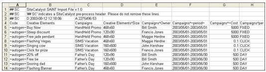

# Klassifizierungsdatendateien (veraltet)

{{classification-importer-deprecation}}

Mit dem Import-Tool können Sie Classification-Daten in einer -Datei stapelweise in Analytics Reporting hochladen. Der Import erfordert ein bestimmtes Dateiformat für erfolgreiche Datenuploads.

Um Ihnen beim Erstellen gültiger Datendateien zu helfen, können Sie eine Vorlagendatei herunterladen, die eine Dateistruktur bereitstellt, in die Sie die Klassifizierungsdaten einfügen können. Weitere Informationen finden Sie unter [Klassifizierungsvorlage herunterladen](/help/components/classifications/importer/c-download-saint-data.md).

Weitere Informationen zu Zeichenbeschränkungen in Klassifizierungen finden Sie unter [Allgemeine Dateistruktur](/help/components/classifications/importer/c-saint-data-files.md).

## Allgemeine Dateistruktur

Die folgende Abbildung zeigt eine Beispieldatendatei:



Eine Datendatei muss die folgenden Strukturregeln einhalten:

* Klassifizierungen dürfen keinen Wert von 0 (null) haben.
* Adobe empfiehlt, die Anzahl der Spalten für den Import und Export auf 30 zu begrenzen.
* Hochgeladene Dateien sollten UTF-8 ohne BOM-Zeichenkodierung verwenden.
* Sonderzeichen wie Tabulatoren, Zeilenumbrüche und Anführungszeichen können in eine Zelle eingebettet werden, wenn das v2.1-Dateiformat angegeben und die Zelle ordnungsgemäß [auskommentiert](/help/components/classifications/importer/importer-faq.md) ist. Zu den Sonderzeichen gehören:

  ```text
  \t     tab character 
  \r     form feed character 
  \n    newline character 
  "       double quote
  ```

  Das Komma ist kein Sonderzeichen.

* Klassifizierungsnamen dürfen kein Caret (^) enthalten, da dieses Zeichen eine Unterklassifizierung bezeichnet.
* Seien Sie vorsichtig, wenn Sie einen Bindestrich verwenden. Wenn Sie beispielsweise einen Bindestrich (-) in einem sozialem Begriff verwenden, erkennt Social ihn als [!DNL Not]-Operator (Minuszeichen). Wenn Sie beispielsweise mit dem Import *`fragrance-free`* als Begriff angeben, interpretiert Social den Begriff folgendermaßen: Parfüm *`minus`* frei. Dadurch werden Wortlaute mit den Begriffen *`fragrance`*, jedoch nicht *`free`* erfasst.
* Zeichenbeschränkungen werden erzwungen, um Berichtdaten zu klassifizieren. Wenn Sie beispielsweise eine Klassifizierungstextdatei für Produkte (*`s.products`*) mit Produktnamen mit mehr als 100 Zeichen (Byte) hochladen, werden die Produkte nicht in den Berichten angezeigt. Für Trackingcodes und für alle benutzerdefinierten Konversionsvariablen (eVars) sind jeweils 255 Byte zulässig. Diese Richtlinie erstreckt sich auch auf Spaltenwerte für Klassifizierungs- und Unterklassifizierungen, für die dieselbe Beschränkung von 255 Byte gilt.
* Tabulatorgetrennte Datendatei (Sie können die Vorlagendatei mit jeder Tabellenkalkulationsanwendung oder einem Texteditor erstellen).
* Die Dateierweiterung muss entweder `.tab` oder `.txt` lauten.
* Ein Rautenzeichen (#) kennzeichnet die Zeile als Benutzerkommentar. Adobe ignoriert alle Zeilen, die mit # beginnen.
* Ein Doppelpfund-Zeichen gefolgt von SC (`## SC`) kennzeichnet die Zeile als Vorab-Header-Kommentar, der vom Reporting verwendet wird. Löschen Sie diese Zeilen nicht.
* Klassifizierungsexporte können aufgrund der Zeilenumbruchzeichen im Schlüssel doppelte Schlüssel aufweisen. In einem FTP- oder Browser-Export kann dies behoben werden, indem Anführungszeichen für das FTP-Konto aktiviert werden. Dadurch werden alle Schlüssel mit Zeilenumbrüchen in Anführungszeichen gesetzt.
* Zelle C1 in der ersten Zeile der Importdatei enthält eine Versionskennung, die bestimmt, wie Klassifizierungen die Verwendung von Anführungszeichen im Rest der Datei handhaben.

   * v2.0 ignoriert Anführungszeichen und geht davon aus, dass sie alle Teil der angegebenen Schlüssel und Werte sind. Betrachten Sie beispielsweise diesen Wert: „Dies ist „ein Wert“. v2.0 würde dies wörtlich interpretieren als: „Dies ist „ein gewisser Wert“.
   * v2.1 weist Klassifizierungen an anzunehmen, dass Anführungszeichen Teil der in Excel-Dateien verwendeten Dateiformatierung sind. Daher würde v2.1 das obige Beispiel wie folgt formatieren: Dies ist „ein Wert“.
   * Probleme können auftreten, wenn v2.1 in der Datei angegeben ist, aber was tatsächlich gewünscht wird, ist v2.0 - d. h. wenn Anführungszeichen in einer Weise verwendet werden, die unter Excel-Formatierung unzulässig ist. Beispiel: Sie haben den Wert: „VP NO REPS“ S/l Dress w/ Overlay. In Version 2.1 ist dies eine falsche Formatierung (der Wert sollte von öffnenden und schließenden Anführungszeichen umgeben sein und Anführungszeichen, die Teil des tatsächlichen Werts sind, sollten in Anführungszeichen gesetzt werden), und Klassifizierungen funktionieren über diesen Punkt hinaus nicht.
   * Vergewissern Sie sich, dass Sie eine der folgenden Aktionen durchführen: Ändern Sie das Dateiformat in v2.0, indem Sie die Kopfzeile (Zelle C1) in den Dateien ändern, die Sie hochladen, ODER setzen Sie die Anführungszeichen für Excel in allen Ihren Dateien korrekt um.

* Die erste (Nicht-Kommentar)-Zeile der Datendatei enthält die Spaltenüberschriften, die die Classification-Daten in der Spalte bezeichnen. Das Import-Tool erfordert ein bestimmtes Format für Spaltenüberschriften. Weitere Informationen finden Sie unter [Format der Spaltenüberschrift](/help/components/classifications/importer/c-saint-data-files.md).
* Unmittelbar nach der Kopfzeile in einer Datendatei befinden sich die Datenzeilen. Jede Datenzeile sollte ein Datenfeld für jede Spaltenüberschrift enthalten.
* Die Datendatei unterstützt die folgenden Steuercodes, mit denen Adobe die Datei strukturiert und Klassifizierungsdaten korrekt importiert:

<table id="table_0548F2E58B6644208147434EB9B3C21B"> 
 <thead> 
  <tr> 
   <th colname="col1" class="entry"> STEUERCODE </th> 
   <th colname="col2" class="entry"> BESCHREIBUNG </th> 
  </tr> 
 </thead>
 <tbody> 
  <tr> 
   <td colname="col1"> <p>&lt;Neue Zeile&gt; </p> </td> 
   <td colname="col2"> <p>Ein neues Zeilenzeichen ist das einzige unterstützte Trennzeichen zwischen Datenzeilen/Datensätzen in der Datendatei. Normalerweise müssen Sie diese Zeichen nur speziell einfügen, wenn Sie ein Programm schreiben, um automatisch Datendateien zu generieren. </p> </td> 
  </tr> 
  <tr> 
   <td colname="col1"> <p>~autogen~ </p> </td> 
   <td colname="col2"> <p>Fordert Adobe an, automatisch eine eindeutige ID für dieses Element zu generieren. </p> <p>Im Kampagnenkontext weist dieser Kontrollwert Adobe an, jedem Kreativelement eine Kennung zuzuweisen. Weitere Informationen finden Sie unter <a href="/help/components/classifications/importer/c-saint-data-files.md"  >Schlüssel</a>. </p> </td> 
  </tr> 
  <tr> 
   <td colname="col1"> <p>~Zeitraum~ </p> </td> 
   <td colname="col2"> <p>Gibt an, dass die Datenspalte den mit dem Element verknüpften Datumsbereich darstellt. Weitere Informationen finden Sie unter <a href="/help/components/classifications/importer/c-saint-data-files.md"  >Datum</a>. </p> </td> 
  </tr> 
  <tr> 
   <td colname="col1"> <p>Leeres Feld </p> </td> 
   <td colname="col2"> <p>Stellt einen NULL-Wert für das aktuelle Feld dar. Verwenden Sie dies, wenn eine bestimmte Datenspalte nicht auf den aktuellen Datensatz anwendbar ist. </p> </td> 
  </tr> 
  <tr> 
   <td colname="col1"> <p>PER-Modifikatoren </p> </td> 
   <td colname="col2"> <p>Zeigt an, dass die Datenspalte <span class="wintitle">PER-Modifizierer</span>-Felder repräsentiert. Weitere Informationen finden Sie unter <a href="/help/components/classifications/importer/c-saint-data-files.md"  >PER-Modifizierer-Überschriften</a>. </p> </td> 
  </tr> 
 </tbody> 
</table>

## Format der Spaltenüberschrift

>[!NOTE]
>
>Adobe empfiehlt, die Anzahl der Spalten für den Import und Export auf 30 zu begrenzen.

Classification-Datendateien unterstützen die folgenden Überschriften:

### Schlüssel

Jeder Wert muss innerhalb des Systems eindeutig sein. Der Wert in diesem Feld entspricht einem Wert, den Sie im [!DNL JavaScript]-Beacon für Ihre Website der [!DNL Analytics]-Variablen zugewiesen haben. Daten in dieser Spalte können ~autogen~ oder einen beliebigen anderen eindeutigen Trackingcode beinhalten.

### Überschrift einer Klassifizierungsspalte

>[!NOTE]
>
>Die Werte in der Überschrift der Spalte [!UICONTROL Klassifizierungen] müssen die Namenskonvention für Klassifizierungen exakt erfüllen, da sonst der Import fehlschlägt. Wenn die Administratorin oder der Administrator beispielsweise im [!UICONTROL Campaign Set-up Manager] den Wert [!UICONTROL Campaigns] in [!UICONTROL Internal Campaign Names] ändert, muss dies ebenfalls in die Spaltenüberschrift übernommen werden. „Schlüssel“ ist ein reservierter Klassifizierungswert (Kopfzeile). Neue Klassifizierungen mit dem Namen „Schlüssel“ werden nicht unterstützt.

Darüber hinaus unterstützt die Datendatei die folgenden zusätzlichen Überschriftenkonventionen zum Identifizieren von Unterklassifizierungen und anderen spezialisierten Datenspalten:

### Untergliederungsüberschrift

Beispiel: `Campaigns^Owner` ist eine Spaltenüberschrift für die Spalte, die `Campaign Owner` enthält. `Creative Elements^Size` ist auch eine Spaltenüberschrift für die Spalte, die die `Size` Unterklassifizierung der `Creative Elements` enthält.

## Fehlerbehebung für Classifications

* [Häufige Probleme beim Hochladen von](https://helpx.adobe.com/de/analytics/kb/common-saint-upload-issues.html): Knowledge Base-Artikel, in dem Probleme aufgrund von falschen Dateiformaten und Dateiinhalten beschrieben werden.
