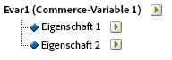
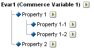

# Unterklassifizierungen

{{classification-importer-deprecation}}

Adobe Analytics unterstützt sowohl einstufige als auch mehrstufige Klassifizierungsmodelle. Mit einer Classification-Hierarchie können Sie eine Classification auf eine Classification anwenden.

>[!NOTE]
>
>Unterklassifizierung bezieht sich auf die Möglichkeit, Klassifizierungen von Klassifizierungen zu erstellen. Das ist allerdings nicht dasselbe wie eine zum Erstellen von [!UICONTROL Hierarchie] berichten verwendete [!UICONTROL Classification-Hierarchie]. Weitere Informationen zu Klassifizierungshierarchien finden Sie unter [Klassifizierungshierarchien](/help/admin/tools/manage-rs/edit-settings/conversion-var-admin/classification-hierarchies.md).

Beispiel:

Jede Klassifizierung in diesem Modell ist unabhängig und entspricht einem neuen Unterbericht für die ausgewählte Berichtsvariable. Darüber hinaus stellt jede Klassifizierung eine Datenspalte in der Datendatei dar, wobei der Klassifizierungsname als Spaltenüberschrift dient. Beispiel:

| SCHLÜSSEL | EIGENSCHAFT 1 | EIGENSCHAFT 2 |
|---|---|---|
| 123 | ABC | A12B |
| 456 | DEF | C3D4 |

Weitere Informationen zum Datendateiformat finden Sie unter [Klassifizierungsdatendateien](/help/components/classifications/importer/c-saint-data-files.md).

Klassifizierungen auf mehreren Ebenen bestehen aus übergeordneten und untergeordneten Klassifizierungen. Beispiel:

**Übergeordnete Classifications:** Als übergeordnete Classification zählt jede Classification, der eine andere Classification untergeordnet ist. Eine Classification kann gleichzeitig über- und untergeordnet sein. Die übergeordneten Klassifizierungen der obersten Ebene entsprechen einstufigen Klassifizierungen.

**Untergeordnete Classifications:** Als untergeordnete Classification gilt jede Classification, der eine andere Classification anstelle der Variablen übergeordnet ist. Untergeordnete Klassifizierungen bieten zusätzliche Informationen zu ihrer übergeordneten Klassifizierung. Beispielsweise könnte eine Klassifizierung [!UICONTROL Kampagnen] eine untergeordnete Klassifizierung Kampagnenverantwortlicher enthalten. [!UICONTROL Numerisch] Classifications fungieren auch als Metriken in Classification-Berichten.

Jede Klassifizierung, ob übergeordnet oder untergeordnet, bildet eine Datenspalte in der Datendatei. Die Spaltenüberschrift für eine untergeordnete Classification, die das folgende Benennungsformat verwendet:

`<parent_name>^<child_name>`

Weitere Informationen zum Datendateiformat finden Sie unter [Klassifizierungsdatendateien](/help/components/classifications/importer/c-saint-data-files.md).

Beispiel:

| SCHLÜSSEL | EIGENSCHAFT 1 | Eigenschaft 1^Eigenschaft 1-1 | Eigenschaft 1^Eigenschaft 1-2 | Eigenschaft 2 |
|---|---|---|---|---|
| 123 | ABC | Grün | Klein | A12B |
| 456 | DEF | Rot | Groß | C3D4 |

Obwohl die Dateivorlage für eine mehrstufige Klassifizierung komplexer ist, bieten mehrstufige Klassifizierungen die Möglichkeit, separate Ebenen als separate Dateien hochzuladen. Dieser Ansatz kann verwendet werden, um die Datenmenge zu minimieren, die regelmäßig (täglich, wöchentlich usw.) hochgeladen werden muss, indem Daten in Klassifizierungsebenen gruppiert werden, die sich im Laufe der Zeit ändern, im Vergleich zu denen, die dies nicht tun.

>[!NOTE]
>
>Wenn die [!UICONTROL Schlüssel]-Spalte in einer Datendatei leer ist, erzeugt Adobe automatisch eindeutige Schlüssel für jede Datenzeile. Um beim Hochladen einer Datendatei mit Classification-Daten der zweiten oder einer höheren Stufe mögliche Dateibeschädigungen zu vermeiden, fügen Sie in jeder Zeile der [!UICONTROL Schlüssel] spalte ein Sternchen (*) ein.

## Beispiele

>[!NOTE]
>
>Die Produkt-Classification-Daten sind auf Datenattribute beschränkt, die sich direkt auf das Produkt beziehen. Die Daten beschränken sich nicht auf die Kategorisierung oder den Verkauf der Produkte auf der Website. Datenelemente wie Verkaufskategorien, Site-Browse-Knoten oder Verkaufsartikel sind keine Produktklassifizierungsdaten. Stattdessen werden diese Elemente in Berichtskonversionsvariablen erfasst.

Beim Hochladen von Datendateien für diese Produktklassifizierung können Sie die Klassifizierungsdaten als einzelne Datei oder als mehrere Dateien hochladen (siehe unten). Durch die Trennung des Farbcodes in Datei 1 vom Farbnamen in Datei 2 müssen die Farbnamendaten (die nur einige Zeilen umfassen können) nur aktualisiert werden, wenn neue Farbcodes erstellt werden. Dadurch wird das Feld „Farbname (CODE^COLOR)“ aus der häufiger aktualisierten Datei 1 entfernt und die Dateigröße und -komplexität bei der Erstellung der Datendatei reduziert.

### Produkt-Classification – Einzeldatei {#section_E8C5E031869C449F9B636F5EB3BFEC17}

| SCHLÜSSEL | PRODUKTNAME | PRODUKTDETAILS | GESCHLECHT | GRÖSSE | CODE | CODE^COLOR |
|---|---|---|---|---|---|---|
| 410390013 | POLO-SS | Herren Poloshirt, Kurzarm (M,01) | M | M | 01 | Stein |
| 410390014 | POLO-SS | Herren Poloshirt, Kurzarm (L,03) | M | L | 03 | Heide |
| 410390015 | Polo-LS | Poloshirt für Damen, Langarm (S,23) | F | S | 23 | Aqua |

### Produkt-Classification – Mehrere Dateien (Datei 1) {#section_A99F7D0F145540069BA4EEC0597FF13F}

| SCHLÜSSEL | PRODUKTNAME | PRODUKTDETAILS | GESCHLECHT | GRÖSSE | CODE |
|---|---|---|---|---|---|
| 410390013 | POLO-SS | Herren Poloshirt, Kurzarm (M,01) | M | M | 01 |
| 410390014 | POLO-SS | Herren Poloshirt, Kurzarm (L,03) | M | L | 03 |
| 410390015 | Polo-LS | Poloshirt für Damen, Langarm (S,23) | F | S | 23 |

### Produkt-Classification – Mehrere Dateien (Datei 2) {#section_19ED95C33B174A9687E81714568D56A3}

| SCHLÜSSEL | CODE | CODE^COLOR |
|---|---|---|
| &#42; | 01 | Stein |
| &#42; | 03 | Heide |
| &#42; | 23 | Aqua |
