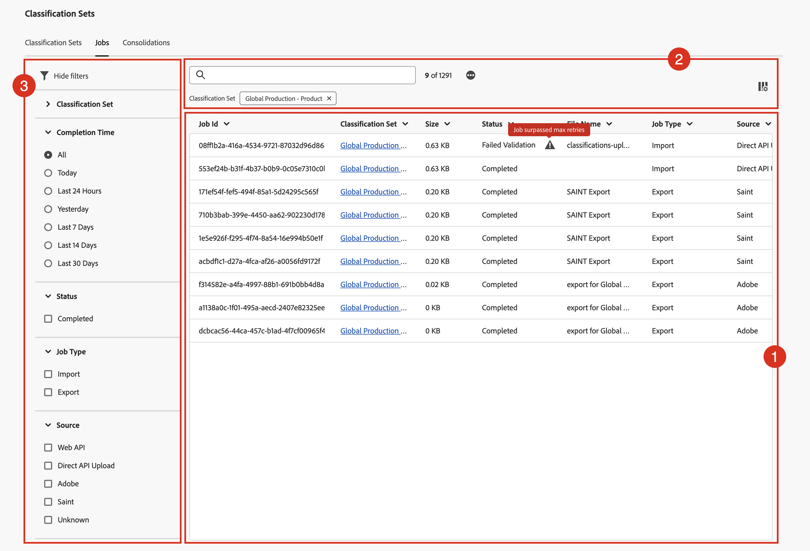

# Anzeigen von und Ausführen von Klassifizierungsaufträgen

Der Classification Jobs Manager zeigt aktuelle und abgeschlossene Klassifizierungsaufträge an, die für Klassifizierungssätze generiert werden. Sie können den Manager auch verwenden, um Klassifizierungsdaten oder Vorlagen für einen bestimmten Auftrag herunterzuladen.

So zeigen Sie Klassifizierungsaufträge an und führen Aktionen für sie durch:

1. Wählen Sie **[!UICONTROL Komponenten]** in der oberen Menüleiste von Adobe Analytics aus und wählen Sie dann **[!UICONTROL Klassifizierungssätze]**.
1. Wählen **[!UICONTROL unter]** die Registerkarte **[!UICONTROL Vorgänge]** aus.

## Classification Jobs Manager

Der **[!UICONTROL Klassifizierungssätze - Aufträge]** Manager verfügt über die folgenden Elemente der Benutzeroberfläche:

### Liste der Klassifizierungsaufträge

Die **[!UICONTROL Klassifizierungsaufträge]** Liste ➊ zeigt Klassifizierungsaufträge an. Die Liste umfasst die folgenden Spalten:

| Spalte | Beschreibung |
|---|---|
| **[!UICONTROL Vorgangs-ID]** | Die Kennung des Klassifizierungsauftrags. |
| **[!UICONTROL Klassifizierungssatz]** | Der Klassifizierungssatz, der mit dem Klassifizierungsvorgang verknüpft ist. |
| **[!UICONTROL size]** | Die Größe der Datei, die als Teil des Klassifizierungsauftrags exportiert oder importiert wurde. |
| **[!UICONTROL Status]** | Der Status des Klassifizierungsauftrags. Mögliche Werte sind: **[!UICONTROL Erstellt]**, **[!UICONTROL In Warteschlange]**, **[!UICONTROL Validiert]**, **[!UICONTROL Fehlgeschlagene Validierung]**, **[!UICONTROL Verarbeitung]**, **[!UICONTROL Verarbeitung]**, **[!UICONTROL Fehlgeschlagene Verarbeitung]** , **[!UICONTROL Abgeschlossen]** oder **[!UICONTROL Fortschritt]**. Bewegen Sie gegebenenfalls den Mauszeiger über den Warnhinweis , um zusätzliche Informationen anzuzeigen. |
| **[!UICONTROL Dateiname]** | Gibt den Namen oder die Funktion an, die zum Importieren oder Exportieren der Datei als Teil des Klassifizierungsauftrags verwendet wird. Mögliche Werte sind: <ul><li>*kein Wert*</li><li>Der Name der Datei, die als Teil des Klassifizierungsauftrags verarbeitet wird.</li><li>**[!UICONTROL SAINT-Export]**: Der Vorgang ist ein Export aus der [Legacy-Klassifizierungsschnittstelle](/help/components/classifications/importer/c-working-with-saint.md).</li><li>**[!UICONTROL Export für _Klassifizierungssatz_ bei _Zeitstempel_]**: Der Auftrag ist ein Download aus der [schema](manage/schema.md#download)-Oberfläche.</li></ul> |
| **[!UICONTROL Vorgangstyp]** | Der Typ des Klassifizierungsauftrags. Mögliche Werte sind: **[!UICONTROL Import]** oder **[!UICONTROL Export]**. |
| **[!UICONTROL Quelle]** | Die Quelle des Klassifizierungsauftrags. Mögliche Werte sind: **[!UICONTROL Web-API]**, **[!UICONTROL Direct API Upload]**, **[!UICONTROL Adobe]**, **[!UICONTROL SAINT]** oder **[!UICONTROL Unknown]**. |
| **[!UICONTROL Geänderte Zeilen]** | Die Anzahl der geänderten Zeilen, die der Klassifizierungsauftrag geändert hat. |
| **[!UICONTROL Zeilen insgesamt]** | Die Anzahl der Zeilen insgesamt, die der Klassifizierungsvorgang verarbeitet hat. |
| **[!UICONTROL Abschlusszeit]** | Die Abschlusszeit des Klassifizierungsauftrags. |
| **[!UICONTROL Datei-Download]** | Verwenden Sie , um die Datei (Vorlage oder Daten) herunterzuladen, die mit dem Klassifizierungsauftrag verknüpft sind. |

Um die Größe einer Spalte in der Liste der Klassifizierungsaufträge zu ändern, haben Sie folgende Möglichkeiten:

* Bewegen Sie den Mauszeiger über das Spaltentrennzeichen und ziehen Sie das Spaltentrennzeichen auf die gewünschte Spaltenbreite.
* Wählen Sie  und wählen Sie **[!UICONTROL Spaltengröße ändern]**. Mit einer vertikalen Linie mit der Schaltfläche Größe ändern können Sie die Größe der Spalte in das gewünschte Format ändern.

So sortieren Sie eine Spalte in der Liste der Klassifizierungsaufträge

* Wählen Sie  und wählen Sie **[!UICONTROL Aufsteigend sortieren]** oder **[!UICONTROL Absteigend sortieren]**. Ein Pfeil (↑↓) gibt an, welche Spalte sortiert ist.

### Suchen und Schaltflächen

In dem Bereich, der über der Liste der Klassifizierungsaufträge ➋, haben Sie folgende Möglichkeiten:

* Suchen  nach Klassifizierungsaufträgen. Die Ergebnisse werden in der Liste der Klassifizierungsaufträge angezeigt. Wählen  aus, um die Suche zu löschen.
* Entfernen Sie alle Filter, die auf die Liste der Klassifizierungsaufträge angewendet werden. Wählen Sie  aus, um einen Filter zu entfernen.
* Wählen Sie  aus, um weitere 1000 Klassifizierungsaufträge zu laden. Zunächst werden in der Liste der Klassifizierungssätze bis zu 1000 Klassifizierungsaufträge angezeigt.
* Definieren Sie die Spalten der Auftragsliste für Klassifizierungssätze. Wählen Sie  aus und wählen Sie im Dialogfeld **[!UICONTROL Tabelle anpassen]** die Spalten aus, die unter **[!UICONTROL Select columns to show]**. Wählen Sie **[!UICONTROL Anwenden]** aus, um die Spalteneinstellungen anzuwenden.

### Panel „Filter“

Wählen Sie  aus, um die ➌ des Filterbedienfelds anzuzeigen, mit der Sie die Liste der Klassifizierungsaufträge filtern können. Sie können nach folgenden Kriterien filtern:

* **[!UICONTROL Klassifizierungssatz]**. Wählen Sie einen oder mehrere Klassifizierungssätze aus, um die Liste der Klassifizierungsaufträge zu filtern.
* **[!UICONTROL Abschlusszeit]**. Wählen Sie einen der möglichen Werte aus, um die Liste der Klassifizierungsaufträge nach Abschlusszeit zu filtern.
* **[!UICONTROL Status]**. Wählen Sie einen der möglichen Werte aus, um die Liste der Klassifizierungsaufträge nach Status zu filtern.
* **[!UICONTROL Vorgangstyp]**. Wählen Sie einen der möglichen Werte aus, um die Liste der Klassifizierungsaufträge nach Auftragstyp zu filtern.
* **[!UICONTROL Source]**. Wählen Sie einen der möglichen Werte aus, um die Liste der Klassifizierungsaufträge nach der Quelle zu filtern.

Wählen Sie  **[!UICONTROL Filter ausblenden]** aus, um das Bedienfeld „Filter“ auszublenden.

Beachten Sie, dass die im Bedienfeld Filter angezeigten Filter die Optionen für die vorab geladenen Klassifizierungsaufträge widerspiegeln.
