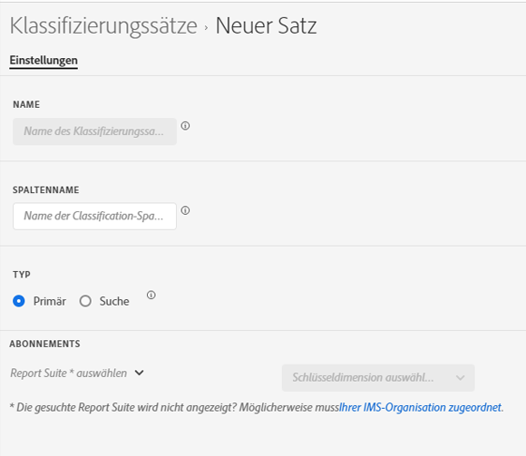

# Erstellen und Bearbeiten von Klassifizierungssätzen

Über [ Manager für Klassifizierungssätze ](#create-a-classification-set) Sie [ Klassifizierungssätze erstellen und ](#edit-a-classification-set) bearbeiten.

## Erstellen eines Klassifizierungssatzes

So erstellen Sie einen Klassifizierungssatz:

1. Wählen Sie **[!UICONTROL Komponenten]** in der oberen Menüleiste von Adobe Analytics aus und wählen Sie dann **[!UICONTROL Klassifizierungssätze]**.
1. Wählen **[!UICONTROL unter]** die Registerkarte **[!UICONTROL Klassifizierungssätze]** aus.
1. Wählen Sie  **[!UICONTROL New]**.
1. Im Dialogfeld **[!UICONTROL Neuen Klassifizierungssatz hinzufügen]**:

   

   1. Geben Sie einen &quot;**[!UICONTROL &quot;]**. Beispiel: `Classification Set Example`.
   1. Geben Sie eine **[!UICONTROL Beschreibung (optional)]** ein. Zum Beispiel `Example classification set`.
   1. Geben Sie eine oder mehrere E-Mail-Adressen (durch Kommata getrennt) in **[!UICONTROL Bei Problemen]**. Diese Benutzer erhalten bei Problemen eine E-Mail-Benachrichtigung.
   1. Wählen Sie **[!UICONTROL Klassifizierungssatz]** Typ“ aus. Mögliche Typen sind:
      * **[!UICONTROL Primär]**. Ein primärer Klassifizierungssatz gilt für Dimensionen, die in Adobe Analytics erfasst wurden. Primäre Klassifizierungen sind eine Möglichkeit, granulare Dimensionswerte in aussagekräftigere Datenebenen zu gruppieren (klassifizieren). Beispielsweise können Sie interne Suchbegriffe in internen Suchkategorien gruppieren, um Designs in Ihren Suchdaten zu verstehen. Oder klassifizieren Sie Produkt-SKUs nach Farbe oder Kategorie.
         * Geben Sie ein oder mehrere **[!UICONTROL Abonnements]** ein.  Sie können mehrere **[!UICONTROL Report Suite]**- und **[!UICONTROL Dimension]**-Kombinationen zu einem Klassifizierungssatz definieren.

         * Wählen Sie  aus, um eine Kombination **[!UICONTROL Report Suite]** und **[!UICONTROL Key Dimension]** zu löschen.

        Wenn Sie eine Kombination aus **[!UICONTROL Report Suite]** und **[!UICONTROL Key Dimension]** hinzufügen, die bereits in einem anderen Klassifizierungssatz vorhanden ist, wird unter der Kombination ein roter Warnhinweis angezeigt. Sie können auf **[!UICONTROL Zu vorhandenem hinzufügen]** klicken, um den anderen Klassifizierungssatz zu öffnen und [Klassifizierungen zum Schema hinzufügen](schema.md) für diesen anderen Klassifizierungssatz oder die Dimension ändern.
      * **[!UICONTROL Suche]**. Eine Lookup-Tabelle wird häufig als untergeordnete Klassifizierung oder Unterklassifizierung bezeichnet und ist eine Klassifizierung einer primären Klassifizierung. Bei einer Suche handelt es sich um Metadaten über einen Klassifizierungswert und nicht um die ursprüngliche Dimension. Beispielsweise könnte eine Dimension *Produkt* über eine primäre Classification mit *Farbcode* verfügen. Eine Lookup-Tabelle mit *Farbname* kann dann an den *Farbcode“ angehängt werden* um jeden Farbcode zu erklären.
1. Wählen **[!UICONTROL Speichern]**, um den Klassifizierungssatz zu speichern. Wählen Sie **[!UICONTROL Abbrechen]**, um die Definition aufzuheben.
1. Um das Schema für den Klassifizierungssatz zu definieren, wählen Sie den neu erstellten Klassifizierungssatz aus dem Manager **[!UICONTROL Klassifizierungssätze]** aus, um [Klassifizierungssatz zu bearbeiten](#edit-a-classification-set).

## Bearbeiten eines Klassifizierungssatzes

So bearbeiten Sie einen Klassifizierungssatz:

1. Wählen Sie **[!UICONTROL Komponenten]** in der oberen Menüleiste von Adobe Analytics aus und wählen Sie dann **[!UICONTROL Klassifizierungssätze]**.
1. Wählen **[!UICONTROL unter]** die Registerkarte **[!UICONTROL Klassifizierungssätze]** aus.
1. Wählen Sie den Titel Ihres Klassifizierungssatzes aus.
1. Im Dialogfeld **[!UICONTROL Klassifizierungssatz: _Klassifizierungssatztitel_]**können Sie die [Einstellungen](settings.md) und das [Schema](schema.md) für den Klassifizierungssatz definieren.
1. Klicken Sie abschließend auf **[!UICONTROL Speichern]**, um Ihre Änderungen zu speichern. Wählen Sie zum Abbrechen **[!UICONTROL Abbrechen]** aus.

<!--

### Schema

In the Schema tab 

You can use the Classification set manager to create a classification set.

**[!UICONTROL Components]** > **[!UICONTROL Classification sets]** > **[!UICONTROL Sets]** > **[!UICONTROL Add]**

When creating a classification set, the following fields are available.

* **[!UICONTROL Name]**: A text field used to identify the classification set. This field cannot be edited upon creation, but can be renamed later.
* **[!UICONTROL Column Name]**: The name of the first classification dimension that you want to create. This field is the dimension name used in Analysis Workspace, and the column name when exporting classification data. You can add more column names after the classification set is created.
* **[!UICONTROL Type]**: Radio buttons that indicate the type of classification.
  * **[!UICONTROL Primary]**: Apply to dimensions collected in Analytics. They are a way to group (classify) granular dimension values into more meaningful levels of data. For example, you might want to group internal search keywords into internal search categories, to better understand themes in your search data.
  * **[!UICONTROL Lookup]**: Commonly referred to as child or subclassifications, a lookup table is a classification of a primary classification. It is metadata about a classification value, rather than the original dimension. For example, the Product variable might have a primary classification of 'Color code'. A lookup table of 'Color name' could then be attached to 'Color code' to further explain what each code means.
* **[!UICONTROL Subscriptions]** The report suites and dimensions that this classification set applies to. You can add multiple report suite and dimension combinations to a classification set.

If a classification set exists for a given report suite + variable, the classification is added to the schema instead. A given report suite + variable combination cannot belong to multiple classification sets.

-->