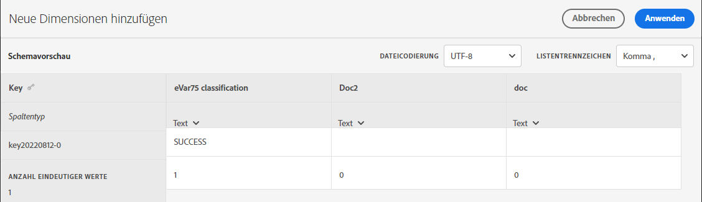
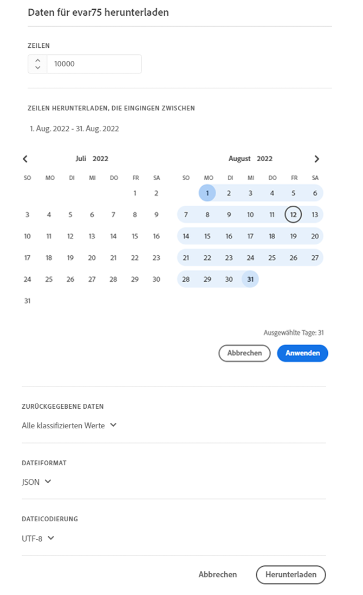
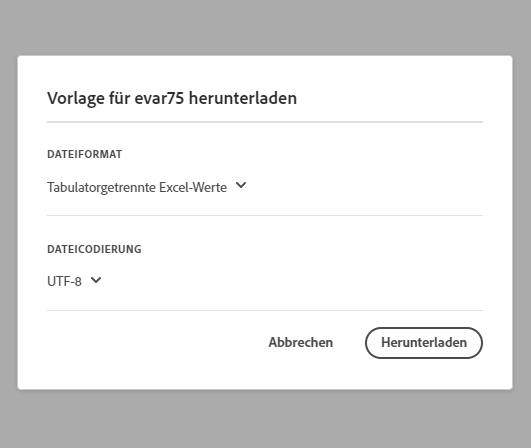

# Schema

Zeigen Sie die derzeit konfigurierten Klassifizierungsdimensionen für diesen Klassifizierungssatz an.

**[!UICONTROL Komponenten]** > **[!UICONTROL Klassifizierungssätze]** > **[!UICONTROL Sets]** > Klicken Sie auf den Namen des gewünschten Klassifizierungssatzes > **[!UICONTROL Schema]**

Folgende Schaltflächen sind verfügbar:

<!--* **[!UICONTROL Add]**: Adds an empty row so that you can add a classification dimension to the schema.-->
* **[!UICONTROL Hochladen]**: Manuelles Hochladen von Klassifizierungsdaten für eine oder mehrere Klassifizierungsdimensionen. `JSON`-, `CSV`-, `TSV`- und `TAB` werden unterstützt. Beim Hochladen einer gültigen Datei wird eine Tabellenvorschau der zu klassifizierenden Daten angezeigt.
   * **[!UICONTROL Dateicodierung]**: Wählen Sie mithilfe dieser Dropdown-Liste die richtige Dateicodierung aus. Zu den gültigen Optionen gehören [!UICONTROL UTF-8] und [!UICONTROL Latin1].
   * **[!UICONTROL Listentrennzeichen]**: Wählen Sie das richtige Listentrennzeichen aus. Wenn Sie eine heruntergeladene Datei oder eine Vorlagendatei verwenden, stellen Sie sicher, dass das [!UICONTROL Listentrennzeichen] hier mit dem [!UICONTROL Listentrennzeichen] übereinstimmt, das beim Herunterladen der Datei verwendet wurde.
   * **[!UICONTROL Anwenden]**: Speichern der hochgeladenen Klassifizierungsdaten in den Klassifizierungssatz.

  

* **[!UICONTROL Herunterladen]**: Laden Sie Schlüsselwerte und ihre Classification-Spalten herunter.
   * **[!UICONTROL Zeilen]**: Die maximale Anzahl von Zeilen, die in die herunterzuladene Datei aufgenommen werden sollen.
   * **[!UICONTROL Zeilen herunterladen, die eingingen zwischen]**: Eine Datumsauswahl im Kalender, mit der Sie Schlüsselwerte nach dem Zeitpunkt filtern können, zu dem sie in Berichten angezeigt werden. Wenn in diesem Datumsbereich kein Schlüsselwert erfasst wurde, erscheint er nicht in der heruntergeladenen Datei.
   * **[!UICONTROL Zurückgegebene]**: Eine Dropdown-Liste, mit der Sie die in der heruntergeladenen Datei enthaltenen Schlüsselwerte anhand der zugehörigen Klassifizierungsdaten filtern können.
      * **[!UICONTROL Alle klassifizierten Werte]**: Umfasst Zeilen, in denen in mindestens einer Spalte Klassifizierungsdaten enthalten sind.
      * **[!UICONTROL Alle nicht klassifizierten Werte]**: Umfasst Zeilen, in denen in mindestens einer Spalte Klassifizierungsdaten fehlen.
   * **[!UICONTROL Dateiformat]**: Eine Dropdown-Liste, die das Dateiformat der herunterzuladenden Datei bestimmt. Die Optionen umfassen [!UICONTROL JSON], [!UICONTROL Kommagetrennte Werte] und [!UICONTROL Tabulatorgetrennte Werte für Excel].
   * **[!UICONTROL Dateicodierung]**: Eine Dropdown-Liste, in der die Dateicodierung bestimmt wird. Die Optionen umfassen [!UICONTROL UTF-8] und [!UICONTROL Latin1]. UTF-8 wird empfohlen.

  

* **[!UICONTROL Vorlage]**: Herunterladen einer Vorlagendatei. Diese Datei ähnelt der Datei, die mit der Schaltfläche [!UICONTROL Herunterladen] erhalten wird, mit der Ausnahme, dass sie keine Klassifizierungsdaten oder Schlüsselwerte enthält.
   * **[!UICONTROL Dateiformat]**: Eine Dropdown-Liste, die das Dateiformat der Vorlagendatei bestimmt. Die Optionen umfassen [!UICONTROL Kommagetrennte Werte] und [!UICONTROL Tabulatorgetrennte Werte für Excel].
   * **[!UICONTROL Dateicodierung]**: Eine Dropdown-Liste, in der die Dateicodierung bestimmt wird. Die Optionen umfassen [!UICONTROL UTF-8] und [!UICONTROL Latin1]. UTF-8 wird empfohlen.
   * **[!UICONTROL Listentrennzeichen]**: Eine Dropdown-Liste, die das Listentrennzeichen bestimmt, das Klassifizierungsspalten in jeder Zeile trennt.

  

* **[!UICONTROL Vorgangsverlauf]**: Ein Verknüpfungs-Link, über den Sie zum [Vorgangsmanager](../job-manager.md) gelangen, der Aufträge nur für diesen Klassifizierungssatz anzeigt.
* **[!UICONTROL Automate]**: Erfasst automatisch Daten aus externen Speicherorten.
   * **[!UICONTROL Standortkonto]**: Eine Dropdown-Liste mit vorhandenen Standortkonten, die von Ihrem Unternehmen konfiguriert wurden. Wenn Ihr Unternehmen noch kein Standortkonto konfiguriert hat, können Sie eines konfigurieren, indem Sie [!UICONTROL **Neues Konto erstellen**] auswählen.

     Informationen zum Konfigurieren des Speicherort-Kontos finden Sie unter [Konfigurieren von Cloud-Import- und -Exportkonten](/help/components/locations/configure-import-accounts.md).

   * **[!UICONTROL Speicherort]**: Eine Dropdown-Liste mit vorhandenen Speicherorten, die von Ihrem Unternehmen konfiguriert wurden. Wenn Ihr Unternehmen noch keinen Speicherort konfiguriert hat, können Sie einen konfigurieren, indem Sie [!UICONTROL **Neuen Speicherort erstellen**] auswählen.

     Informationen zum Konfigurieren eines Speicherorts finden Sie unter [Konfigurieren von Cloud-Import- und -Exportspeicherorten](/help/components/locations/configure-import-locations.md).

   * **[!UICONTROL Trennzeichen]**: Das Spaltentrennzeichen für hochgeladene Dateien. Die Optionen umfassen [!UICONTROL Komma], [!UICONTROL Semikolon], [!UICONTROL Doppelpunkt], [!UICONTROL Vertikaler Balken], [!UICONTROL Leerzeichen], [!UICONTROL Schrägstrich], [!UICONTROL Schrägstrich], [!UICONTROL Strich] oder [!UICONTROL Unterstrich].

   * **[!UICONTROL Codierung]**: Eine Dropdown-Liste, in der die Dateicodierung bestimmt wird. Die Optionen umfassen [!UICONTROL UTF-8] und [!UICONTROL Latin1]. UTF-8 wird empfohlen.
