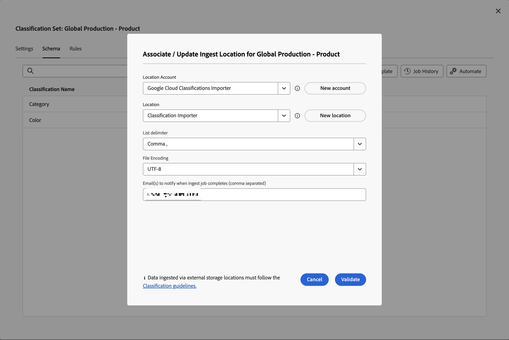

# Klassifizierungssatz-Schema

Das Schema ist die Liste von Klassifizierungen, die Sie auf die Schlüsseldimensionen anwenden möchten, die Sie für den Klassifizierungssatz definiert haben. Wenn Sie beispielsweise Produkt als Schlüsseldimension definiert haben und dieses Feld eine Produkt-SKU enthält, verwenden Sie das Schema, um Klassifizierungen wie Produktname, Produktfarbe, Produktgröße und mehr hinzuzufügen.

So bearbeiten Sie das Schema für einen Klassifizierungssatz:

1. Wählen Sie **[!UICONTROL Komponenten]** in der oberen Menüleiste von Adobe Analytics aus und wählen Sie dann **[!UICONTROL Klassifizierungssätze]**.
1. Wählen **[!UICONTROL unter]** die Registerkarte **[!UICONTROL Klassifizierungssätze]** aus.
1. Wählen **[!UICONTROL Manager Klassifizierungssätze]** Klassifizierungssatz aus, für den Sie das Schema bearbeiten möchten.
1. Wählen Sie **[!UICONTROL Dialogfeld „Klassifizierungssatz _(Klassifizierungssatzname_]**die Registerkarte **[!UICONTROL Schema]**aus. Diese Registerkarte besteht aus den folgenden Elementen der Benutzeroberfläche:

   

   * [Klassifizierungsliste](#classification-list)
   * [Suche](#search)
   * [Aktionen](#actions)
   * [Aktionsleiste](#action-bar)

## Klassifizierungsliste

Die Liste der Klassifizierungen enthält die folgenden Spalten:

| Spalte | Beschreibung |
|---|---|
| **[!UICONTROL Klassifizierungsname]** | Der von Ihnen für die Klassifizierung angegebene Name. |
| **[!UICONTROL Identitätsname]** | Der abgeleitete Name durch das System für die Klassifizierung. Dieser Name ist schreibgeschützt und Sie können den Identitätsnamen verwenden |
| **[!UICONTROL Klassifiziert nach]** | Falls verwendet, einen Link zum Such-Klassifizierungssatz, der zur Klassifizierung dieser Klassifizierung verwendet wird. |

## Suche

Sie können schnell  nach einer oder mehreren Klassifizierungen suchen. Verwenden Sie , um die Suche zu löschen.

## Aktionen

Die folgenden Aktionen sind als Schaltflächen oben in der Klassifizierungsliste verfügbar:

| Symbol | Aktion | Beschreibung |
|---|---|---|
|  | **[!UICONTROL Hinzufügen]** | [Klassifizierung hinzufügen](#add) zur Liste hinzufügen. |
|  | **[!UICONTROL Hochladen]** | [Hochladen einer JSON-, CSV-, TSV- oder TAB-Datei](#upload). |
|  | **[!UICONTROL Herunterladen]** | [Herunterladen von Klassifizierungsdaten](#download). |
|  | **[!UICONTROL Vorlage]** | [Vorlage herunterladen](#template) für Klassifizierungsdaten. |
|  | **[!UICONTROL Vorgangsverlauf]** | Den [Auftrags-Manager für Klassifizierungssätze](/help/components/classifications/sets/job-manager.md) anzeigen, der nach dem ausgewählten Klassifizierungssatz gefiltert wurde. |
|  | **[!UICONTROL Automate]** | [Automatisieren Sie die Aufnahme von Klassifizierungsdaten](#automate) durch die Verwendung eines Cloud-Speicherorts. |

### Hinzufügen

Um eine neue Klassifizierung hinzuzufügen, wählen Sie  **[!UICONTROL Hinzufügen]** aus.

Geben **[!UICONTROL im Dialogfeld Neue Klassifizierung für _Klassifizierungssatzname_]**den **[!UICONTROL Klassifizierungsnamen]**ein und wählen Sie **[!UICONTROL Hinzufügen]**. Die Klassifizierung wird der Liste hinzugefügt.

### Hochladen

Um Klassifizierungsdaten in das Schema für eine Klassifizierung zu importieren, wählen Sie  **[!UICONTROL Upload]** aus.

1. Im Dialogfeld **[!UICONTROL Neue Klassifizierungen hinzufügen]**:

   * Ziehen Sie eine Datei, die Klassifizierungsdaten enthält, und legen Sie die Datei auf **[!UICONTROL hier per Drag-and-Drop]**.
   * Wählen Sie **[!UICONTROL Durchsuchen]** und wählen Sie eine Datei von Ihrem Computer oder Netzwerk aus.

   Es wird eine **[!UICONTROL Schemavorschau]** des Inhalts der Datei angezeigt. Die Vorschau zeigt die Datenspalten aus der Datei an. Um die Größe einer Spalte zu ändern, wählen Sie  und anschließend **[!UICONTROL Spaltengröße ändern]** aus. Es wird ein Ziehgriff angezeigt, mit dem Sie die Größe der Spalte ändern können.

   Wenn im Klassifizierungssatz für eine Spalte keine Klassifizierung definiert ist, wird ein Warnhinweis  angezeigt. Der Warnhinweis erklärt, dass im vorhandenen Klassifizierungsschemasatz keine Klassifizierung vorhanden ist und beim Import erstellt wird.

1. Wählen Sie **[!UICONTROL Bei Konflikt Daten überschreiben?]**, wenn Sie die aktuellen Klassifizierungsdaten mit den neuen importierten überschreiben möchten. Zum Beispiel:

   | | Schlüssel | Aktuelle Produktfarbe | Datei importieren | Neue Produktfarbe |
   |---|---|---|---|---|
   |  **[!UICONTROL Daten bei Konflikt überschreiben?]** | 1234 | Grün | Blau | Blau |
   |  **[!UICONTROL Daten bei Konflikt überschreiben?]** | 1234 | Grün | Blau | Grün |

1. Wählen Sie **[!UICONTROL Anwenden]** aus. Ein Warnhinweis wird angezeigt, wenn Spalten im vorhandenen Schemasatz nicht als Klassifizierungen vorhanden sind. Diese Spalten werden als neue Klassifizierungen hinzugefügt, wenn Sie den Upload bestätigen.

   

   Wählen Sie **[!UICONTROL Upload bestätigen]** aus, um den Upload zu bestätigen. Wählen Sie **[!UICONTROL Upload abbrechen]**, um den Upload abzubrechen.

### Herunterladen

Um Klassifizierungsdaten herunterzuladen, wählen Sie  **[!UICONTROL Herunterladen]** aus.

Im Dialogfeld **[!UICONTROL Daten für Klassifizierungssatz _Name des Klassifizierungssatzes_]**herunterladen:

1. Geben Sie die Anzahl **[!UICONTROL Zeilen]** ein, die Sie herunterladen möchten. Beispiel: `10000`.
1. Um den Zeitraum auszuwählen, für den Sie Classification-Datenzeilen herunterladen möchten, geben Sie Start- und Enddaten für &quot;**[!UICONTROL Zeilen herunterladen, die zwischen empfangen wurden]** ein. Oder verwenden Sie , um ein Kalender-Popup zur Auswahl des Zeitraums zu verwenden.
1. Um auszuwählen, welche Daten zurückgegeben werden sollen, wählen Sie eine Option unter **[!UICONTROL Daten zurückgegeben]** aus.

   * **[!UICONTROL Alle Werte]** gibt alle Werte für die aktuellen Klassifizierungsdaten zurück.
   * **[!UICONTROL Alle Spalten leer]** Gibt eine Spalte mit Schlüsselwerten für die vorhandenen Klassifizierungsdaten zurück. und Spalten ohne Wert für Klassifizierungsdaten, für die keine Werte vorhanden sind.
   * **[!UICONTROL Alle Spalten leer]** gibt eine Schlüsselspalte mit Werten für die vorhandenen Klassifizierungsdaten zurück. und Spalten ohne Wert für Klassifizierungsdaten.
1. Um das [Dateiformat](/help/components/classifications/sets/data-files.md#general-file-requirements) der heruntergeladenen Klassifizierungsdaten auszuwählen, wählen Sie eine Option aus dem Dropdown-Menü **[!UICONTROL Dateiformat]** aus. Die Optionen sind:

   * **[!UICONTROL JSON]**.
   * **[!UICONTROL Kommagetrennte Werte]** (CSV)
   * **[!UICONTROL Tabulatorgetrennte Werte für Excel]** (TSV oder TAB).

1. Um die [Dateicodierung](/help/components/classifications/sets/data-files.md#general-file-requirements) zu wählen, wenn die Datei heruntergeladen wird, wählen Sie eine Option aus dem Dropdown-Menü Dateicodierung aus. Die Optionen sind:

   * **[!UICONTROL UTF-8]**
   * **[!UICONTROL Latin-1]**.

1. Wählen Sie **[!UICONTROL Herunterladen]** aus, um die Klassifizierungsdaten herunterzuladen. Sie finden die heruntergeladene Datei im Standard-Download-Verzeichnis Ihres Browsers und die Datei heißt <code><i>Klassifizierungssatz</i>.<i>json</i>|<i>csv</i>|<i>tsv</i></code>  Wenn die Datei bereits vorhanden ist, eine Sequenznummer <code>(<i>x</i>)</code> wird dem Dateinamen hinzugefügt. Wenn Sie Optionen angegeben haben, die keine Daten zurückgeben, wird ein Dialogfeld **[!UICONTROL Hinweis]** angezeigt, in dem Sie darüber informiert werden, die Optionen für den Datumsbereich und die zurückgegebenen Daten zu ändern.

### Vorlage

Um eine Vorlage für Klassifizierungsdaten herunterzuladen, wählen Sie  **[!UICONTROL Template]** aus.

Im Dialogfeld **[!UICONTROL Vorlage für Klassifizierungssatz _herunterladen_]**:

1. Um das [Dateiformat](/help/components/classifications/sets/data-files.md#general-file-requirements) der heruntergeladenen Klassifizierungsdaten auszuwählen, wählen Sie eine Option aus dem Dropdown-Menü **[!UICONTROL Dateiformat]** aus. Die Optionen sind:

   * **[!UICONTROL Kommagetrennte Werte]**.
   * **[!UICONTROL Tabulatorgetrennte Werte für Excel]**.

1. Um die [Dateicodierung](/help/components/classifications/sets/data-files.md#general-file-requirements) zu wählen, wenn die Datei heruntergeladen wird, wählen Sie eine Option aus dem Dropdown-Menü Dateicodierung aus. Die Optionen sind:

   * **[!UICONTROL UTF-8]**
   * **[!UICONTROL Latin-1]**.

1. Wählen Sie **[!UICONTROL Herunterladen]** aus, um die Klassifizierungsdatenvorlage herunterzuladen. Sie finden die heruntergeladene Datei im Standard-Download-Verzeichnis Ihres Browsers mit dem Titel <code><i>Klassifizierungssatz</i>.<i>CSV</i>|<i>TSV</i></code>  Wenn die Datei bereits vorhanden ist, eine Sequenznummer <code>(<i>x</i>)</code> wird dem Dateinamen hinzugefügt.

### Automate {#automate}

>[!CONTEXTUALHELP]
>id="classificationsets_schema_automate_locationaccount"
>title="Standortkonto"
>abstract="Liste der Speicherort-Konten von Kontotypen, die den Import von Klassifizierungsdaten unterstützen. Wählen Sie **[!UICONTROL Neues Konto]** aus, um ein neues Speicherort-Konto zu erstellen."
>additional-url="https://experienceleague.adobe.com/docs/analytics/components/locations/configure-import-accounts.html?lang=en" text="Konfigurieren von Cloud-Import- und -Exportkonten"

>[!CONTEXTUALHELP]
>id="classificationsets_schema_automate_location"
>title="Standort"
>abstract="Liste der Standorte am ausgewählten Speicherort-Konto, die den Import von Klassifizierungsdaten unterstützen. Wählen Sie **[!UICONTROL Neuer Speicherort]**, um einen neuen Speicherort zu erstellen."
>additional-url="https://experienceleague.adobe.com/docs/analytics/components/locations/configure-import-locations.html?lang=en" text="Konfigurieren von Cloud-Import- und -Exportspeicherorten"

Um die Aufnahme der Klassifizierung zu automatisieren, wählen Sie  **[!UICONTROL Automatisieren]**.

Im Dialogfeld **[!UICONTROL Aufnahme-Speicherort zuordnen/aktualisieren _Klassifizierungssatzname_]**:

1. Um einen Cloud-Speicherort auszuwählen, wählen Sie eine Option aus **[!UICONTROL Speicherort-Konto]**. Es [ nur (Speicherort-Konten unterstützter Kontotypen angezeigt, die den Import von Klassifizierungsdaten ](https://experienceleague.adobe.com/de/docs/analytics/components/locations/configure-import-accounts). Um ein neues Konto zu erstellen, wählen Sie **[!UICONTROL Neues Konto]** aus.
1. Um einen Speicherort auszuwählen, wählen Sie eine Option aus **[!UICONTROL Speicherort]**. Es werden nur die Standorte der ausgewählten Kontotypen für den Import von Klassifizierungsdaten angezeigt. Um einen neuen Speicherort zu erstellen, wählen Sie **[!UICONTROL Neuer Speicherort]**.

   >[!IMPORTANT]
   >
   >Der Speicherort, den Sie erstellen oder auswählen, sollte ein **[!UICONTROL Präfix]** (Ordner) innerhalb des **[!UICONTROL Buckets]** enthalten, um die Klassifizierungsdatendateien zu hosten. Beispiel: ein Ordner mit dem Namen `files`. Das Hosten von Dateien am Stamm eines Buckets funktioniert nicht mit den meisten Cloud-Speicherorten.
   >

1. Um ein Trennzeichen auszuwählen, wählen Sie eine Option aus dem Dropdown-Menü **[!UICONTROL Listentrennzeichen]** aus. Die Optionen sind:
   * **[!UICONTROL Komma ,]**
   * **[!UICONTROL Semikolon ;]**
   * **[!UICONTROL Doppelpunkt :]**
   * **[!UICONTROL Vertikaler Balken |]**
   * **[!UICONTROL Leerzeichen]**
   * **[!UICONTROL tab]**
1. Um die [Dateicodierung](/help/components/classifications/sets/data-files.md#general-file-requirements) beim Herunterladen der Datei auszuwählen, wählen Sie eine Option aus dem Dropdown-Menü **[!UICONTROL Dateicodierung]** aus. Die Optionen sind:

   * **[!UICONTROL UTF-8]**
   * **[!UICONTROL Latin-1]**.

1. Um Benutzer über den Abschluss von Aufnahmevorgängen zu benachrichtigen, geben Sie E-Mail-Adressen ein, durch Kommata getrennt, **[!UICONTROL E-Mail(s), die benachrichtigt werden sollen, wenn Aufnahmevorgänge abgeschlossen sind (durch Kommata getrennt)]**.
1. Wählen Sie **[!UICONTROL Validieren]** aus. Die Verbindung zum Cloud-Speicherort wird validiert.
1. Wenn die Validierung erfolgreich war, wird eine Popup-Meldung angezeigt, in der die Location **[!UICONTROL Validierung erfolgreich angezeigt wird. Verbindung mit Cloud-Speicher verifiziert.]** Wählen Sie**[!UICONTROL  Speichern ]**, wenn Sie die Verbindung zur Cloud-Verbindung erstellt haben. Wählen Sie andernfalls**[!UICONTROL  Aktualisieren ]**aus. Oder wählen Sie**[!UICONTROL  Abbrechen ]**, um die Konfiguration des Cloud-Speicherorts abzubrechen.

Wenn Sie Dateien in den Cloud-Speicherort hochladen, wird die Datei innerhalb von 15 Minuten erkannt und als Importvorgang übermittelt. Das Ergebnis dieses Importvorgangs wird im [Classifications Job Manager“ ](/help/components/classifications/sets/job-manager.md). Wenn Sie der Liste der Benutzer hinzugefügt werden, um über den Abschluss von Aufnahmevorgängen zu informieren, erhalten Sie auch E-Mail-Nachrichten.

Zum Beispiel:

{width="400"}

## Aktionsleiste

In der Aktionsleiste werden die für die ausgewählte Klassifizierung verfügbaren Aktionen angezeigt. Verfügbare Optionen sind:

| Symbol | Aktion | Beschreibung |
|---|---|---|
|  | **[!UICONTROL Suche hinzufügen]** | Fügen Sie einen Klassifizierungssatz als Suche hinzu (Unterklassifizierung). In der **[!UICONTROL Lookup anhängen]**-Tabelle: <ol><li>Wählen Sie im Dropdown-Menü **[!UICONTROL Klassifizierungsname]** eine Suchklassifizierung aus.</li><li>Wählen Sie **[!UICONTROL Hinzufügen]** aus.</li></ol>Die Lookup-Klassifizierung wird zur Klassifizierung hinzugefügt und in der Spalte **[!UICONTROL Klassifiziert nach]** mit der internen ID aufgeführt. |
|  | **[!UICONTROL Suche entfernen]** | Entfernen Sie einen Klassifizierungssatz als Suche. Um die Suche dauerhaft aus der Klassifizierung zu löschen, klicken Sie im Bestätigungsdialogfeld **[!UICONTROL _Klassifizierungssatz entfernen_ aus _Klassifizierung_]**auf **[!UICONTROL Löschen]**. |
|  | **[!UICONTROL Umbenennen]** | Benennen Sie **[!UICONTROL Klassifizierungsname]** einer Klassifizierung um. Geben **[!UICONTROL im Dialogfeld &quot;_: (Klassifizierungsname_]**einen neuen Namen ein und wählen Sie **[!UICONTROL Umbenennen]**. |
|  | **[!UICONTROL Löschen]** | Löschen einer Klassifizierung. Das **[!UICONTROL Löschen _Klassifizierungsname_]**wird angezeigt. Wählen Sie **[!UICONTROL Löschen]**aus, um die Klassifizierung zu löschen. |
